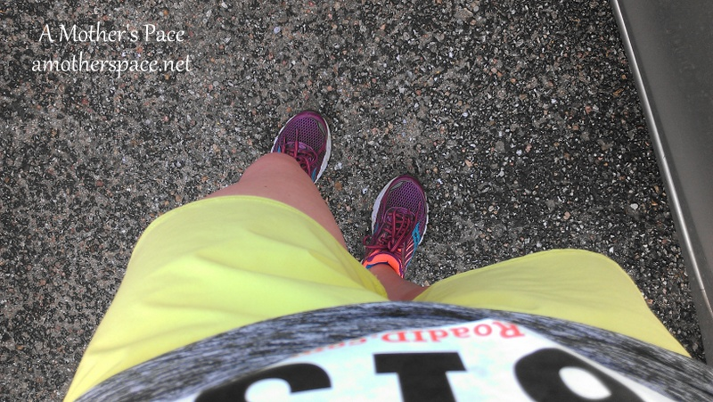
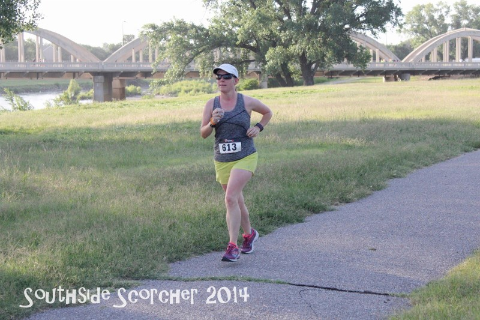
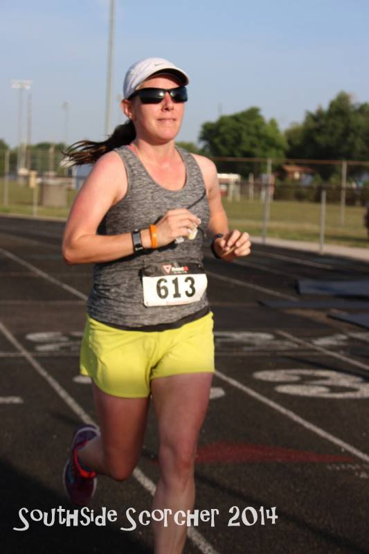
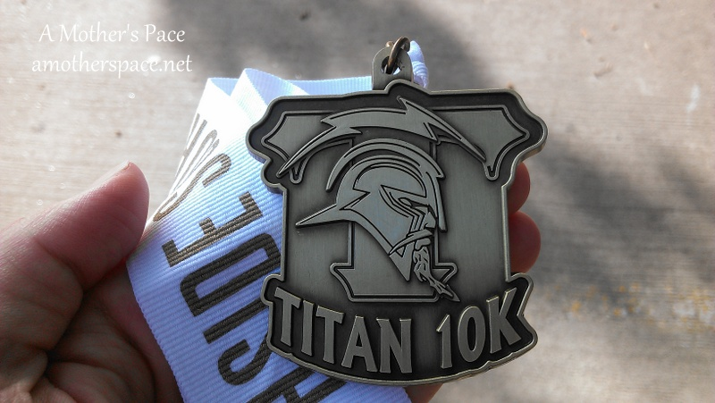

 

My training plan for my long run last weekend called for 16 miles with 6 mid miles at marathon race pace. So I thought, why don't I just sign up for a local 10k to help with the faster mid miles? Just my luck, the Titan 10k Southside Scorcher was last Saturday.

 

 

I've never ran this race before but I was very happy with the low 70 to mid 70 degrees that we had for the race. For July in Kansas it could have been much warmer! It's not called the Southside Scorcher for nothing!

I woke up very early and got ready to head out. I drove over to South High School where the race was located. I had asked if the track was available for a warm up run and since I didn't know the area of town really well I had decided to warm up on the track instead of on the streets. When I got there no one was running on the track and I felt very self-conscious being the only one. I ended up running a mile around the school before I checked the track again.

By now there were others running it so I hopped on to get another mile in before the race. Now all along I had thought that the race began at 6:30. At 6:28 I was surprised that no one was lining up yet. I continued on with my 3rd warm up mile waiting for things to come together. As it turned out it was a 7:00 race start. It worked out better for me because I was able to run 3 miles (10:16 pace) before the race started (instead of my planned 2) and I was able to easily fit in a restroom break. One major plus of this race was that it was held at the football field/track of the high school so the restrooms were open to the runners.

I lined up at the start with a friend from high school that I had bumped into before the race. We chatted about running for a few minutes and then we were off!

 

\[caption id="attachment\_2569" align="aligncenter" width="647"\] Photo Credit: [Running Connection](https://www.facebook.com/RunningConnection?ref=br_tf) \[/caption\]

 

 

My plan for this 10k was to run my marathon race pace which meant that I would not have a PR. I wanted to stick as close to 9:30 as I could. I still had a lot of miles after the race and I didn't want to burn my legs during the race.

Racing at a pace that I know I can easily keep is so much fun! I enjoyed the scenery of the water we ran by, the bridges, the river we ran by and the park we ran through.

 

\[caption id="attachment\_2567" align="aligncenter" width="533"\] Photo Credit: [Running Connection](https://www.facebook.com/RunningConnection?ref=br_tf)\[/caption\]

 

I also decided not to carry water and instead practice getting water and Gatorade at the water stops.  It was very hard not to stop my watch when I slowed down to a walk at the water stops. On training runs if I happen to stop running (at a stop light, or to change a podcast, etc) I always stop my watch. It's a habit I guess and I came very close to hitting stop two times during this race.

The Gatorade did not sit well with my stomach. This makes me a little nervous for Chicago because that is what they have at their water stops. I'm going to keep trying it though and maybe I will get used to it.

Official Race Distance: 10k (6.2 miles)

Nike+ Distance: 6.3 miles

Official Time: 59:48

Nike+ Time: 59:49

Official Average Pace: 9:38

Nike+ Average Pace 9:29

Age Group Placement: 9/20

Overall Placement: 86/181

I finished the race just under 1 hour. Ate a piece of watermelon (why don't more races have watermelon??? So good!), stopped by the restrooms again and then headed to the car. This race was a very small local race with beautiful scenery. I have never ran in this area of town before but I would definitely do this race again. It was well organized and they had medals! Not bad that I got a medal out of my long run, right?!

 

 

Next, I drove to the riverside area which was just under 10 minutes of driving. There I got out and continued on with my long run. To say that my legs were heavy would be putting it mildly. I just decided to ignore my pace and just run however slowly I needed to to get all 16 miles in for the day. I parked and did 3 out and backs to my car so that I could replenish my water and Nuun.

By this time it was later in the morning and getting very hot. My energy was fading fast but I was determined to get all 16 miles in. I picked this area of town specifically because I used to live nearby and miss running these roads. I was hoping that would distract me enough to finish and it did. 6.71 miles at an 11:38 average pace. That is by far the slowest I have ran lately, well over a minute slower.

I'm glad that I experimented with running marathon pace miles at a race during a long run. My downfall was getting in the car and having to drive somewhere to get more miles in for the day. My legs just did not want to run after that. They weren't sore but they were very tired and heavy. In the future if I do this again I would want to be able to run again right after the 10k and not have to drive to a different location.

A total of 16 miles on the dot and a medal, not a bad day for a long run at all!

 

\_\_\_\_\_\_\_\_\_\_\_\_\_\_\_\_\_

I’m running the Chicago Marathon with Team RMHC!

To find out more read my post about [Running for Charity](http://amotherspace.net/2014/06/the-chicago-marathon-running-for-charity/) or head over to my [fundraising page](http://www.kintera.org/faf/donorReg/donorPledge.asp?ievent=1097960&supId=399266070) to make a donation.

——————————-

Find A Mother’s Pace on…

Twitter [@amotherspace3](https://twitter.com/amotherspace3)

Facebook [amotherspace3](http://facebook.com/amotherspace3)

Instagram [amotherspace](http://instagram.com/amotherspace)

Pinterest [amotherspace](http://pinterest.com/amotherspace/)

Bloglovin’ [A Mother’s Pace](http://www.bloglovin.com/en/blog/6680087)

RSS [amotherspace](http://feeds.feedburner.com/amotherspace)
