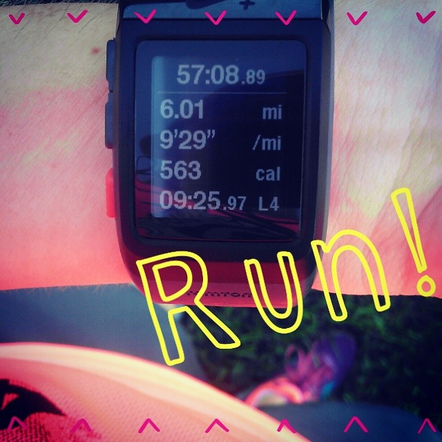
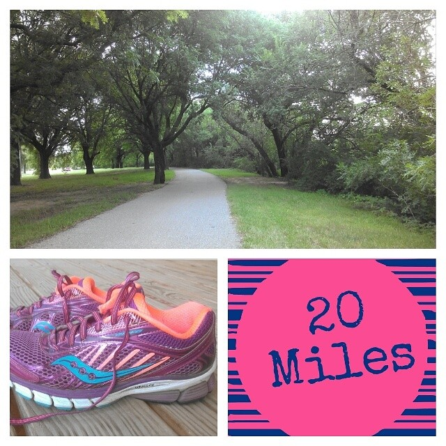
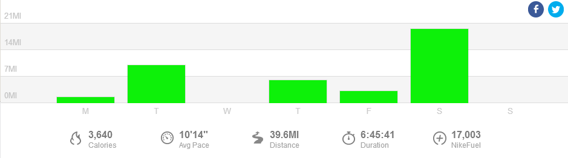

 

Today I need advice. I'm suddenly in the market for a new GPS watch and I need help starting my research.

 

 

Let me start off by saying that I LOVE my [Nike+ Sportwatch](http://amotherspace.net/2014/03/5-reasons-why-i-run-with-a-nike-sportwatch/ "5 Reasons Why I Run With a Nike SportWatch") and it is really hard for me to switch to a different brand. But I've had several watches in the past couple of years (all have been replaced by Nike because the watch was under warranty) and I just can't justify buying a new Nike watch at this point. Their customer service is amazing, by the way.

On Saturday 19.55 miles into my long run my watch died on me. I thought this might be a possibility (it beeped low battery at me last week after 18 miles) so I had charged my watch before running and taken it off the charger right as I was heading out the door. My run lasted just under 3.5 hours and luckily for me I knew exactly where my 20 miles needed to end. I also had a very good idea of time and pace right before my watch died so I have a pretty accurate read of that run even though my data ends .45 miles before I finished.

 

 

Obviously, I'm training for a marathon and I need a watch that can last all 26.2 miles. That's my number 1 criteria. I also would like a watch that I can program a workout ahead of time and give me an accurate actual pace. Those are the top things that my Nike+ watch is missing and they are all important features to me.

I'm hoping to make my purchase before my next 20 miler in a couple of weeks so I have some time to do a little research. I'm hoping you'll have some good ideas for me to help me get started.

 

## **Weekly Workouts**

 

**Monday:** 2.10 miles (9:31 pace) + 10 minutes Kettlebells and Core Work + 20 minutes Spin Bike

My training plan for today called for a FUN workout. I literally didn't know what I was going to do until I woke up in the morning. I decided to head downstairs and do a little circuit workout with the spin bike, treadmill and kettlebells. I spent 10 minutes with each and then repeated the bike and the treadmill but ran out of time for more weights.

**Tuesday:**  10.01 miles (10:32 pace)

I'm pretty sure this is my first ever double digit run during the week. I know during my last marathon training my highest midweek run capped at 8 miles. It felt great to get out and run long during the week. I ran a negative split run today, the first 5 slower than the last 5.

**Wednesday:** 25 minutes Kettlebells and Core

This is my rest or cross training day of the week. I wasn't up for the spin bike today so I just got in a new kettlebell workout from greatist.com.

**Thursday:**  6.01 miles (9:29 pace)

Intervals today. 6 x 4 minute repeats in zone 3 with 3 minutes of recovery between.

**Friday:**  3.11 miles (9:29 pace)

I love that point in marathon training when 3 miles feels like nothing. All the other runs are much longer making 3 miles feel like such a treat!

**Saturday:**  20 miles (10:24 pace)

Today I ran from our current neighborhood past my old neighborhood and through old routes that I haven't ran in almost 3 years since we have moved. I loved my old neighborhood routes. It was hot and humid out today so I stopped at a drinking fountain to refill my hydration pack and I stopped again at the farmer's market for a refill and a bathroom break. I don't want to get in the habit of stopping for a bathroom break on my long runs because I want to avoid stopping on race day. Hopefully it won't be this warm and humid on race day so I won't need to drink as much water.

**Sunday:** REST

 

 

 

One of my main goals for 2014 is to Run This Year in kilometers. That's 2,014 kilometers or 1,251.44 miles.

Weekly Running Miles: 41.23

Weekly Average Pace: 10:14

July Running Miles: 144.78

2014 Running Miles: 759.90

2014 Running Kilometers: 1222.94

 

**What's your favorite GPS watch? How does the battery hold up? What are your favorite features of a watch?**

 

\_\_\_\_\_\_\_\_\_\_\_\_\_\_\_\_\_

I’m running the Chicago Marathon with Team RMHC!

To find out more read my post about [Running for Charity](http://amotherspace.net/2014/06/the-chicago-marathon-running-for-charity/) or head over to my [fundraising page](http://www.kintera.org/faf/donorReg/donorPledge.asp?ievent=1097960&supId=399266070) to make a donation.

——————————-

Find A Mother’s Pace on…

Twitter [@amotherspace3](https://twitter.com/amotherspace3)

Facebook [amotherspace3](http://facebook.com/amotherspace3)

Instagram [amotherspace](http://instagram.com/amotherspace)

Pinterest [amotherspace](http://pinterest.com/amotherspace/)

Bloglovin’ [A Mother’s Pace](http://www.bloglovin.com/en/blog/6680087)

RSS [amotherspace](http://feeds.feedburner.com/amotherspace)
