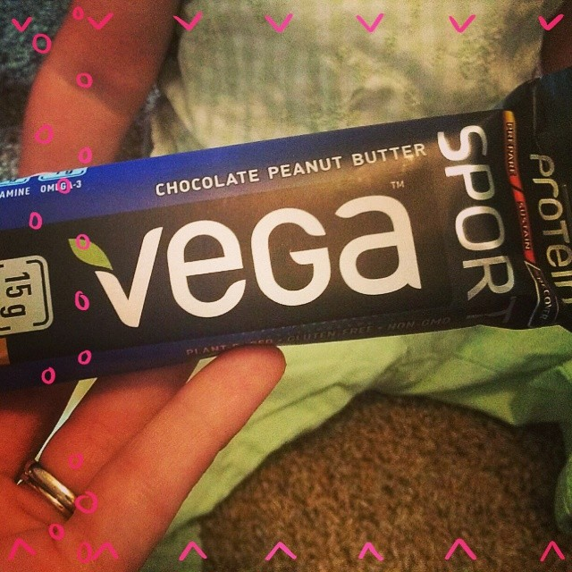
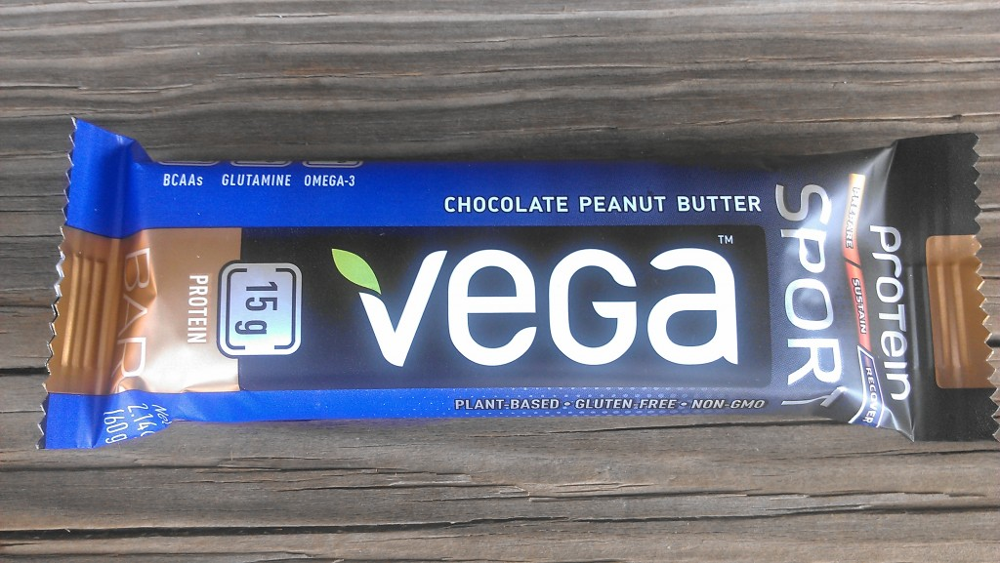
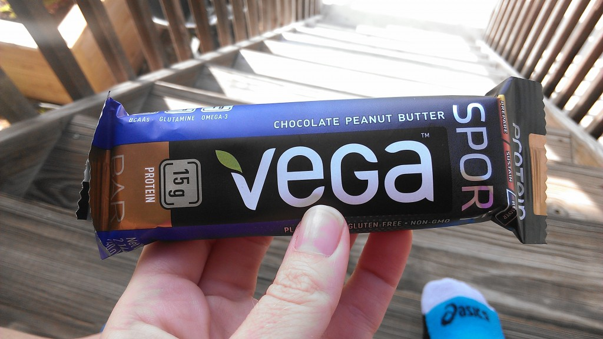

_My post today has been sponsored by Fit Approach on behalf of Vega. I received a box of Protein Vega Sport Bars in exchange for my honest review. All opinions are my own._

As a busy mom of three children, ages 4, 3 and 17 months, recovery after a workout can be a little difficult to squeeze into my routine. In the past my best case scenario was to take a few minutes to stretch outside before coming back in the house and then my husband usually fixed some eggs for me while I jumped in the shower. I admit that I'm extremely lucky to have a husband that takes care of me so well but even in the best circumstances I wasn't replenishing my nutrition within the ideal time of 30 minutes post run.

When I had the opportunity to try out a few [protein bars from Vega Sport](http://vegasport.com/product/protein-bar/?utm_campaign=FitAppVSProteinBar&utm_medium=link&utm_source=blogger&utm_content=FitAppVSProteinBar0), I jumped at the chance. The day after they arrived I had an 8 miler scheduled. I woke up late and just finished my run as my husband was heading to work. Immediately I grabbed a chocolate peanut butter bar because I knew I wouldn't have time to fix anything else for quite awhile.

I was very impressed with the taste. I've had protein bars in the past but never really liked eating them.  The ratio of chocolate to peanut butter in these bars is perfect, in my opinion.

I've been enjoying these bars for a couple of weeks now and I save them for after my harder, longer workouts. They've definitely changed my recovery routine in a good way. Now, before a run I make myself a bowl of yogurt  topped with homemade granola (I know, it's a strange thing to have before a run, but whatever works, right?!) and that counts as my 'breakfast' of the day. When I get home from a run I grab a glass of chocolate milk and a [Vega Sport Protein Bar](http://vegasport.com/product/protein-bar/?utm_campaign=FitAppVSProteinBar&utm_medium=link&utm_source=blogger&utm_content=FitAppVSProteinBar0) for recovery right away. I wait and have the eggs at lunch time.

[Vega Sport Protein Bars](http://vegasport.com/product/protein-bar/?utm_campaign=FitAppVSProteinBar&utm_medium=link&utm_source=blogger&utm_content=FitAppVSProteinBar0) are plant-based, gluten-free, non-GMO and made mainly out of organic ingredients. They help to [#fuelyourbetter](%20fuelyourbetter.com?utm_campaign=FitAppFuelYourBetter&utm_medium=link&utm_source=blogger&utm_content=FitAppFuelYourBetter0) with healthy ingredients and recover after a hard workout.

I think the true test of reviewing a product is whether or not I would spend my own money and replenish my stash by buying more. The answer to this YES! I've already searched for a store that carries them nearby and I'll buy them soon because my supply is dwindling. My husband has also been enjoying them after cycling workouts as he trains for an upcoming 50k.

My recovery after my long runs is going so well and I'm convinced that refueling with protein so quickly afterwards has a lot to do with it. I'll refuel with the Vega Bars after hard workouts and they will definitely be a part of my recovery after running the Chicago Marathon on October 12th.

**How do you #fuelyourbetter? Have you tried this or any other Vega products?** 

\_\_\_\_\_\_\_\_\_\_\_\_\_\_\_

I’m running the Chicago Marathon with Team RMHC!

To find out more read my post about [Running for Charity](http://amotherspace.net/2014/06/the-chicago-marathon-running-for-charity/) or head over to my [fundraising page](http://www.kintera.org/faf/donorReg/donorPledge.asp?ievent=1097960&supId=399266070) to make a donation.

——————————-

Find A Mother’s Pace on…

Twitter [@amotherspace3](https://twitter.com/amotherspace3)

Facebook [amotherspace3](http://facebook.com/amotherspace3)

Instagram [amotherspace](http://instagram.com/amotherspace)

Pinterest [amotherspace](http://pinterest.com/amotherspace/)

Bloglovin’ [A Mother’s Pace](http://www.bloglovin.com/en/blog/6680087)

RSS [amotherspace](http://feeds.feedburner.com/amotherspace)
