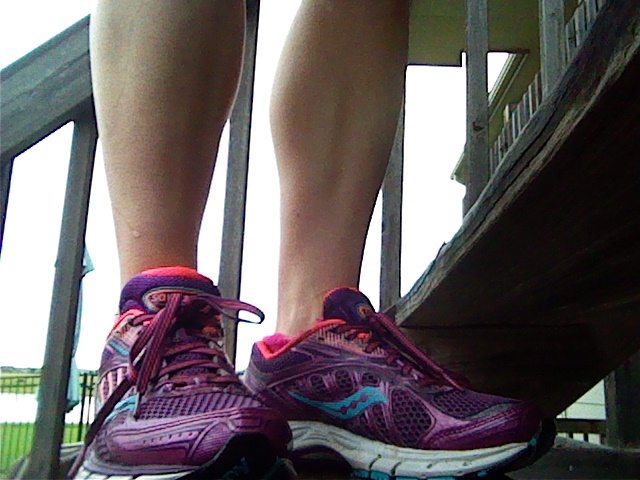
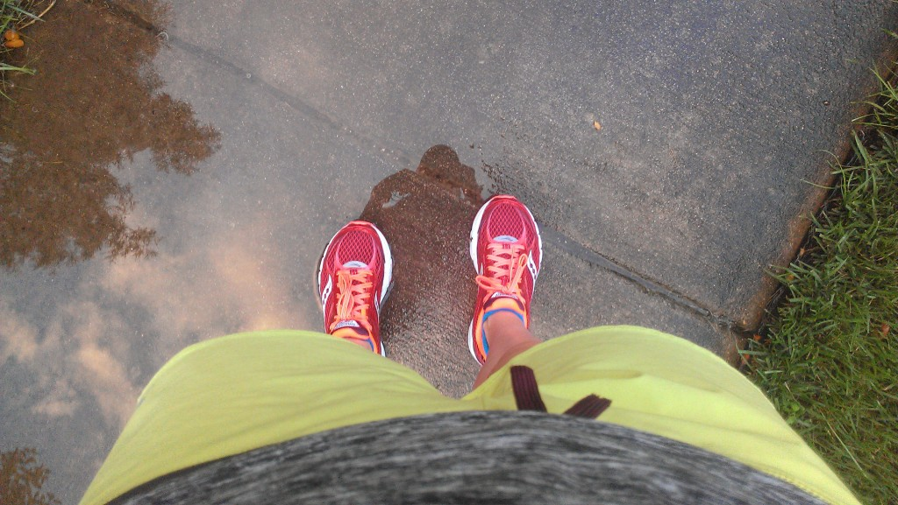
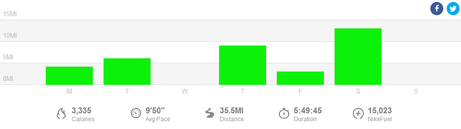

 

This week it appears that my biggest lesson I learned while marathon training is to actually READ my training plan correctly. Doesn't seem so difficult, does it? Evidently it was for me this week because I miss-read two workouts.

It wasn't the end of the world by any means but still frustrating to me.

The first was my Thursday workout. For some reason my training log was open to the first week in September and when I looked at my workout I didn't notice that it was on the wrong date. I just looked at the plan for Thursday and took off running. I ran 9 miles with the last 4 at race pace but I was supposed to run intervals. At least I didn't just run easy, right?

 

 

The next run I messed up was on Friday. I didn't even look at my plan before I left. Why I didn't look, I have no idea. I thought I was supposed to run 3 miles easy but really I was supposed to run 4 miles easy. I guess it all evens out because I ran too many miles on Thursday!

So this week I'm back to LOOKING at my plan and reading the right entries. I'll let you know how it goes.

I ran my 7th half marathon over the weekend. I'm working on a race recap that will be out this week.

 

 

## **Weekly Workouts**

 

**Monday:** 4.15 miles (10:13 pace) + 20 minutes Kettlebells and Core Work

My legs were feeling a little tired this morning so I stuck to the easiest version of this workout. My plan called for 4-5 miles + 10 strides. At 3 miles I started running my strides and finished with just over 4 miles. It's important to listen to your body and not just push it all the time.

 

 

**Tuesday:** 6.15 miles (9:29 pace)

Tempo intervals today. My goal was to run each mile interval as close to a 9 minute mile as possible. I ran a mile as a warm up and then the intervals (9:17, 8:54, 8:48, 9:01) with .25 recovery in between. My first mile was a little slow but I'm happy with the last 3. Sometimes it's hard to find the right pace in the first mile.

**Wednesday:** Rest

Again, I'm listening to my body this week. I was tired so I slept in, on purpose. I didn't set an alarm and it felt glorious! My plan says cross training or rest and this week I chose the rest option.

**Thursday:** 9.10 miles (10:22 pace)

I narrowly missed a thunderstorm and headed outside as soon as I thought it was over. The rain had stopped and there wasn't anymore lightning but there were puddles everywhere. And mud. I really broke in my shiny new shoes on this run. The puddles and mud slowed me down during the first half of this run (mud is really slippery!) but the last 4 miles of my run were supposed to be at race pace. As of right now my hope for my race pace is between 9:27 and 9:59. My splits for these last 4 miles were: 9:41, 9:52, 9:46 and 9:45.

 

 

**Friday:** 3.10 miles (10:16 pace)

A nice refreshing August run in the rain. I was a sweaty mess by the end of it because of the humidity but it felt fantastic to be out in the rain.

**Saturday:** 13.07 miles (9:22 pace)

Run for Your Momma Half Marathon. I set a new PR! Recap coming soon.

**Sunday:** REST

 

 

 

One of my main goals for 2014 is to Run This Year in kilometers. That's 2,014 kilometers or 1,251.44 miles.

Weekly Running Miles: 35.57

Weekly Average Pace: 9:50

August Running Miles: 54.78

2014 Running Miles: 833.19

2014 Running Kilometers: 1340.89

 

**Have you ever completely done the wrong run or workout?**

 

\_\_\_\_\_\_\_\_\_\_\_\_\_\_\_\_\_

I’m running the Chicago Marathon with Team RMHC!

To find out more read my post about [Running for Charity](http://amotherspace.net/2014/06/the-chicago-marathon-running-for-charity/) or head over to my [fundraising page](http://www.kintera.org/faf/donorReg/donorPledge.asp?ievent=1097960&supId=399266070) to make a donation.

——————————-

Find A Mother’s Pace on…

Twitter [@amotherspace3](https://twitter.com/amotherspace3)

Facebook [amotherspace3](http://facebook.com/amotherspace3)

Instagram [amotherspace](http://instagram.com/amotherspace)

Pinterest [amotherspace](http://pinterest.com/amotherspace/)

Bloglovin’ [A Mother’s Pace](http://www.bloglovin.com/en/blog/6680087)

RSS [amotherspace](http://feeds.feedburner.com/amotherspace)
