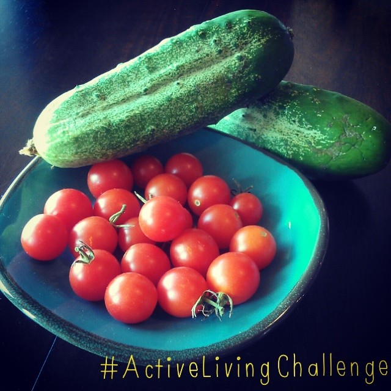
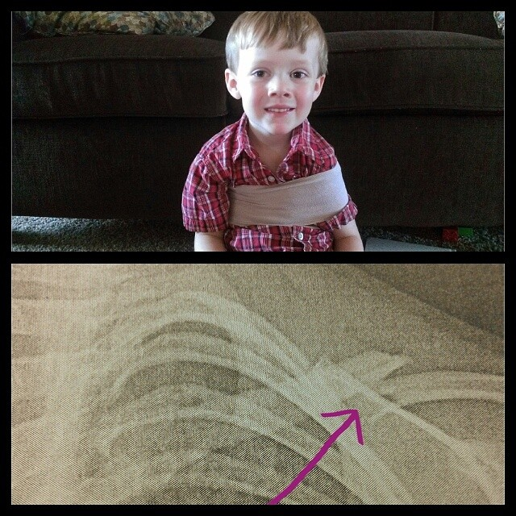
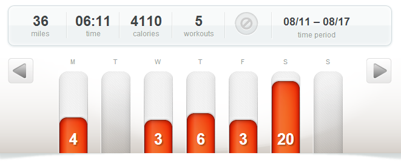

 

Here I am again with another weekly update on my training log. As of today there are only 53 days until the Chicago Marathon! That seems so far away yet I know it will be here in a blink of an eye.

I'm taking a step back this week to say that training is going so well. I'm recovering from hard workouts and long runs better than I ever have before (thanks to [Vega Protein Bars](http://amotherspace.net/2014/07/vega-protein-bar-review-fuelyourbetter/ "Vega Protein Bar Review #fuelyourbetter"), my foam roller and compression socks!) and I'm running more miles than ever as well.

Because I'm running so much, it makes me want to share a lot with you. New product reviews from everything to my new watch that I just bought (Garmin Forerunner 220) to new shoes (Saucony Ride 7's) to how much I am loving my new Oiselle Roga shorts. But I'm behind, I'm behind on my race report from my half marathon last weekend and I had to drop out of the [Active Living Challenge](http://amotherspace.net/2014/08/activelivingchallenge-week-1/ "#ActiveLivingChallenge Week 1") with the Sweat Pink community over on Instagram this week.

 

 

 

Last week was a crazy week. One that I hope doesn't repeat any time soon. My son fell out of bed at night and broke his collarbone. He's doing fantastic and hardly complains about the pain at all. He also is being a champ about missing out on fun things like riding his bike, climbing on playground equipment and swimming, just to name a few.

 

 

My husband left on a business trip that same day for several days. I juggled the household, 3 kids and doctors appointments as best I could and some things didn't get accomplished. (See my above list of everything I want to do with the blog!) Last week made me in awe of all those single parents out there!

So now I'm playing catch up and I hope to resume regular posting soon but, in all honesty, life is very unpredictable so I can't make any promises!

Despite all the challenges I still fit in my training runs last week. I had to shuffle a couple of days, shorten a run and run on the treadmill a few times. Luckily my husband was back at home for my 20 miler on Saturday because I would not have wanted to attempt that one on the treadmill! Keep reading below to find out more about my 10th week in training for the Chicago Marathon.

 

 

## **Weekly Workouts**

Week 10: Chicago Marathon Training

**Monday:** 4.2 miles (10:17 pace)

I had just completed a half marathon 2 days before this run so I had no idea how my legs would actually feel on the run and whether or not I would finish it. But I'm happy to say that my legs felt great and I went ahead and did the 4 miles on my training plan.

**Tuesday:** Rest Day

**Wednesday:** 3.16 miles (9:00 pace)

A quick 3 miles while Nana watched the kids.

**Thursday:** 6 miles (9:36 pace)

Back on the treadmill. Kids watched a movie and read books, I ran my miles.

**Friday:** 3 miles (9:38 pace)

Another treadmill run today.

**Saturday:** 20.02 miles (10:36 pace)

My second 20 miler of the training cycle. This one went well and I stayed in my long run pace range even though I didn't have my new watch set up right and couldn't see my overall pace during the run. Very hot, humid and my allergies were bugging me but I'm stronger because of this run.

**Sunday:** REST

 

 

 

One of my main goals for 2014 is to Run This Year in kilometers. That's 2,014 kilometers or 1,251.44 miles.

Weekly Running Miles: 36.38

August Running Miles: 91.16

2014 Running Miles: 869.57

2014 Running Kilometers: 1399.44

 

**Are you running Chicago in October? How is your training coming along?**

**What's the first to go when your life becomes extra busy?**

 

\_\_\_\_\_\_\_\_\_\_\_\_\_\_\_\_\_

I’m running the Chicago Marathon with Team RMHC!

To find out more read my post about [Running for Charity](http://amotherspace.net/2014/06/the-chicago-marathon-running-for-charity/) or head over to my [fundraising page](http://www.kintera.org/faf/donorReg/donorPledge.asp?ievent=1097960&supId=399266070) to make a donation.

——————————-

Find A Mother’s Pace on…

Twitter [@amotherspace3](https://twitter.com/amotherspace3)

Facebook [amotherspace3](http://facebook.com/amotherspace3)

Instagram [amotherspace](http://instagram.com/amotherspace)

Pinterest [amotherspace](http://pinterest.com/amotherspace/)

Bloglovin’ [A Mother’s Pace](http://www.bloglovin.com/en/blog/6680087)

RSS [amotherspace](http://feeds.feedburner.com/amotherspace)
