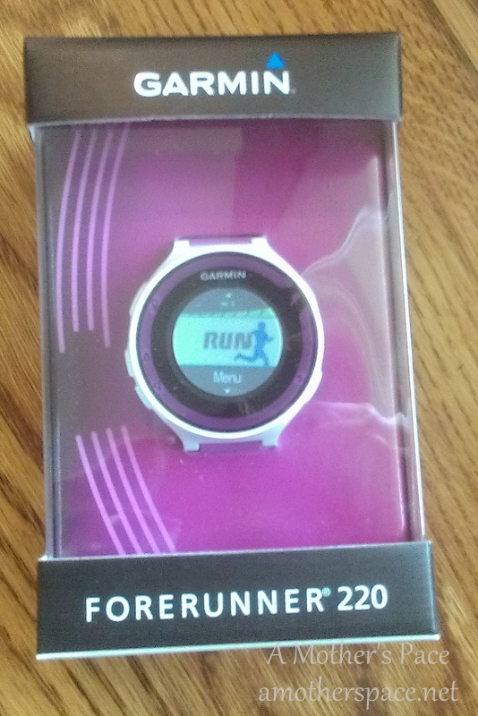
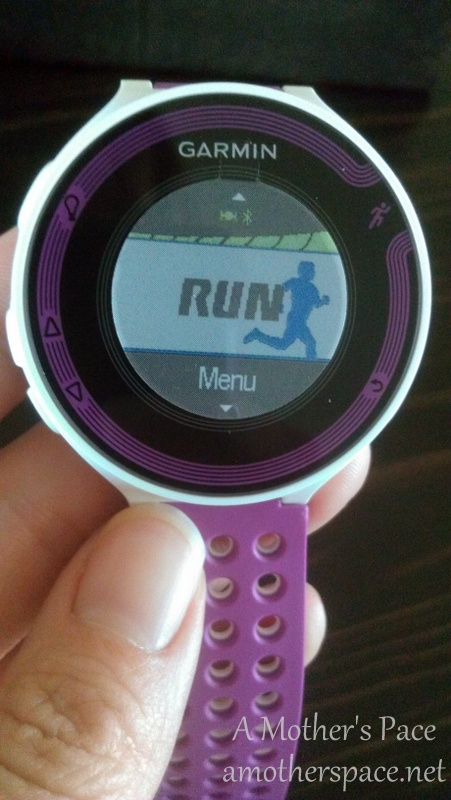
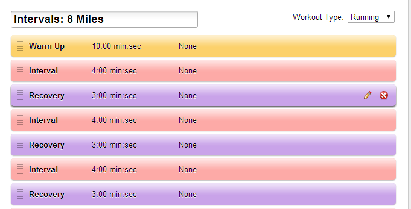
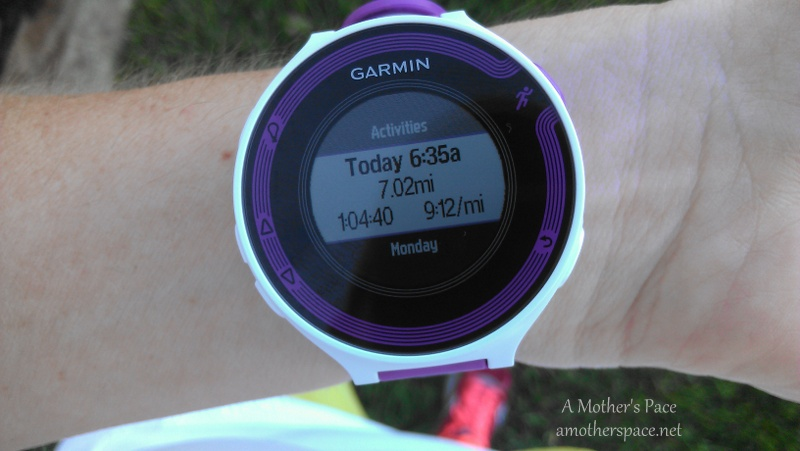
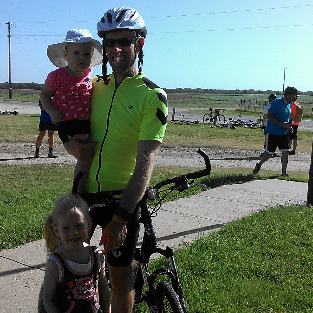
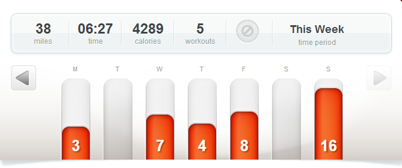

 

I just wrapped up my first full week of running with my new Garmin Forerunner 220 (workout details below) so I wanted to write a little 'mini' review but I'm sure I'll add more thoughts on it over the next few weeks as I run more with it and discover new features. This watch can do a lot!

 

 

My very first time out running with the watch was challenging. I thought I had everything set up right and then after I had started out...on a 20 miler...I realized that the lap was set to change at every kilometer. I normally keep track of miles so this was a little confusing to me. I also didn't set up the average pace at all on the watch so I had no way of really knowing what my pace was during the whole run. 20 miles of not really looking at my watch actually felt pretty good, although I was incredibly worried that I wasn't in my long run pace range. It turned out that I stuck within the range and I ended up being very happy with the run overall.

 

 

What I didn't realize on that run was that I could change some of the data without stopping the run. I learned this a few runs later while I was out on a tempo run. I noticed the 'slow' alert on the watch before my tempo run and I thought I would use that to help me stay below my tempo speed. What I didn't think about was how annoying the alert was going to be during the warm up and the fact that I was running under trees. At that point my watch thought I was going a 13:00+ pace (I wasn't anywhere close to that) and was beeping all the time.

After a couple miles of this I couldn't stand it anymore. I decided to risk starting the data over on the run to see if I could turn off the alerts. I managed to get into the settings and turn that feature off all while my run was paused. Very nice. Now if I want to use that feature again in the future I know that I can turn it on after my warm up and off before my cool down. Oh, and avoid trees. Lots of beeping with trees!

I set up my first screen to have the lap pace showing. I feel like this gives me a pretty decent idea of what my actual pace is during each mile. This was one area that my old watch was missing and it is probably my favorite function that this watch has.

 

 

I'm looking forward to my run today. There are so many things that I haven't tried out yet and one is the ability to program a workout into the watch ahead of time. I've entered in an 8 mile interval workout and my watch will be able to tell me when it's time to change speeds. I love not having to count intervals or look at my watch constantly to see when the minutes are up. This feature will really come in handy!

Overall I've been very happy with my purchase. I like the extra data that it gives me and it is very user friendly.

 

 

## PROS of the Garmin Forerunner 220:

- I like the look of the watch. I choose purple but it also comes in a black/red combo. The face is bigger than my old watch but the band is smaller.
- Set up the watch to show the data that is most important to you. I have mine set up with the distance, lap pace and average pace on the first screen.
- Lap pace function. I love that I can see what my actual pace is and not just have to look at the average pace to gauge speed on a run.
- Change functions while out on a run.
- Ability to program workouts into the watch ahead of time.
- Wireless connection to the computer. Very convenient.
- Garmin Connect App. My phone can't handle another app right now but very soon I'm switching phones and I'm very excited to use the app while running. My husband will be able to follow along with my run and see exactly where I am just by checking the app on his phone.

## CONS of the Garmin Forerunner 220:

- I haven't really noticed a 'Garmin' community online.  I miss that about the Nike+ community. I've met a lot of Instagram friends through Nike+ and wish that Garmin had something similar.
- Garmin Connect website. It's confusing to me and I would like to be able to make graphs easily of my weekly workouts. I'm hoping I get better with this with time.

_Disclaimer: I purchased this watch with my own money and wanted to share how I am liking it with you. I haven't been compensated for my review in any way._

 

 

And now for my week in workouts. I had to switch my long run to Sunday because I was busy spectating a local 50K bike race that my husband rode on Saturday. Because of that I switched a few other runs throughout the week as well. I was able to do a mid week longer run on Friday instead of the usual Thursday.

 

 

## **Weekly Workouts**

Week 11: Chicago Marathon Training

**Monday:** 3.2 miles (9:57 pace)

**Tuesday:** 15 minutes Nike Training Club Ab Burner + 10 minutes Kettlebells

Rest day today but I realized I hadn't done ab work in awhile. Boy, did I feel this one!

**Wednesday:** 7.02 miles (9:14 pace)

5 mile tempo run. (9:07, 9:07, 9:05, 8:53, 9:05)

**Thursday:** 4.2 miles (10:02 pace)

**Friday:** 7.6 miles (10:25 pace)

**Saturday:** REST

**Sunday:** 16.02 (10:33 pace)

Another tough long run this weekend. I shouldn't complain about the heat and humidity because it's been a fairly cool summer in the mornings here.

 

 

 

One of my main goals for 2014 is to Run This Year in kilometers. That's 2,014 kilometers or 1,251.44 miles.

Weekly Running Miles: 38:04

August Running Miles: 129.20

2014 Running Miles: 908.61

2014 Running Kilometers: 1462.27

 

**What GPS Watch or App do you use?** 

\_\_\_\_\_\_\_\_\_\_\_\_\_\_\_\_\_

I’m running the Chicago Marathon with Team RMHC!

To find out more read my post about [Running for Charity](http://amotherspace.net/2014/06/the-chicago-marathon-running-for-charity/) or head over to my [fundraising page](http://www.kintera.org/faf/donorReg/donorPledge.asp?ievent=1097960&supId=399266070) to make a donation.

——————————-

Find A Mother’s Pace on…

Twitter [@amotherspace3](https://twitter.com/amotherspace3)

Facebook [amotherspace3](http://facebook.com/amotherspace3)

Instagram [amotherspace](http://instagram.com/amotherspace)

Pinterest [amotherspace](http://pinterest.com/amotherspace/)

Bloglovin’ [A Mother’s Pace](http://www.bloglovin.com/en/blog/6680087)

RSS [amotherspace](http://feeds.feedburner.com/amotherspace)
