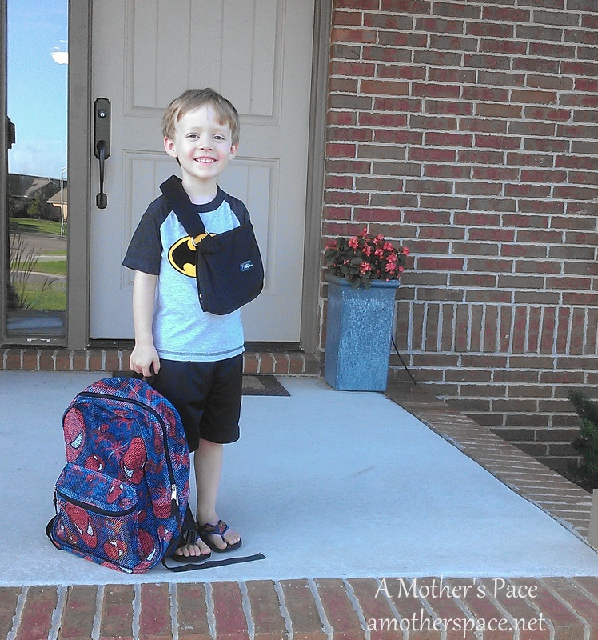

 

It's been awhile since I've written a 'Life Lately' post so I thought that Amanda's [Thinking Out Loud](http://www.runningwithspoons.com/) series would be the perfect fit this week.

The big news around our house is the start of a new school year. Little A started her first ever day of preschool on Tuesday with a lot of very big smiles. My shy little girl was so ready and excited for preschool and it made me a very proud mommy. She ended up having a wonderful experience and talked about it for the rest of the day!

 

 

Little O started his second year of preschool on Wednesday. He loved school last year and couldn't wait to go back this fall. The teachers are being great about his broken collarbone and have put out a sand table to occupy him during recess. He's been so brave about his broken bone. (He fell out of bed in the middle of the night a couple of weeks ago.) He hardly complains at all even when he misses out on some of his favorite activities like riding bikes, swimming and playing at recess or at the park.

 

 

My youngest turned 18 months old this week. She has such a fun personality right now. She loves to do everything all by herself and she wants to do everything that big brother and big sister are doing. She makes us laugh every day, loves to dance, sing and color. An ice cream party seemed like the perfect way to celebrate 18 months with this goofy girl!

 

 

Labor Day weekend was pretty hectic as prepared for a huge fundraiser at my house. My brother-in-law and I are raising money for upcoming endurance events (Chicago for me and a Century Ride for him.) I'm raising money for the [Ronald McDonald House Charities](http://amotherspace.net/2014/06/the-chicago-marathon-running-for-charity/ "The Chicago Marathon: Running for Charity") and he is raising money for the Leukemia and Lymphoma Society through Team in Training.

 

 

The party ended up being a huge success. We smoked about 100 pounds of brisket, pork and bologna and had some delicious home brew available as well. We're pretty lucky because it was a slightly hot but nice evening and most of the people were able to hang out in the backyard under a few canopies. We had about 100 people attend and I'm happy to say that this party pushed me past my fundraising goal! Now if we could just get rid of all of these flies that are still hanging around!!

 

 

One thing about marathon training is that you run _A LOT_ of miles. I ran my highest mileage ever in August (165+ miles!!!) and so on September 1st I started wearing my second pair of [Saucony Ride 7's](http://amzn.to/WcXSXP). (affiliate link) Now I have them in blue and in red! The Ride's are my favorite running shoe and always offer me great support while I'm out on a run. I'm planning on wearing my red 7's on marathon day (they match my red Ronald McDonald House jersey) and so I'll run low mileage in those for now and save the higher mileage days for the blue's.

And finally, in case you missed it, on Monday I had the honor of being featured on Another Mother Runner's 'Follow That Mother' series. You can read more about it -----> [here](http://amotherspace.net/2014/09/follow-that-mother/ "Follow That Mother!").

 

\_\_\_\_\_\_\_\_\_\_\_\_\_\_\_\_\_

I’m running the Chicago Marathon with Team RMHC!

To find out more read my post about [Running for Charity](http://amotherspace.net/2014/06/the-chicago-marathon-running-for-charity/) or head over to my [fundraising page](http://www.kintera.org/faf/donorReg/donorPledge.asp?ievent=1097960&supId=399266070) to make a donation.

——————————-

Find A Mother’s Pace on…

Twitter [@amotherspace3](https://twitter.com/amotherspace3)

Facebook [amotherspace3](http://facebook.com/amotherspace3)

Instagram [amotherspace](http://instagram.com/amotherspace)

Pinterest [amotherspace](http://pinterest.com/amotherspace/)

Bloglovin’ [A Mother’s Pace](http://www.bloglovin.com/en/blog/6680087)

RSS [amotherspace](http://feeds.feedburner.com/amotherspace)
