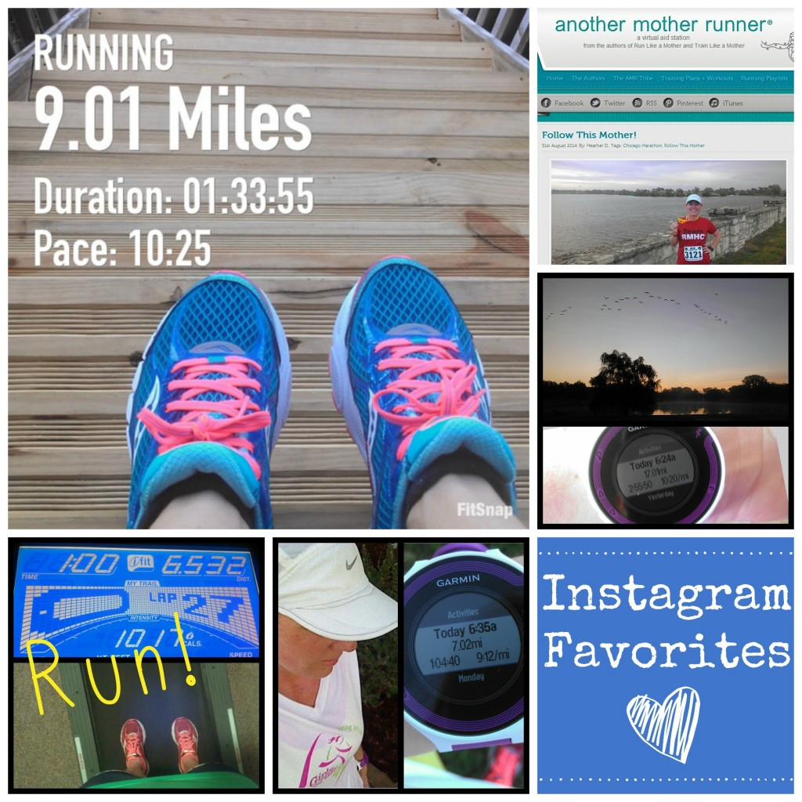
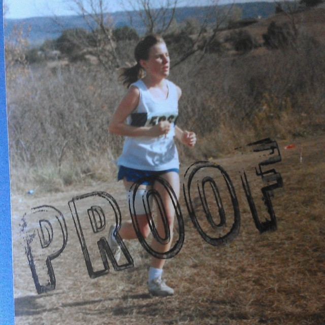
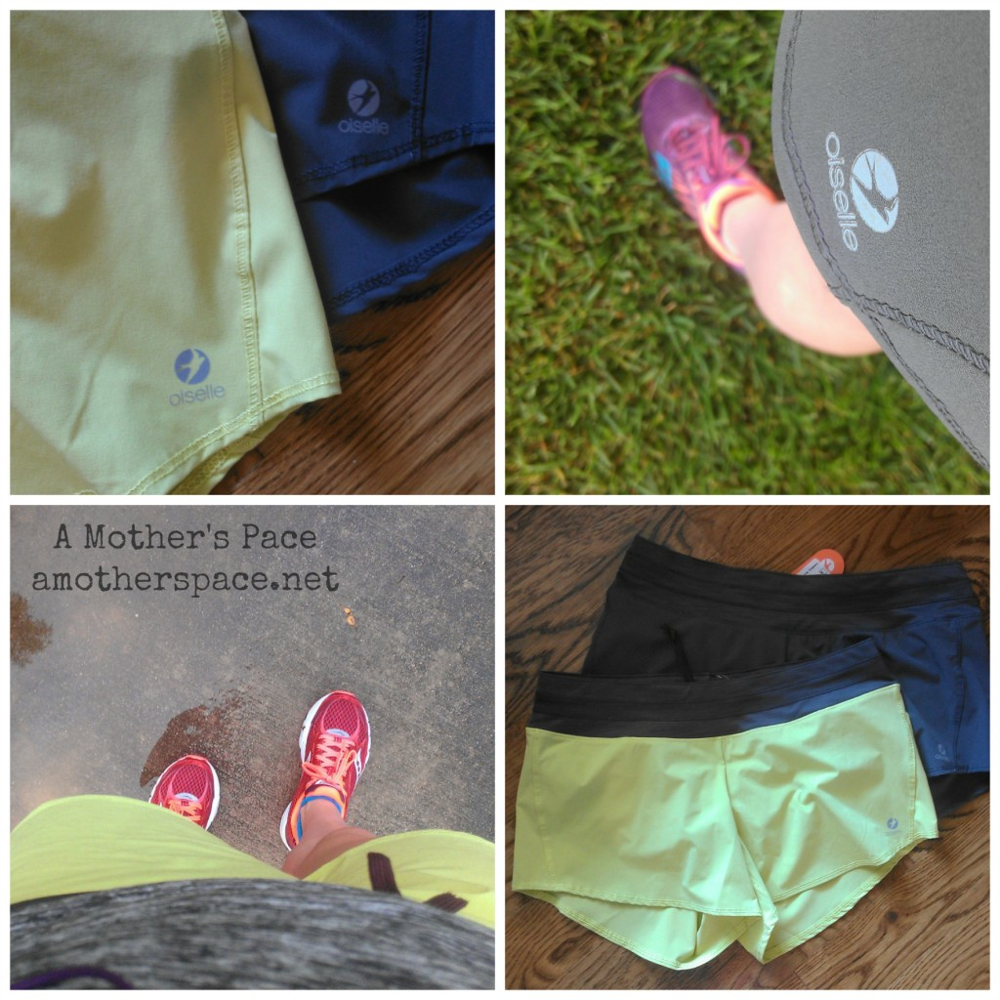
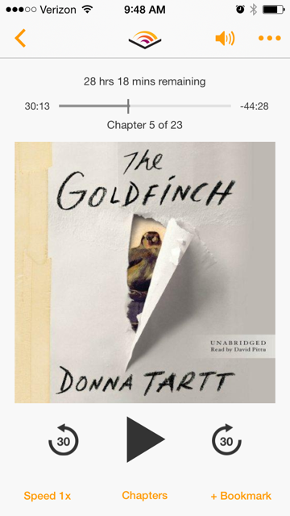

It's been a few weeks since I've done a Friday Favorites post. I have a lot of favs right now so I'll jump right in.

## Instagram

\[one\] I recently made the switch from Android to iPhone and I'm loving all the new apps that are now available to me. I've been playing around a little on Instagram lately. Fitsnap is one of my favorites! \[two\] I was recently featured on the Another Mother Runner website in Sarah and Dimity's Follow That Mother series. Read more ---> [here](http://amotherspace.net/2014/09/follow-that-mother/ "Follow That Mother!"). \[three\] I'm running in the early morning still and lately that means I'm seeing some pretty spectacular sunrises. \[four\] It always amazes me when I can run a pace for 7 miles (or more) when sometimes that exact same pace is impossible for 3 miles. \[five\] I've had a few treadmill miles lately and they've been tough. I'm slowly getting used to it again because I'm guessing I'll be on it a lot over the winter.

Follow me on Instagram ----> [here](http://instagram.com/amotherspace).

## Flashback Friday

I stumbled upon this oldie but goodie recently from my high school cross country days. This particular photo was taken during a state championship and I believe I placed dead last. My injury on my leg was killing me and the only reason I didn't drop out was because our little team of 5 needed everyone to cross the finish line in order to place as a team. Little did I know that one of my other teammates dropped out of the race earlier! I'm glad I finished though. I specifically remember people clapping for me at the finish line and besides being completely embarrassed, I was proud that I finished.

## Interesting Reads

[Meatless Monday: Risotto Primavera](http://thefitfoodiemama.com/meatless-monday-risotto-primavera/?utm_content=bufferc0c73&utm_medium=social&utm_source=twitter.com&utm_campaign=buffer) by Annmarie at The Fit Foodie Mama

[Balancing your Running Goals](http://wholesomelyfit.com/balancing-running-goals/?utm_content=buffer0e6e1&utm_medium=social&utm_source=twitter.com&utm_campaign=buffer) by Bryanna at Wholesomely Fit

[Train Your Brain to Run Your Best](http://www.runladylike.com/2014/09/02/give-mental-training-boost/?utm_content=buffer70fb2&utm_medium=social&utm_source=twitter.com&utm_campaign=buffer) by Jesica at Runladylike

[Guest Post: Strength Training by Ariana](http://runninghutch.com/course-of-action/training-crossfit/guest-post-strength-training-ariana/?utm_content=buffer1d0bd&utm_medium=social&utm_source=twitter.com&utm_campaign=buffer) over on Matters of Course

[FlipBelt Made Me a Better Mom](http://vitatrain4life.com/flipbelt-made-me-a-better-mom/?utm_content=buffera8eb4&utm_medium=social&utm_source=twitter.com&utm_campaign=buffer) by Allie on Vita Train for Life

## Favorite Running Gear

 

Hands down, my favorite running shorts are the [Oiselle Rogas](http://amzn.to/1pEBiBR). (affiliate link) Until buying these I was wearing inexpensive shorts that were for the most part purchased at Target. I had no idea how nice a pair of shorts that actually fit well could be. Ever since I purchased these it's been hard to pull out my old shorts and when I do I'm constantly tugging on them. I don't think the old ones will last much longer in my rotation!

I also purchased the [Winona Tank](http://amzn.to/1pZuRXh) and I'm a big fan of that as well. The fabric is so soft that I almost feel like it shouldn't be a workout shirt!

## Currently Reading

Marathon training is the perfect time to listen to an audio book. I'm currently making my way through The Goldfinch by Donna Tartt. I only listen to it while I'm running so it's a great motivator to get me out the door. I had heard that it was a really good book but I didn't know anything about it before I started listening. Needless to say, I'm hooked.

 

 

## Favorite Quotes

“There are far, far better things ahead than any we leave behind.” \- C. S. Lewis 

 

 

 

 

I'm running the Chicago Marathon with Team RMHC!

To find out more read my post about [Running for Charity](http://amotherspace.net/2014/06/the-chicago-marathon-running-for-charity/) or head over to my [fundraising page](http://www.kintera.org/faf/donorReg/donorPledge.asp?ievent=1097960&supId=399266070) to make a donation.

——————————-

Find A Mother’s Pace on…

Twitter [@amotherspace3](https://twitter.com/amotherspace3)

Facebook [amotherspace3](http://facebook.com/amotherspace3)

Instagram [amotherspace](http://instagram.com/amotherspace)

Pinterest [amotherspace](http://pinterest.com/amotherspace/)

Bloglovin’ [A Mother’s Pace](http://www.bloglovin.com/en/blog/6680087)

RSS [amotherspace](http://feeds.feedburner.com/amotherspace)
