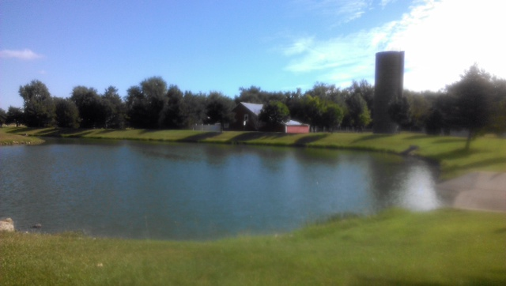
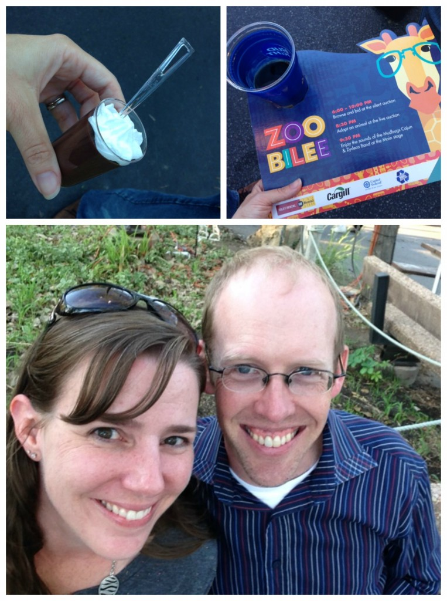
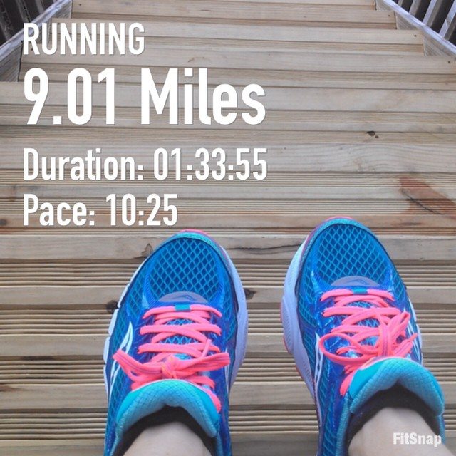
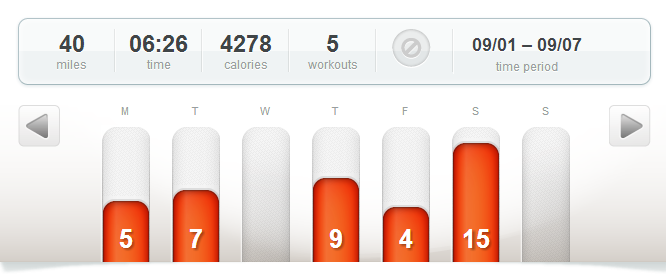

Finally the cooler mornings of fall are here! Running has been hard this summer. A lot of my easy paces lately have been a lot slower than I was used to over the winter. I felt like I was possibly slowing down overall, which could definitely happen, I _am_ getting older. With 3 children 4 and under it's been awhile since I've had a complete year of running without a pregnancy break. I guess I just forgot how tough it is to run in the summer and how great it feels when the speed and love of the run comes back with the cooler temps.

 

 

My long run of the week is an excellent example. I set out to run when it was 61 degrees F outside. That's about 15-20 degrees cooler than I'm used to running in lately. It felt wonderful to be out in the cool breeze. My goal for the run was to keep an average pace just under the 10 minute mile. I've done this before on long runs over the summer but usually it's when the plan calls for a certain amount of race pace miles. And it was always tough. Most of my long runs have been around a 10:30 average pace.

I'm okay with running slower for long runs because I see the importance in varying pace for different kinds of workouts. But on Saturday, when I started, I was running under a 10 minute mile as my warm up and then increased the pace to 9:30. I just decided to run easy (it really felt easy!) and take advantage of the cool weather. The entire run was between a 9:28 and a 9:56 pace and it felt great the whole time. My average pace at the end of the run was 9:41.

I can't wait to see what I can do on marathon day. Now the Chicago weather just has to cooperate!

After my long run on Saturday my husband and I went to our local zoo's annual fundraiser that evening. We've been to Zoobilee a couple of times over the years and it never disappoints! It's the only day of the year that the zoo is closed. They have a ridiculous amount of restaurants that come in and set up booths of food and alcohol. Then they open the gates in the evening for a silent and live auction along with several bands and D.J.'s throughout the zoo.

 

 

Let's just say it's a dangerous event to go to on the same day as a long run. I didn't feel guilty about a thing I ate though. As we walked in the door they gave us little cardboard tables to carry. The cups fit in nicely and it was very convenient to put plates of food on as we walked around. My favorite dessert was the chocolate mousse shown above. I just enjoyed it all and had a fantastic date night with my husband!

The hardest thing about the night was being on my tired legs for hours. I wore my compression sleeves under my jeans and they helped a lot. #runnerprobs

 

## **Weekly Workouts**

Chicago Marathon Training: Week 13

**Monday:** 5.02 miles (9:22 pace)

A vacation day plus cooler weather (finally!!) meant that I was able to take a mid morning run with a nice cool breeze. My training plan said 4-5 miles easy and I ended up running the 5 because the run was going so well.

**Tuesday:** 6.53 miles (9:11 pace)

My phone app said that there was lightning in the area so I decided to stay in for my early morning run. The treadmill was tough and I only managed 6.5 miles before I had to stop to get ready to take the kids to school. With school starting up again I'm going to have to get up a lot earlier to get these miles in!

**Wednesday:** Rest

**Thursday:** 9.01 miles (10:25 pace)

Today I accomplished 9 miles before taking the kids to school. It meant waking up earlier than usual and running in the dark but it was worth it to get the miles in.

 

 

**Friday:** 4.02 miles (9:30 pace)

The humidity is down this week and running just feels easier outside. I'm running a faster pace but it still feels like an 'easy' run. Fall running is the best!

**Saturday:** 15.10 miles (9:41 pace)

I definitely had a runner's high after this one today!

**Sunday:** REST

 

 

 

One of my main goals for 2014 is to Run This Year in kilometers. That's 2,014 kilometers or 1,251.44 miles.

Weekly Running Miles: 39.68

September Running Miles: 39.68

2014 Running Miles: 984.53

2014 Running Kilometers: 1584.45

 

**How is your running going lately?**

 

\_\_\_\_\_\_\_\_\_\_\_\_\_\_\_\_\_

I’m running the Chicago Marathon with Team RMHC!

To find out more read my post about [Running for Charity](http://amotherspace.net/2014/06/the-chicago-marathon-running-for-charity/) or head over to my [fundraising page](http://www.kintera.org/faf/donorReg/donorPledge.asp?ievent=1097960&supId=399266070) to make a donation.

——————————-

Find A Mother’s Pace on…

Twitter [@amotherspace3](https://twitter.com/amotherspace3)

Facebook [amotherspace3](http://facebook.com/amotherspace3)

Instagram [amotherspace](http://instagram.com/amotherspace)

Pinterest [amotherspace](http://pinterest.com/amotherspace/)

Bloglovin’ [A Mother’s Pace](http://www.bloglovin.com/en/blog/6680087)

RSS [amotherspace](http://feeds.feedburner.com/amotherspace)
