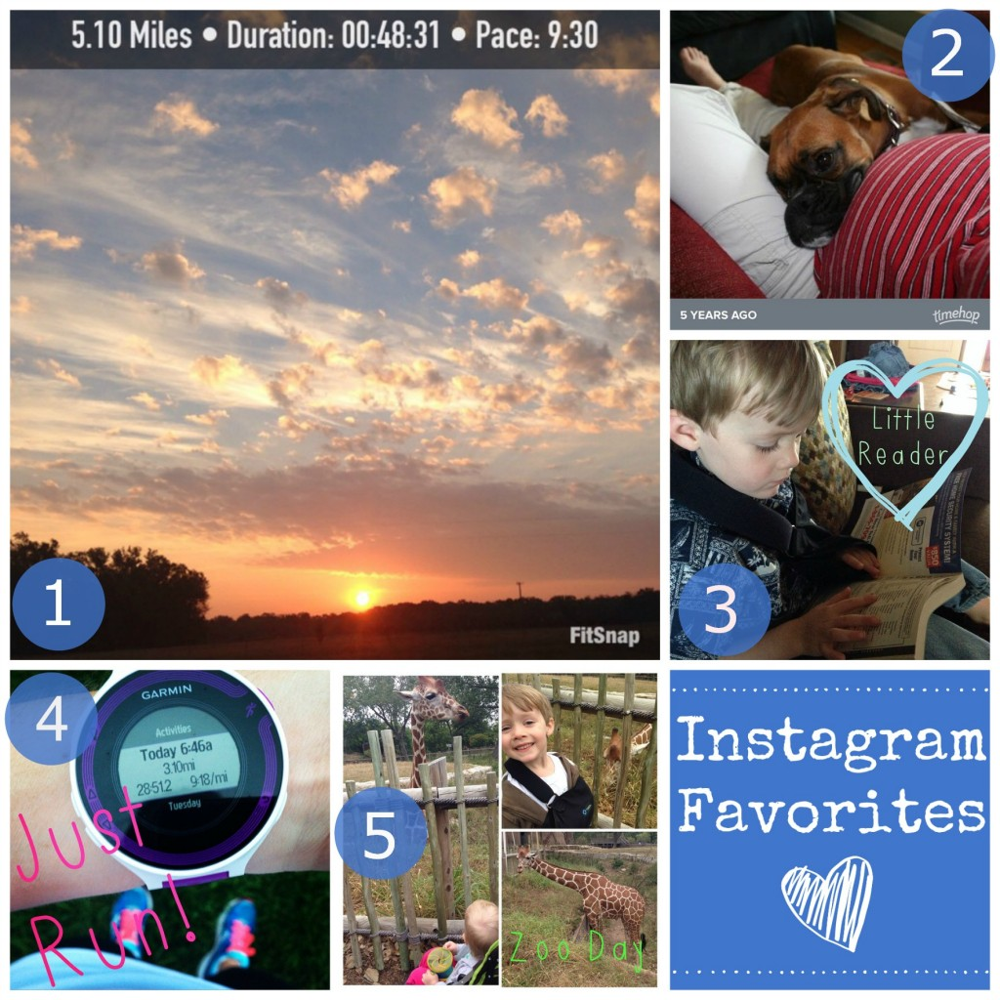
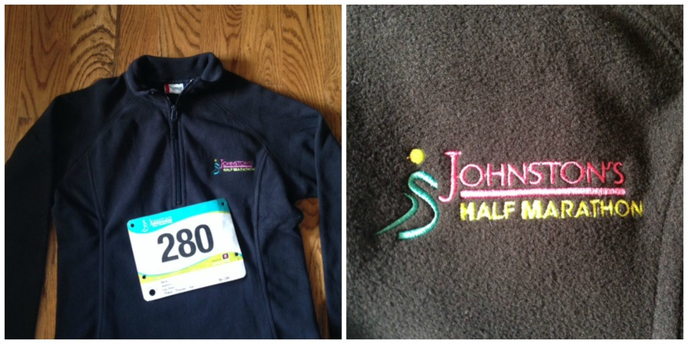
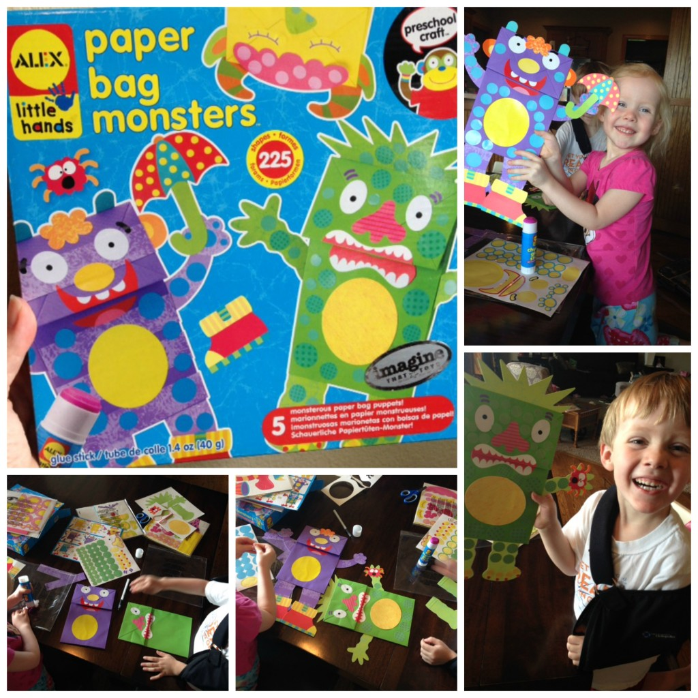

TGIF! Friday is here and so is fall. The cooler weather came in this week and I couldn't be happier about it! There's just something about running in the fall when the air is cool and crisp. Our summer hasn't even been too hot for that long but the humidity has been killing me. And now that cooler weather is here...it's almost time to add soup into my weekly menu plan!

Enough gushing about the weather and instead moving on to my Friday Five: Favorites of the Week.

## \[One\] Instagram

\[one\] Early morning running means catching fantastic sunrises. \[two\] Timehop: a favorite app of mine since I switched over to an iPhone. I love getting pics like these sent to me each day. Our dog, Mika, lived too short of a life and I miss her like crazy but seeing pictures like this one make me smile. She loved my pregnant belly! \[three\] So, earlier in the week I caught my eldest reading...the phone book! He'll really read anything, he loves it so much. \[four\] Just run! Need I say more? \[five\] Cooler weather means more trips to the zoo. We were so close to the giraffes this week!

Follow me on Instagram ----> [here](http://instagram.com/amotherspace).

## \[Two\] Interesting Reads

[Five Ways to Stop Negative Thoughts in Their Tracks](http://familysportlife.net/stop-negative-thoughts/?utm_content=buffer0cf9d&utm_medium=social&utm_source=twitter.com&utm_campaign=buffer) by Tara over at Family Sport Life.

[10 Lessons Learned While Running 100 Marathons](http://dailyburn.com/life/fitness/lessons-learned-running-100-marathons/?utm_content=buffer7de8e&utm_medium=social&utm_source=twitter.com&utm_campaign=buffer#.VA81F7_53kc.twitter) over on Daily Burn.

[5 Lessons Learned on My Bike](http://www.momslittlerunningbuddy.com/2014/09/Cycling-Lessons.html?utm_content=buffer4b28a&utm_medium=social&utm_source=twitter.com&utm_campaign=buffer) by Katie from Mom's Little Running Buddies

[Crockpot Meatballs](http://www.theleangreenbean.com/crockpot-meatballs/?utm_content=buffer9c0f4&utm_medium=social&utm_source=twitter.com&utm_campaign=buffer) from Lindsay at the Lean Green Bean.

[Amp Up Your Workout With Kettlebells](http://fitfluential.com/2014/09/amp-up-your-workout-with-kettlebells/?utm_content=buffer78990&utm_medium=social&utm_source=twitter.com&utm_campaign=buffer) over on Fitfluential.

[27 Tips to Get a Great Race Day Photo {or at least not awful}](http://www.runtothefinish.com/2014/09/27-tips-for-a-good-race-day-photo.html?utm_content=buffer19827&utm_medium=social&utm_source=twitter.com&utm_campaign=buffer) by Amanda at Run to the Finish

[The 22 Best TED Talks for Fitness, Health and Happiness Inspiration](http://greatist.com/health/TED-talks-inspiration?utm_content=bufferdbd3f&utm_medium=social&utm_source=twitter.com&utm_campaign=buffer) from Greatist

## \[Three\] What Would You Do?

My dilemma: I have a 20 miler scheduled for this weekend but I have signed up for the Johnston's Half marathon instead. What do I do? Tack on some warm up miles and then finish out the 20 after the race? Run 20 miles the following week? (I have 15-17 on the plan for next weekend.) Skip it completely?

I'm hesitant to skip it completely. I've already done 2 20 milers during this training cycle and I really want to do a 3rd. I'm leaning towards running a mile or two as a warm up and then finishing what I can after the race. What would you do?

Isn't the fleece nice that we get for signing up for the race? It's the first year that they've made a women's cut and it fits perfectly!

## \[Four\] Life Lately

One of the items that we won during the silent auction at [Zoobilee](http://amotherspace.net/2014/09/chicago-marathon-training-week-13/ "Chicago Marathon Training: Week 13") last weekend was this Paper Bag Monster Kit from Alex Toys. This was a big hit at our house. They were easy enough to put together with just a little help from me and the kids loved getting creative with them. This is something that I probably never would have just bought for the kids but when I saw it at the auction I thought it looked like fun. And it helps that I was able to support our zoo at the same time!

## \[Five\] Something to Look Forward to

The Chicago Marathon, of course! 29 nine days to go!

 

 

\_\_\_\_\_\_\_\_\_\_\_\_\_\_\_\_\_\_\_

 

I'm running the Chicago Marathon with Team RMHC!

To find out more read my post about [Running for Charity](http://amotherspace.net/2014/06/the-chicago-marathon-running-for-charity/) or head over to my [fundraising page](http://www.kintera.org/faf/donorReg/donorPledge.asp?ievent=1097960&supId=399266070) to make a donation.

——————————-

Find A Mother’s Pace on…

Twitter [@amotherspace3](https://twitter.com/amotherspace3)

Facebook [amotherspace3](http://facebook.com/amotherspace3)

Instagram [amotherspace](http://instagram.com/amotherspace)

Pinterest [amotherspace](http://pinterest.com/amotherspace/)

Bloglovin’ [A Mother’s Pace](http://www.bloglovin.com/en/blog/6680087)

RSS [amotherspace](http://feeds.feedburner.com/amotherspace)
