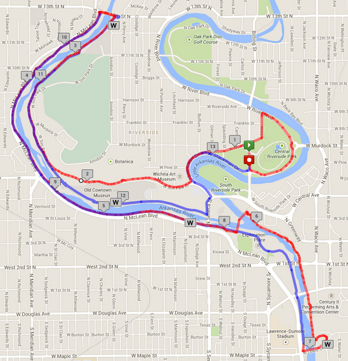
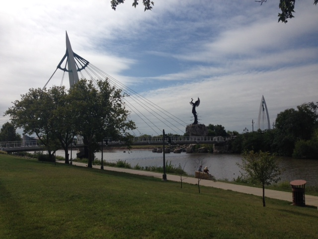
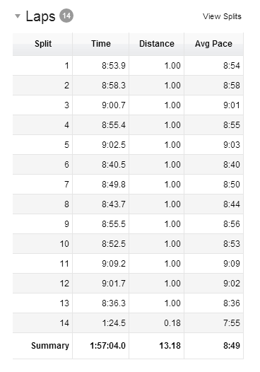
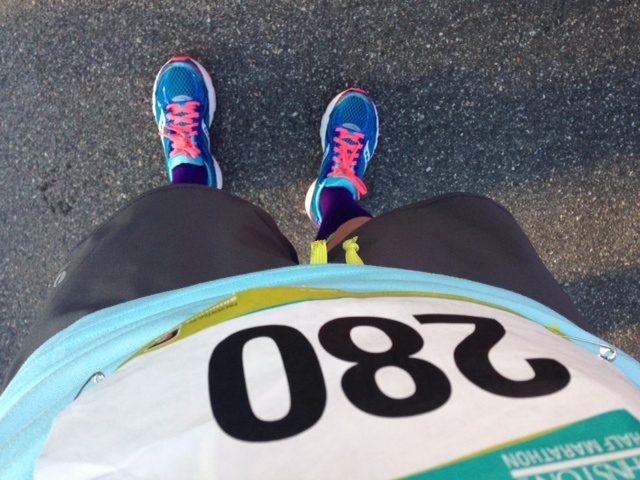
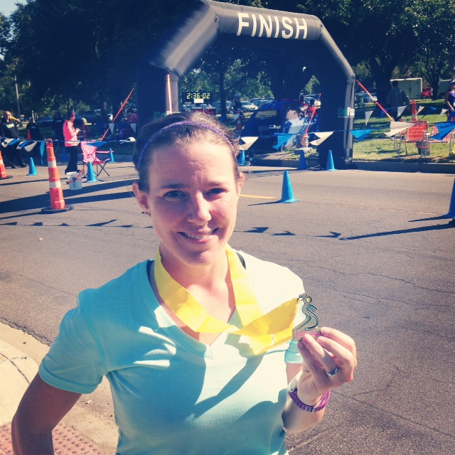

Have you ever had a race day that came together perfectly from start to finish? I've had fun races and great races for a variety of reasons but I've never had that one perfect race. That is until now.

On Sunday I woke up early to get ready for the Johnston's Half Marathon, a local race here in Wichita, KS. My husband and kids were coming along to spectate and so we had to get everyone out the door by 7:00 and shockingly we were in the car precisely at 7 a.m.

We arrived at the start line about 30 minutes before the start so we wondered over to a little outside zoo nearby so that I could warm up and the kids could eat their breakfast. A few dynamic stretches later and I was ready to go.

 

 

As the runners lined up for the start, I kissed my family goodbye and joined the racers. It was not a huge race, only 229 finishers, so the start line was laid back. Pretty soon the countdown was on and we were off.

This course is one of my favorites and goes through the Riverside area that I used to live in back when I was single. I've ran a lot of miles in this part of town and I love reminiscing about it during races.

 

 

This entire race was either by the river on the bike paths or in a tree covered area in the park. It's arguably the prettiest area of Wichita and my favorite place to run. For those reasons alone I will try and run this race every year even if I don't specifically train for the half. This year it didn't hurt anything that the weather was perfect as well. At race start it was 55 degrees and I don't believe that it got much above 60 by the time I finished running.

 

\[caption id="attachment\_2749" align="aligncenter" width="640"\] The Keeper of the Plains bridge that we ran over during the race.\[/caption\]

 

During this race I tried to stay in a zone and just enjoy my surroundings as they happened. I glanced down at my watch occasionally and often found that I was well under my goal pace of 9:05 per mile. This was my first race with my new [Forerunner 220](http://amotherspace.net/2014/08/forerunner-220-mini-review-week-11-chimarathon-training/ "Forerunner 220 Mini Review + Week 11 #ChiMarathon Training") and I have to say that I loved it during the race. Being able to see my average pace for the mile that I was actually running was so helpful. Between that and looking at my overall average pace I knew exactly how I was doing on my goal.

 

Mile 6 was my fastest and it was no coincidence that happened during the same mile that I saw my family. Giving them high fives and seeing them cheer for me gave me a huge burst of energy. I was feeling great at this point in the race and my speed just naturally increased.

For this race I packed two Honey Stinger Vanilla Gels and only ended up eating one in the 10th mile. I also relied on the water stops and did not carry my handheld like I normally do. I don't want to carry water during the Chicago Marathon and this was the test run to try it out. Normally I don't like slowing down at the water stops and I'm not coordinated enough to drink from a cup and run at the same time. So during this race I just slowed to a walk for a few steps to get a small drink and then I was able to get right back into my pace. It gave me the confidence to leave my handheld at home and feel o.k. about relying on the Chicago water stops.

 

 

There were so many times while I was down by the river or running on the path by all the trees that I wanted to stop and take a picture. I was so tempted to try and get out my phone and take a shot while running but I kept it in my FlipBelt. It was a beautiful day out but I don't have many photos to show for it!

My plan was to run the race around my goal pace (9:05) and then kick it in gear during the last two miles if I felt good about it. I was under my goal pace by quite a lot and decided that I would just run what felt easy (about a 8:5x pace) and then speed up in the last two miles. The problem with this was that I was so completely in a zone that I didn't even realize I was in the last mile of the race until it was almost half way over. At that point I sped up because I was just coasting along. This means that maybe I'm not done with the PR's yet!

What amazes me about this race and what makes it the 'perfect' race for me was that at no time did I feel like I couldn't meet or exceed my goal. My goal being, of course, that I wanted to finally run a sub-2 half marathon. I know it had a lot to do with the weather and the fact that I am training for a marathon which means running long miles every weekend. But the biggest key to this PR was my mental training for the race. I'm working on a post that I'll publish soon to share what has been helping me with the mental side of running.

So, yes, you read that right. I crushed my previous half marathon best by over 5 minutes and set a huge PR on this course. I finally, after 8 half marathons, have raced one in under 2 hours. It is huge for me and I even got a little emotional after I crossed the finish line.

 

\[caption id="attachment\_2748" align="aligncenter" width="577"\] Source: [Running Connection](https://www.facebook.com/RunningConnection?ref=br_tf)\[/caption\]

 

Official Distance: 13.1 miles

Forerunner 220 Distance: 13.18 miles

Official Time: 1:57:02

Forerunner 220 Time: 1:57:04

Official Average Pace: 8:56

Forerunner 220 Average Pace: 8:53

Age Placement: 6 out of 27

Overall Placement: 88 out of 229

14 in 2014: Race #11

 

**Have you had a race or a run lately where everything came together for that perfect run?**

 

\_\_\_\_\_\_\_\_\_\_\_\_\_\_\_\_\_

I’m running the Chicago Marathon with Team RMHC!

To find out more read my post about [Running for Charity](http://amotherspace.net/2014/06/the-chicago-marathon-running-for-charity/) or head over to my [fundraising page](http://www.kintera.org/faf/donorReg/donorPledge.asp?ievent=1097960&supId=399266070) to make a donation.

——————————-

Find A Mother’s Pace on…

Twitter [@amotherspace3](https://twitter.com/amotherspace3)

Facebook [amotherspace3](http://facebook.com/amotherspace3)

Instagram [amotherspace](http://instagram.com/amotherspace)

Pinterest [amotherspace](http://pinterest.com/amotherspace/)

Bloglovin’ [A Mother’s Pace](http://www.bloglovin.com/en/blog/6680087)

RSS [amotherspace](http://feeds.feedburner.com/amotherspace)
