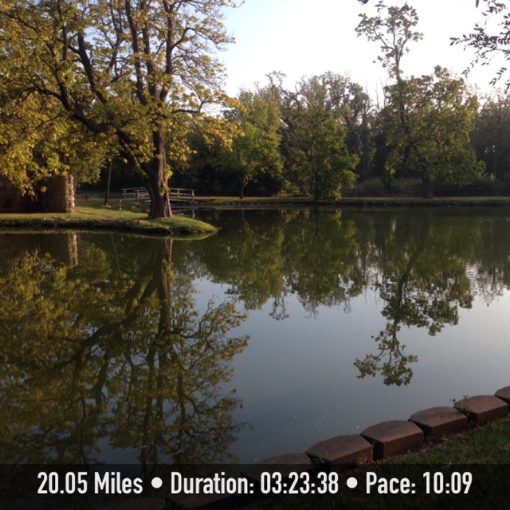
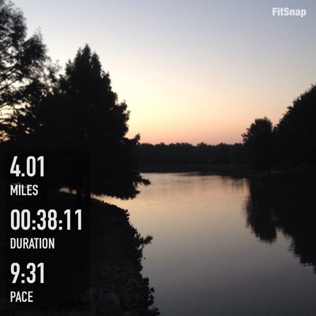
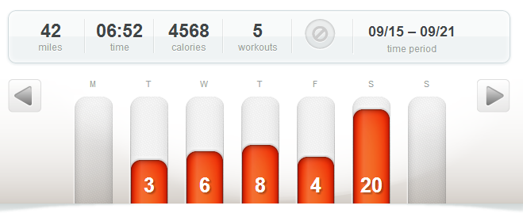

Peak week is over and now it's taper time!

My 3rd 20 miler of this training cycle was one of my toughest runs lately. I'm sure it had a lot to do with the fact that I had just raced a half marathon a few days before it and it was pretty warm outside too. It was a mental struggle the entire run. I constantly was trying to think of excuses not to finish the run. I had a few times when I knew my husband was out driving with the kids and he could have picked me up very easily. I was so close to giving in but I stuck with it and accomplished the 20 miles.

 

 

Somehow for this run I had forgotten all the tips and tricks of positive thinking that I've been working on for months. It is definitely a work in progress and I need to spend more time with it.

Keep reading below to find out how the rest of my training went for week 15.

 

 

## **Weekly Workouts**

Chicago Marathon Training: Week 15

**Monday:**  REST

I thought about cross training but ended up deciding that a morning of sleeping in and completely resting would probably be a good idea after my race yesterday. I just pushed all my running back one day to fit in this extra rest day.

**Tuesday:**  3.18 miles (10:02 pace)

My quads were not happy with me on my morning run today. Still sore from the speedy half marathon over the weekend but they felt much better by the time my run was over.

**Wednesday:** 6.2 miles (9:57 pace)

My training plan said 5-6 and running, although my legs were still tired, felt good and so I decided to complete the longer portion of the plan. This is peak week after all!

**Thursday:**  8.3 miles (9:20 pace)

I had grand plans for this workout but it didn't work out this time around. My plan called for 1-2 warm up miles followed by 5-6 tempo miles and ending with 1-2 cool down miles. According to McMillan Running, my tempo pace should be 8:23-8:37. I started with 2 warm up miles and then ran an 8:38 for my 3rd mile. My legs were still tired from the half marathon on Sunday but I thought they would be o.k. The 4th mile was 8:46 and I knew at that point that I needed to be smart about this workout and stop the tempo right then. 8:46 was hard, really hard and I had to keep in mind that I was supposed to run 20 miles in two days. My goal changed to keeping it in my marathon pace range (9:23, 9:48, 9:23) and then I ended in a cool down mile.

**Friday:**  4.01 miles (9:31 pace)

I had a nice little progression run this morning (9:56, 9:43, 9:19, 9:05) on a new morning route. I was able to take a nice path around this lake 3 times and head home to meet my 4 mile goal.

 

**Saturday:**  20.05 miles (10:09 pace)

Ugh. It's over. It's a little funny how I'd been looking forward to this run all week and then it ended up being such an awful one.

**Sunday:** REST

 

 

One of my main goals for 2014 is to Run This Year in kilometers. That's 2,014 kilometers or 1,251.44 miles.

Weekly Running Miles: 41.64

September Running Miles: 112.00

2014 Running Miles: 1056.85

2014 Running Kilometers: 1700.84

 

 

 

**Have you ever wanted to bail on a run and call for a ride home?**

 

\_\_\_\_\_\_\_\_\_\_\_\_\_\_\_\_\_

I’m running the Chicago Marathon with Team RMHC!

To find out more read my post about [Running for Charity](http://amotherspace.net/2014/06/the-chicago-marathon-running-for-charity/) or head over to my [fundraising page](http://www.kintera.org/faf/donorReg/donorPledge.asp?ievent=1097960&supId=399266070) to make a donation.

——————————-

Find A Mother’s Pace on…

Twitter [@amotherspace3](https://twitter.com/amotherspace3)

Facebook [amotherspace3](http://facebook.com/amotherspace3)

Instagram [amotherspace](http://instagram.com/amotherspace)

Pinterest [amotherspace](http://pinterest.com/amotherspace/)

Bloglovin’ [A Mother’s Pace](http://www.bloglovin.com/en/blog/6680087)

RSS [amotherspace](http://feeds.feedburner.com/amotherspace)
