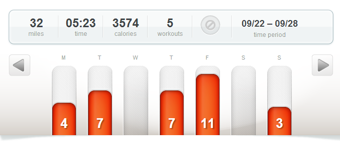
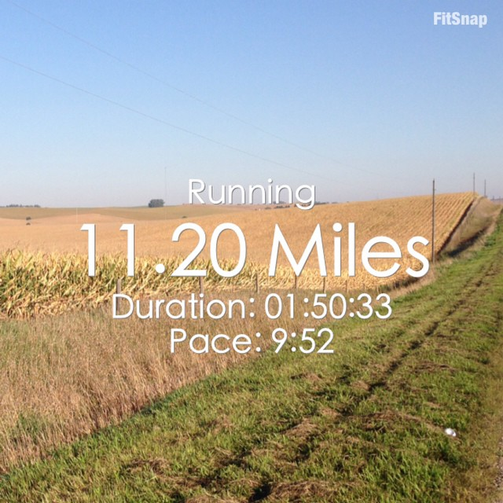
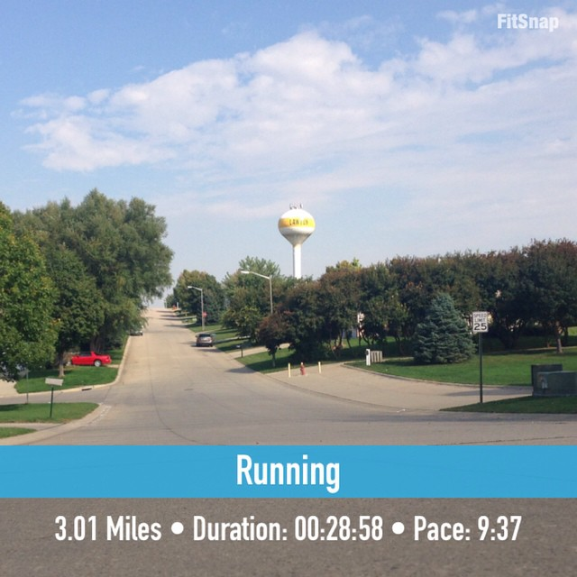

I'm now less than one week out from the Chicago Marathon. ONE WEEK! I'm feeling strong, positive and excited about this race.

I'm not experiencing any 'Taper Crazies' at all this time around. I think life has been so busy that any extra time that I might have from running less is being filled with other things that need to be accomplished. I'm spending this week planning out race weekend. I'm getting organized and packed for the trip. But most importantly I'm spending time MENTALLY preparing for race day.

I am by far a Cubs fan when it comes to baseball but I am from Kansas so I'm rooting for the Royals in the post season this year. Have you seen these guys play yet? The games so far have been full of extra innings, drama and late nights. I decided early on though that I can't throw away my marathon training at this point to watch baseball. As much as I would like to stay up and catch the end of the game, I still have to wake up at 5 in the morning to run.

And the running has been going well. The cooler weather is fantastic and it makes me hope for the perfect race day weather. I'll continue to stalk my Weather Bug app as the week continues!

 

It's been two weeks since I've posted a training update so I'm doubling up this week.

## **Weekly Workouts**

**Chicago Marathon Training: Week 16**

**Monday:** 4.02 miles (10:01 pace)

**Tuesday:**  7.10 miles (10:24 pace)

**Wednesday:** Rest

**Thursday:**   7.01 miles (9:54 pace)

**Friday:**  11.20 miles (9:52 pace)

I ran my long run early this week while traveling. The country roads of Iowa are beautiful this time of year and much hillier than I am used to running!

 

 

**Saturday:**   Rest

**Sunday:** 3.01 miles ( 9:37 pace)

I took advantage of the hills in Iowa for a hill repeat workout today. It felt great and I just concentrated on the Columbus Street Bridge the entire time.

 

 

**Chicago Marathon Training: Week 17**

 

**Monday:** Rest

**Tuesday**: 8.15 miles (9:41 pace)

**Wednesday**: 3.05 miles (9:55 pace)

**Thursday**: 6.01 miles (9:53 pace)

**Friday**: 3.05 miles (9:44 pace)

**Saturday**: 10.30 miles (9:52 pace)

My last 'long' run before the marathon. It's so funny how your perspective changes during marathon training. 10 miles at the beginning seemed so long but now these double digits seemed like a shorter run.

**Sunday**: Rest

 

One of my main goals for 2014 is to Run This Year in kilometers. That's 2,014 kilometers or 1,251.44 miles.

Weekly Running Miles: 32.34/30.56

October Running Miles: 22.41

2014 Running Miles: 1,119.75

2014 Running Kilometers: 1,802.06

 

 

 

**How do you handle taper week?** 

\_\_\_\_\_\_\_\_\_\_\_\_\_\_\_\_\_

I’m running the Chicago Marathon with Team RMHC!

To find out more read my post about [Running for Charity](http://amotherspace.net/2014/06/the-chicago-marathon-running-for-charity/) or head over to my [fundraising page](http://www.kintera.org/faf/donorReg/donorPledge.asp?ievent=1097960&supId=399266070) to make a donation.

——————————-

Find A Mother’s Pace on…

Twitter [@amotherspace3](https://twitter.com/amotherspace3)

Facebook [amotherspace3](http://facebook.com/amotherspace3)

Instagram [amotherspace](http://instagram.com/amotherspace)

Pinterest [amotherspace](http://pinterest.com/amotherspace/)

Bloglovin’ [A Mother’s Pace](http://www.bloglovin.com/en/blog/6680087)

RSS [amotherspace](http://feeds.feedburner.com/amotherspace)
