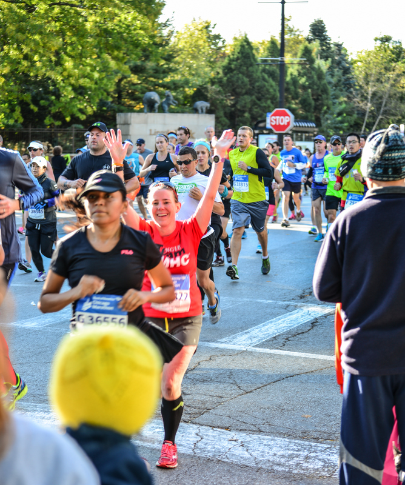
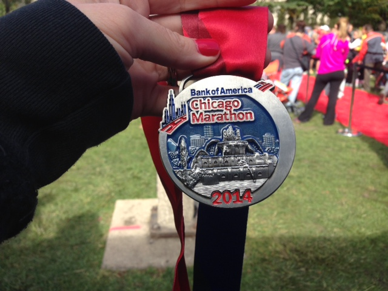

Wow, how do I put into words the entire experience of the Chicago Marathon? It was an amazing day and a dream come true.

The day started out with my sister and I waking up in a hotel room less than a mile away from the start line. She was fantastic and went out to get a bagel, peanut butter and coffee for me to fuel my 26.2+ miles for the day. She also surprised me by wearing a shirt they had made for me. My entire cheer crew wore these!

 

 

Once we were ready we headed out and walked to the Ronald McDonald Charity tent. I'm going to write an entire post about running for this charity so I'm skipping over this part right now. In short, if you've ever considered running the Chicago Marathon with Team RMHC...do it! It was AMAZING!

I made my way to Corral G. It was the perfect running weather. Low 50's and no wind. Just beautiful. Corral G wasn't crowded at all and everything went very smoothly until the start of the race. Once the second wave started we just started walking until we arrived at the start line. It took almost 10 minutes.

 

 

I spent this time just enjoying the crowd and trying to be in the moment. I was not nervous at all about the race at this point. In fact, I was never nervous about the race at all. I was excited and ready to run. I completely think that my mental preparation for the race helped tremendously with the nerves.

And then we were off. It was crowded at the beginning but I just conserved energy and avoided swerving in between people. Once we came out from the first tunnel the crowds were ROCKING and they didn't stop the entire course. I didn't wear headphones during this marathon because I wanted to soak in the crowds and they did not disappoint! I kept looking at the people and the huge buildings and I almost got emotional. Almost, though, I had to stay focused and not fall apart in the first mile! One of my favorite signs that I noticed early on was 'Slow down! I'm trying to count everyone!'

 

\[caption id="attachment\_2812" align="aligncenter" width="634"\] Photo Credit: [Photogenic Chicago](http://photogenicchicago.com)\[/caption\]

 

 

My family was waiting for me in the 5th mile and just knowing they were going to be there was a huge lift for me. When I saw them I stopped for high 5's and some kisses and then was off again with extra energy. I had written my plan for seeing my family on my arm along with when I wanted to take in fuel so that I wouldn't have to think about anything. This ended up working out so well. I've never written down my fuel like that and it helped me stay on track.

 

\[caption id="attachment\_2807" align="aligncenter" width="640"\] L: left | F: fuel | R: right\[/caption\]

 

## BELIEVE | BE GRATEFUL | BE BOLD

My mantra for Chicago. You can train extensively for a race and still when it comes down to race day you have to BELIEVE that your goal is achievable. My number one goal was to enjoy myself and finish strong. I believed that I could do this and that helped push me to the finish line. I'm incredibly GRATEFUL that I have the ability to run. So many of the children that are involved with the Ronald McDonald House Charities are not able to do the activities that they want to do because of illness. I ran for those children and with thoughts of [my niece](http://amotherspace.net/2014/06/the-chicago-marathon-running-for-charity/ "The Chicago Marathon: Running for Charity") and how grateful I am that she is doing well now. The last few miles I wanted to BE BOLD. I didn't train for months not to have a strong finish and having this thought in my head helped to keep me centered.

At some point after this I saw some spectators with several little trampolines just jumping away and cheering everyone as they ran by. So. Much. Fun. Really, Chicago was just one big party that morning. I hope to go back and spectate the race one day. I had my name on the front of my shirt so people would say, 'Looking strong, Angie' or one lady, as I ran by, said, 'Angie!' When I turned around to look at her she pointed to me and said, 'I see you!' and I just pointed right back at her and said, 'I see you too!'

As I was running along in mile 7 I came across some people creating a barrier in the middle of the road. I wasn't sure what was going on until I saw someone performing CPR on a man. It was very hard to see that and I looked away immediately. I just said a prayer for him and thoughts of him stuck with me throughout the race. We looked after the race was finished and found out that he ended up being o.k. I'm so thankful that he is alright!

Before mile 9 I was on the right side of the street because I knew my family was coming up soon. Anytime I was on the side of the road running I would give high 5's to kids that had their hand out. I had a time goal for this race but my main goal was to have FUN. So at the end of mile 8 I was over on the right and ran by a child with an outstretched hand. After I high 5'd him about 8 hands shot up after him (all adults) to high 5 so I just kept going on down the line.

 

\[caption id="attachment\_2816" align="aligncenter" width="530"\] Photo Credit: [Photogenic Chicago](http://photogenicchicago.com)\[/caption\]

 

Mile 9 family stop. More high fives and kisses.

And have you noticed that every time I saw my family my arms went straight up in the air??? I couldn't control it. It just happened. I was so excited to see them and they gave me such a boost!

As much as I wanted to remember every little detail it all tends to blur together a little bit. The most memorable songs that I heard on the course were Eye of the Tiger, I Will Wait, Roar, and Shake It Off. The live music along the way was fantastic as well. Elvis was one of my favorites.

The water stops were so close to each other and very well organized. Some were only a mile apart. They were organized the same way at each stop as well and covered two blocks. First was the First Aid station, next the toilets, third was Gatorade and last was water. I wasn't carrying any hydration so I had told myself ahead of time that I needed to get water at every stop. The only walking I did at all during the race was when I briefly had a water cup in my hands and when I slowed down to give high 5's and kisses to my family. I actually ended up drinking water at all but the last two stops and I also had Gatorade at one of the later stops as well.  Many of the stops were actually very sticky from the Gatorade even though I ran right down the middle.

Another little fact: this was the first year that the marathon had a blue dotted line painted throughout the entire 26.2 miles.

I crossed mile 13.1 in 2 hours and 8 minutes feeling great. It blows me away that this is so much faster than my 1st and second _half_ marathons and yet I was only half way finished with the race. It just goes to show how much a person can improve if they have their mind set to it.

At mile 15 I was supposed to see my family again so I was on the right side of the road. They didn't end up making that checkpoint but I did run into another runner that I knew. Which is pretty amazing considering that I only knew 5 other people running out of the 40,000+ runners out there! We ran together for a little bit but her ankle was hurting and I had to keep my pace if I was going to finish like I had trained.

I started to slow down a bit at mile 18. My watch average pace still read a sub 10 minutes until the end but for most of the race it was around 9:30. Mentally I didn't focus on my sore legs or my aching right foot but I know that these things still slowed me down. My right foot has a callous by the big toe and it was really rubbing wrong during this race. After the race the outside of my foot, my heel and my entire right side hurt and I'm sure this was because the callous made my stride change.

I saw my family one last time somewhere around mile 21. It was just the boost I needed to help me cross the finish line. Definitely the best cheering squad out there!

 

\[caption id="attachment\_2813" align="aligncenter" width="534"\] Photo Credit: [Photogenic Chicago](http://photogenicchicago.com)\[/caption\]

 

I had read about turning onto Michigan Ave. and seeing all the buildings in the distance. For some it's hard because you see how far you still need to run to finish but for others it's easier because the end is in sight. I choose to think positively! I had read an article from Coach Jenny at Runner's World that encouraged me to go fishing on this last long stretch and that's exactly what I did. I picked out a runner ahead and started reeling them in. I passed a lot of people doing this and it helped me to continue to feel strong.

Just before this I had realized how much I was slowing down. I hadn't trained so hard for 18 weeks to give up in the last few miles. I kicked it in gear and finished STRONG. Sure I was hurting but the faster I ran the faster I would cross that finish line.

I ran up the incline to the bridge, turned onto Columbus and saw the finish line. Seeing that finish line was a powerful thing but somehow I kept it together and crossed with my arms up in the air.

4:22:54

I finished almost 8 minutes faster than my goal at the beginning of training. Not to mention that this is a 42 minute PR for me. I was (and still am) super happy with my finish time.

 

\[caption id="attachment\_2814" align="aligncenter" width="534"\] Photo Credit: [Photogenic Chicago](http://photogenicchicago.com)\[/caption\]

 

Official Time: 4:22:54

Garmin Time: 4:23:00

Official Distance: 26.2 miles

Garmin Distance: 26.54 miles

Official Average Pace: 10:02

Garmin Average Pace: 9:54

Overall Place: 18967

Gender Place: 6399

Age Group Place: 1075

 

I can't write this post without a heartfelt thank you to so many people in my life. First and foremost I want to say thank you to my husband. He was there for me all throughout training. He got the kids up almost every morning and started getting them ready for the day. He was also with them while I was out running crazy long distances for hours every Saturday morning. He's my rock and I couldn't have done this race without him by my side.

My kids deserve a huge thank you as well. They were champs the entire busy weekend in Chicago and survived the long two day car ride to get there. It makes me so excited to hear them play 'finish line' games and to see their interest in running.

 

\[caption id="attachment\_2815" align="aligncenter" width="644"\] Photo Credit: [Photogenic Chicago](http://photogenicchicago.com)\[/caption\]

 

Also, a thank you to my sister and brother-in-law. They hosted us this weekend and went way out of their way to make our family of five comfortable in their home. My BIL, a [photographer](http://photogenicchicago.com) in Chicago, took fabulous photos of the marathon and throughout the weekend.

I need to thank everyone back home that was cheering me on from afar. My mom, my dad and my in-laws were all watching on various devices and cheering so loud I could almost hear them from Kansas and Iowa. So many people sent well wishes on Facebook, Instagram, Twitter and this blog. I'm feel extremely blessed to have so much support from those I know and my virtual friends as well.

Lastly, I want to thank those that donated to my cause. As I mentioned above I am writing a separate post about my experience with the Ronald McDonald House Charities. But I would like to say that I was able to exceed my fundraising goal and help our TeamRMHC raise over 1 million dollars!

I think that wraps it up. Thanks for hanging in there and reading this extremely long recap!

 

 

 

\_\_\_\_\_\_\_\_\_\_\_\_\_\_\_\_\_

I’m running I ran the Chicago Marathon with Team RMHC!

To find out more read my post about [Running for Charity](http://amotherspace.net/2014/06/the-chicago-marathon-running-for-charity/) or head over to my [fundraising page](http://www.kintera.org/faf/donorReg/donorPledge.asp?ievent=1097960&supId=399266070) to make a donation.

——————————-

Find A Mother’s Pace on…

Twitter [@amotherspace3](https://twitter.com/amotherspace3)

Facebook [amotherspace3](http://facebook.com/amotherspace3)

Instagram [amotherspace](http://instagram.com/amotherspace)

Pinterest [amotherspace](http://pinterest.com/amotherspace/)

Bloglovin’ [A Mother’s Pace](http://www.bloglovin.com/en/blog/6680087)

RSS [amotherspace](http://feeds.feedburner.com/amotherspace)
