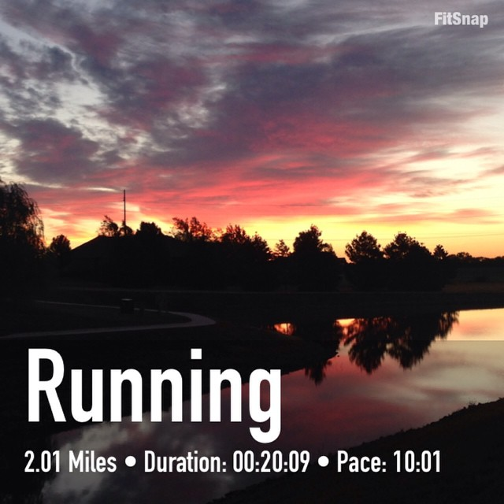
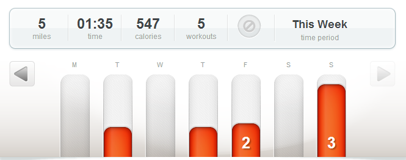
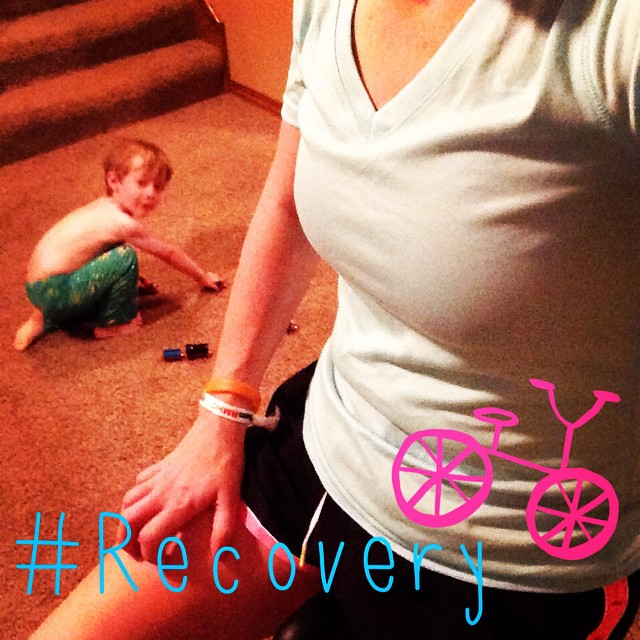
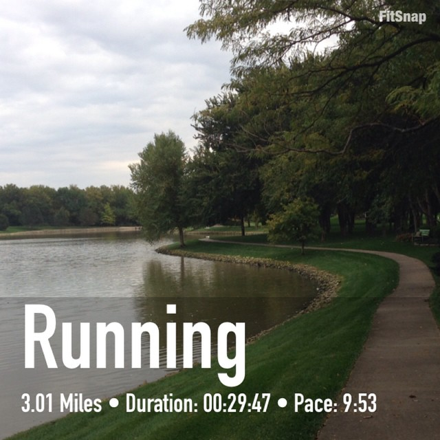

Over a week has past since the Chicago Marathon and so my workouts have been all about recovery this week. I've discovered that I am a whole lot more motivated to get up and exercise when I am able to run because I hit the snooze alarm quite a bit when running wasn't on the schedule. The spin bike just isn't as exciting to me.

 

 

I did manage to get on the bike a couple of times this week and then I also ran a couple of times as well. That first run was after a 4 day break from running and it hurt. I was so excited to get out and run again but once I was about 3/4 of a mile into it my right heel started to hurt again. I've never really been injured before so I am so afraid of that actually happening to me. I took a day off again and tried a few miles on Sunday. I'm happy to say that I had no heel pain at all on Sunday!

One of the best ways to stay motivated after a goal race like I just completed is to figure out what to run next. I have a few races in my sights, a Turkey Trot 10 miler and a half marathon on New Years Day, but I'm not completely sold on either one yet. I want to get a good week of easy running accomplished before I set any new goals.

I also want to take the suggested 26 days off from doing any speed work or difficult running. This marathon training was by far the most mileage and hardest training cycle I have ever done. I want to be smart about recovery and not just rush back into training right away.

Is there a marathon #3 in my future?

Yes! I'm not finished with this distance by any means. I love running long runs every week and the accomplishment of running 26.2 miles is addictive. _It's so hard to not sign up for another marathon right away!_ After my first marathon I told my husband to never let me run one again (ha,ha!) but almost immediately after this one I knew I wanted to run another. I trained smarter for this race and I was more prepared for it. It was still hard and recovery after the fact was rough but overall it was easier. But just because I see a marathon in my future doesn't mean it's going to happen any time soon. The long Saturday runs and the longer midweek runs take away from other activities that my family enjoys and so for right now I'll stick to the 13.1 and under race distances. I'm hoping to give it a couple of years and then get back into it again. Maybe work on speed and increasing the pace on my easy runs instead of spending hours on my feet working on endurance.

 

## **Weekly Workouts**

Chicago Marathon Recovery Week

 

 

**Monday:** Rest

**Tuesday:** Spin Bike 20 minutes, easy

**Wednesday:** Rest

**Thursday:**  Spin Bike 15 minutes, 10 minutes Upper Body Strength

 

 

**Friday:** 2.01 miles (10:01 pace)

**Saturday:** Rest

**Sunday:** 3.01 miles (9:53 pace)

 

 

 

One of my main goals for 2014 is to Run This Year in kilometers. That's 2,014 kilometers or 1,251.44 miles.

Weekly Running Miles: 5.02

October Running Miles: 64.25

2014 Running Miles: 1,161.03

2014 Running Kilometers:1,868.46

 

 

\_\_\_\_\_\_\_\_\_\_\_\_\_\_\_\_\_

I’m running I ran the Chicago Marathon with Team RMHC!

To find out more read my post about [Running for Charity](http://amotherspace.net/2014/06/the-chicago-marathon-running-for-charity/) or head over to my [fundraising page](http://www.kintera.org/faf/donorReg/donorPledge.asp?ievent=1097960&supId=399266070) to make a donation.

——————————-

Find A Mother’s Pace on…

Twitter [@amotherspace3](https://twitter.com/amotherspace3)

Facebook [amotherspace3](http://facebook.com/amotherspace3)

Instagram [amotherspace](http://instagram.com/amotherspace)

Pinterest [amotherspace](http://pinterest.com/amotherspace/)

Bloglovin’ [A Mother’s Pace](http://www.bloglovin.com/en/blog/6680087)

RSS [amotherspace](http://feeds.feedburner.com/amotherspace)
