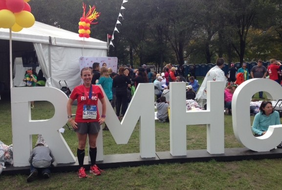
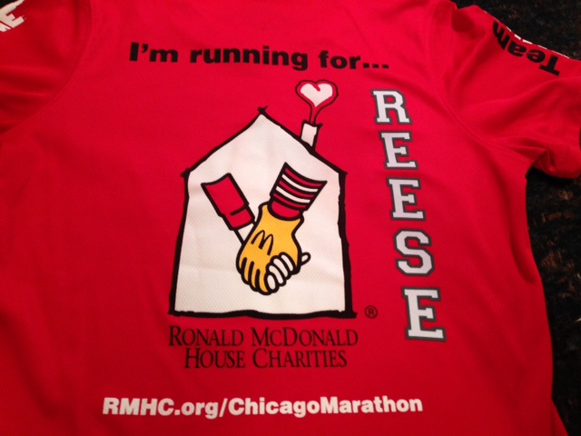
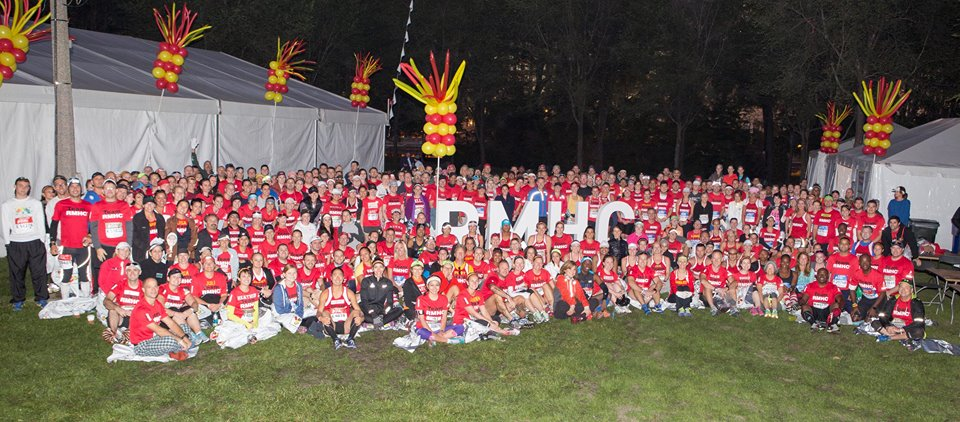
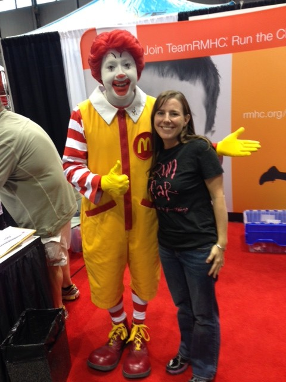
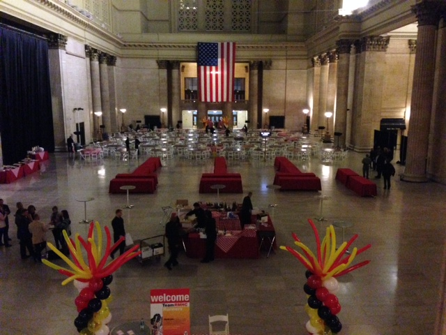
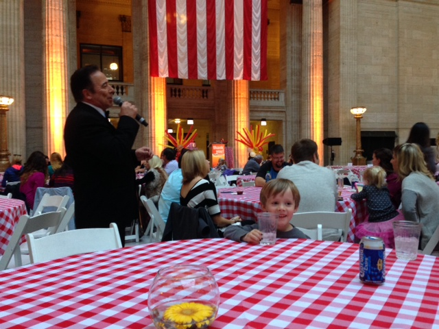
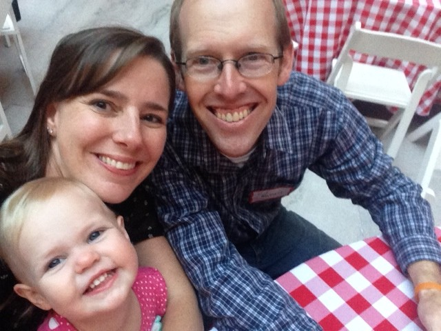
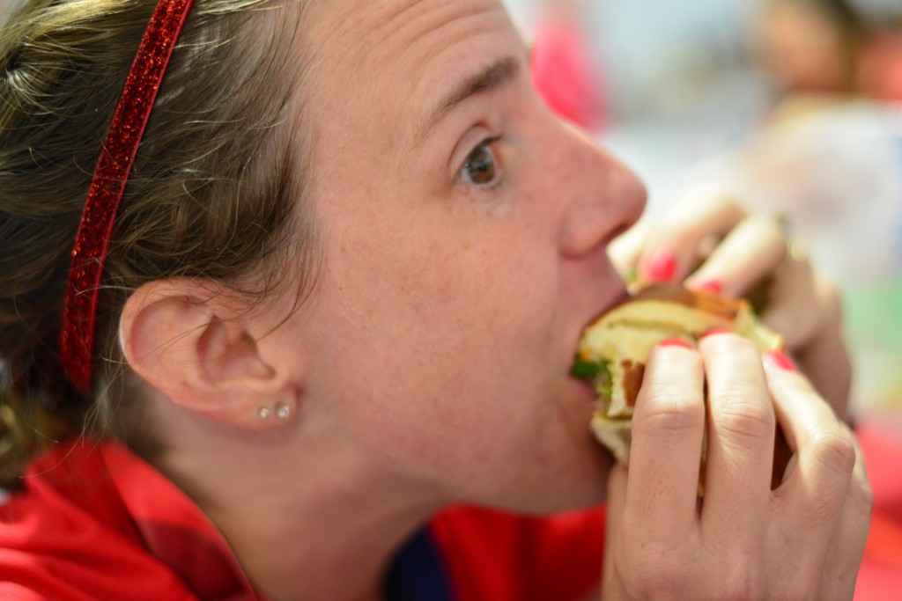
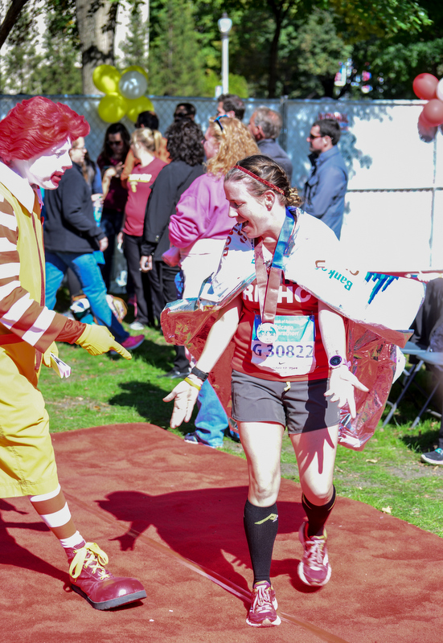
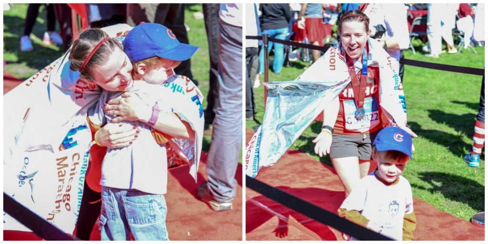

 

The [Chicago Marathon](http://amotherspace.net/2014/10/2014-chicago-marathon-race-recap/ "2014 Chicago Marathon Race Recap") was an amazing experience overall. I love the city and the spectators certainly came out for the party. This race would have been a fantastic experience all on it's own but running for the Ronald McDonald House Charities (Team RMHC) added so much meaning to the event.

I decided to run with Team RMHC in honor of my niece and her family. You can read more about my choice to run with the charity [here](http://amotherspace.net/2014/06/the-chicago-marathon-running-for-charity/ "The Chicago Marathon: Running for Charity") and also on my [donation page](http://teamrmhc.kintera.org/faf/donorReg/donorPledge.asp?ievent=1097960&lis=0&kntae1097960=4BE147D17541488C9C61EE89ABBC8559&supid=399266070).

 

 

I signed up to run with Team RMHC early on and my commitment was to raise $1,000. I've ran with Team in Training 3 other times and I didn't want to just ask my friends and family for money this time around. They are so generous but I felt like I needed to work a little harder for the donations. Sure, I posted my donation page on Facebook a few times and received some money that way but the bulk of my donations came from two events that I hosted.

First was a Pampered Chef party. My consultant offers her commission in exchange for the free items that I would have earned. I had a great turn out for the party and ended up raising $440! We also co-hosted a Beer & Bologna party with my brother-in-law to raise funds for both Team RMHC and Team in Training. Both of us were able to surpass our fundraising goals with this party. Not only was it fun but we had some excellent smoked meat (not just bologna, although that is fantastic!) and delicious home brew for the event.

As we got closer to race day the Team RMHC Facebook group was very active. A lot of people posted photos of long runs, asked questions about training and what to expect in Chicago and supported each other through months of training. Because this was my first time running Chicago, the group helped me feel confident and knowledgeable on race day.

 

\[caption id="attachment\_2829" align="aligncenter" width="636"\] Team RMHC!\[/caption\]

 

This team together raised 1.1 MILLION dollars! We had 811 runners and a record breaking fundraising team.

Team RMHC had a table at the expo. I had my photo taken with Ronald himself. I tried to talk my kids into posing with me but they were just a little frightened of the clown!

 

 

The night before the marathon we went to the Team RMHC pasta party at the Chicago Union Station. What a beautiful venue! The photos are dark and don't do the space justice at all but trust me, it was beautiful!

 

 

I'm not sure who the entertainer was while we waiting for dinner but he was an amazing singer.

 

 

The food was delicious and plentiful. They had veggies to make a huge salad. Chicken, salmon, pasta with cream sauce and red sauce (with meatballs!), pizza, and so much more. I also forgot to mention the bar and dessert tables as well. No one was going to go hungry by any means!

Then the speeches started. We listened to Renee, the woman in charge of Team RMHC, and Coach Brendan. We also listened to a fellow Team RMHC runner tell her story of utilizing a Ronald McDonald House. The number one fundraiser (she raised $55,000!!) also spoke and shared how her family has benefited from the Ronald McDonald House. My favorite speaker of all though was Carey Pinkowski, the Chicago Marathon race director. He was very motivating and inspiring. It's amazing to hear just a little bit about what goes in to pulling off a huge marathon like the Chicago Marathon.

 

 

Now I can jump ahead to the next morning. Race day morning! Everything that I've mentioned above about the team makes me happy I joined but on race day I found out how _smart_ it was to join Team RMHC. The following are some of the serious perks that runners on Team RMHC were able to enjoy.

- heated charity tent at the start line
- mylar blankets to take to the start line
- port-a-potties with hardly any line at all
- chairs to sit on before the race
- pre-race food and water
- private bag check
- extra tickets for family and friends to enter the charity tent
- post race buffet
- post race massage table
- post race DJ

 

\[caption id="attachment\_2841" align="aligncenter" width="477"\] Best. Hamburger. Ever. \[Photo Credit: [Photogenic Chicago](http://photogenicchicago.com/)\]\[/caption\] 

I could go on and list more, I'm sure, but these are the few that stuck out to me as I sat down to write this. Seriously, if I ever run the Chicago Marathon again (which I would LOVE to do at some point) it will be through the Ronald McDonald House Charities.

Did I mention there was a red carpet? Yes, we were welcomed by Ronald McDonald and a line of people cheering us as we returned to the tent.

 

\[caption id="attachment\_2839" align="aligncenter" width="503"\] He liked my red shoes! \[Photo Credit: [Photogenic Chicago](http://photogenicchicago.com/)\]\[/caption\] 

One of the highlights of my day was seeing my family again after 26.2 miles. They supported me throughout my training and cheered me on through the miles of the marathon. I wouldn't have been able to accomplish what I did without them.

 

\[caption id="attachment\_2840" align="aligncenter" width="598"\] \[Photo Credit: [Photogenic Chicago](http://photogenicchicago.com/)\]\[/caption\] 

So, have I convinced you to run the Chicago Marathon with Team RMHC yet? If you are even thinking about it I highly encourage it. This wasn't my first marathon but there were a lot of first time marathoners on the team. It's nice to belong to a community that grows together as the training progresses. Many people were from all over the country but came together on race day.

Finally, I want to mention that my [fundraising page](http://teamrmhc.kintera.org/faf/donorReg/donorPledge.asp?ievent=1097960&lis=0&kntae1097960=4BE147D17541488C9C61EE89ABBC8559&supid=399266070) is still open until the end of the year. I exceeded my fundraising goal and even donated to it myself. The families that the Ronald McDonald House helps all over the country depend on people like you and I to help them in their time of need. So, even though my goal is met, this is an important and worthwhile charity. If you are wanting to donate head on over to [my page](http://teamrmhc.kintera.org/faf/donorReg/donorPledge.asp?ievent=1097960&lis=0&kntae1097960=4BE147D17541488C9C61EE89ABBC8559&supid=399266070) and find out more information!

 

 

Did you miss my Chicago Marathon race recap? Read it ------> [here](http://amotherspace.net/2014/10/2014-chicago-marathon-race-recap/ "2014 Chicago Marathon Race Recap").

\_\_\_\_\_\_\_\_\_\_\_\_\_\_\_\_\_

I’m running I ran the Chicago Marathon with Team RMHC!

To find out more read my post about Running for Charity or head over to my fundraising page to make a donation.

——————————-

Find A Mother’s Pace on…

Twitter @amotherspace3

Facebook amotherspace3

Instagram amotherspace

Pinterest amotherspace

Bloglovin’ A Mother’s Pace

RSS amotherspace
