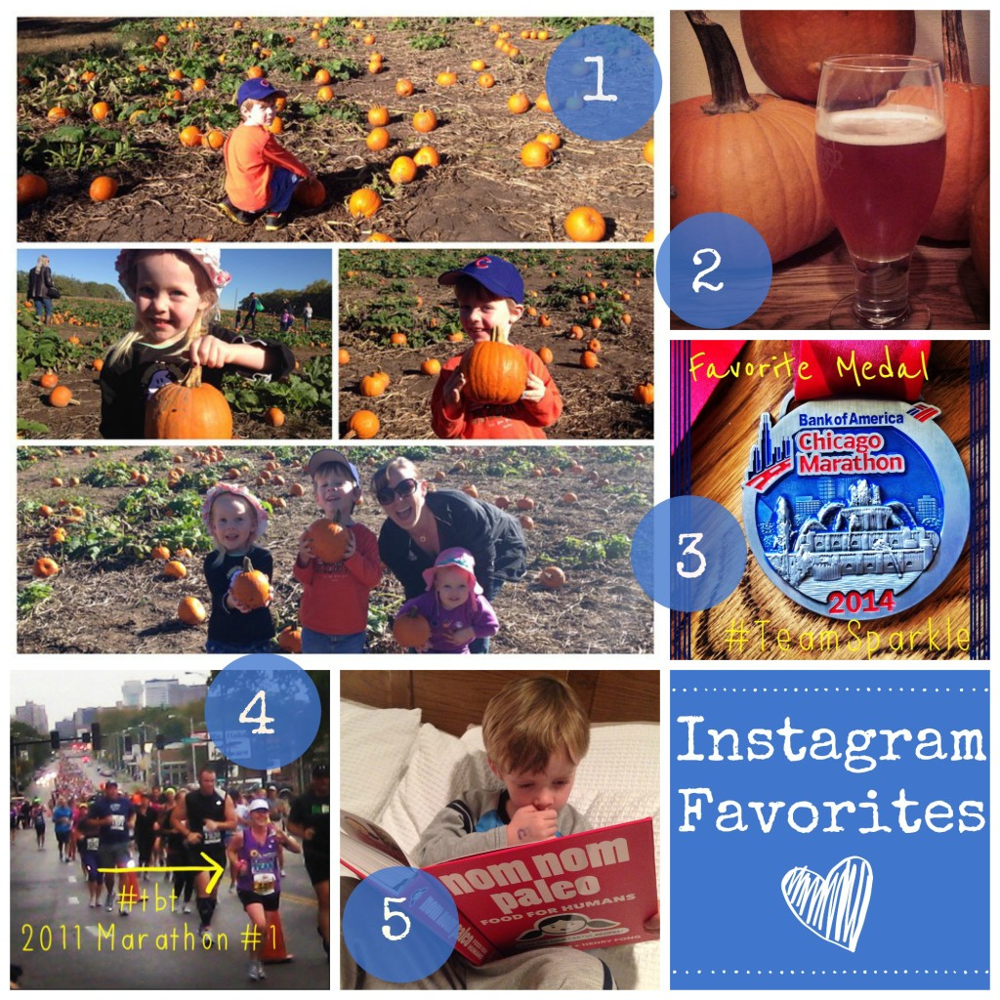
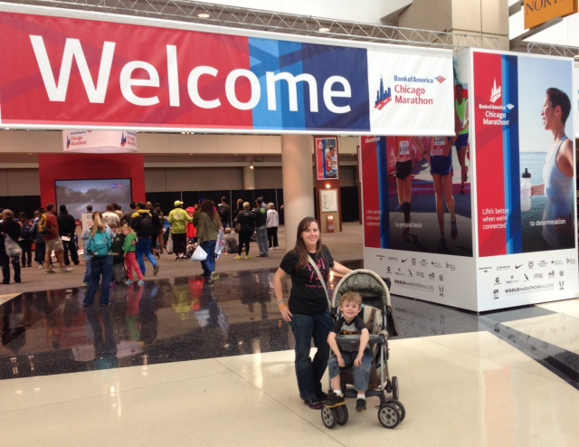
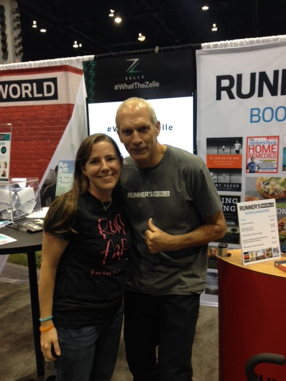
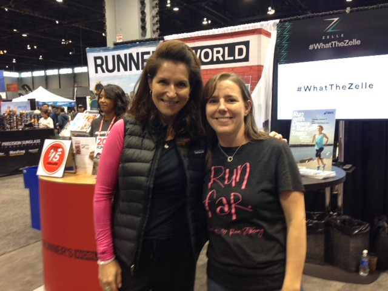
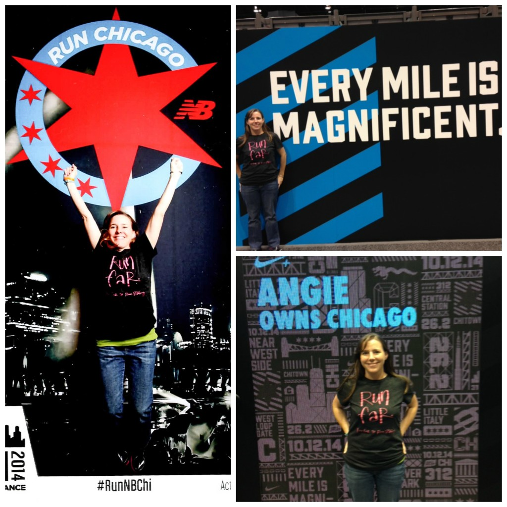
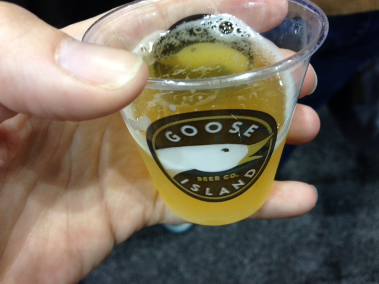
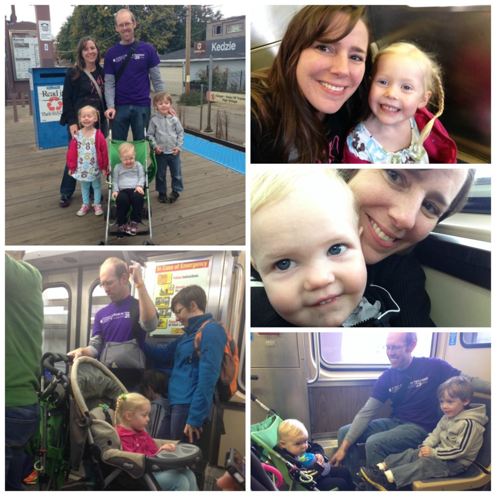
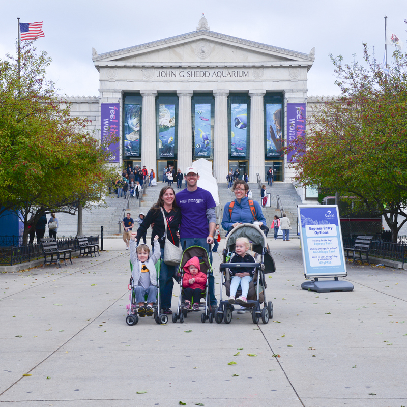
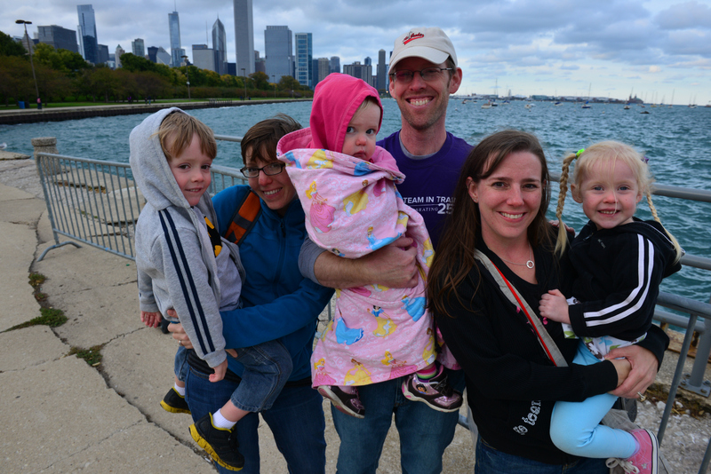
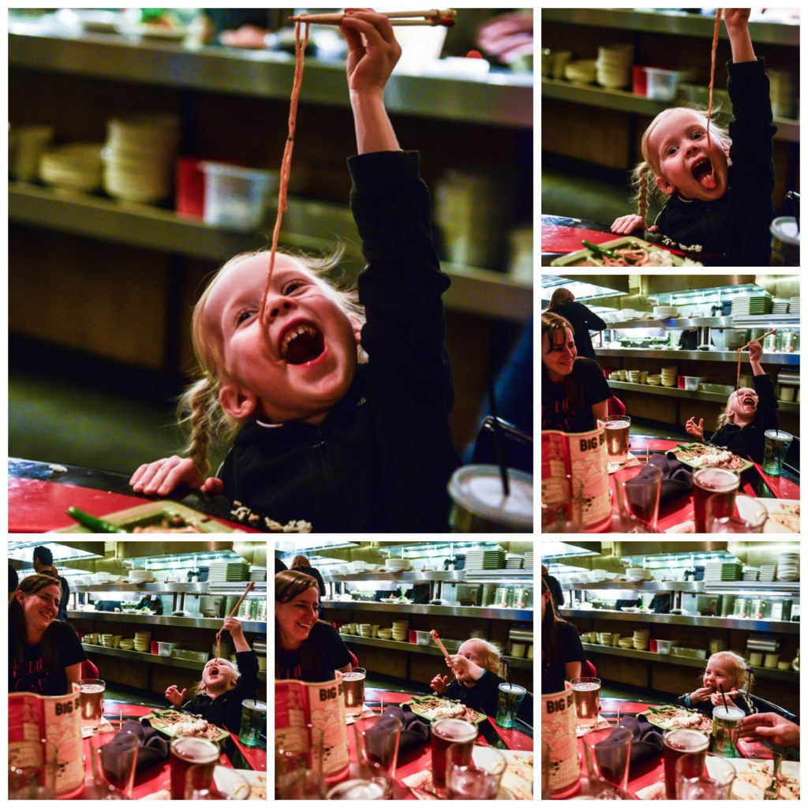

I have one last lingering Chicago Marathon post and then it will be back to regular programming. Well, it might not be regular but I'll update you on that situation on Monday with my Weekly Workouts report.

Today I'm veering slightly from my Friday Favorites to post some favorites in life and from the Chicago Marathon Expo. We had an amazing long weekend in Chicago and have been pretty busy since then as well so hopefully this post will make me up to date!

## Instagram

I always like to stop by Instagram first on Fridays. It's fun to show what has been going on in 'life lately' through my Instagram account.

\[one\] The Pumpkin Patch! This year we went two days in a row with both Little A & Little O's classes. We had beautiful days both times and now have 6 pumpkins at our house. \[two\] I'll keep the pumpkin theme going and talk about how much I am LOVING pumpkin beer this season. Usually I'm all about the Octoberfest brews but this year I can't get enough of my pumpkin beers. I've been trying out several varieties but so far my favorite is this one, Yumkin Pumpkin, from our local brewery, Wichita Brewing Company. \[three\] I'm participating in a short Instagram challenge this week with Team Sparkle. I always like posting with challenges like these because it makes me put up photos that I might not have otherwise. Like, I'm sure I wouldn't have taken a photo of my Chicago Marathon medal... :)  \[four\] My favorite throwback lately was from my first marathon. I was 9 months postpartum. It was taken at mile 3 with a sea of runners behind me on a rainy day in October. \[five\] I caught my son reading a cookbook! The fun part is that I tagged Nom Nom Paleo in my Instagram post and she commented! Now he just needs to start making the recipes for me!

Follow me on Instagram ----> [here](http://instagram.com/amotherspace).

## Chicago Marathon Expo

 

 

I had heard to allow for a couple of hours at the Expo. I probably could have spent the whole day there! We ended up at the Expo a little later than anticipated and didn't time lunch very well. We ended up eating there instead of going somewhere fun for lunch.

I've never been to a big city expo before so I was very impressed with the organization. It was a breeze to pick up the bib number and then the t-shirt pick up was easy as well. The only other place that I had to go was the Ronald McDonald table to pick up my charity tent wristbands. The other stops that I wanted to make were to the Sparkly Soul booth to pick out a red headband to match my Team RMHC shirt on marathon day and the Gu booth to pick up an Espresso Gu that I had forgotten at home.

My favorite part about the Expo was meeting the one and only Bart Yasso. I couldn't wipe the smile off of my face after meeting him!

 

I also was able to meet Coach Jenny at the Runner's World booth. We chatted briefly about her coaching app that runners can use during the Chicago Marathon because I was planning on using it. I thought it would be helpful to get tips on running the tangents because I'd heard that this was an easy race to add distance onto your marathon finish if you didn't run the tangents smartly. She also points out local attractions and points of interest along the way. I was very disappointed when I forgot my headphones and was unable to listen to it during the race.

I couldn't resist taking some photos at all the photo op areas. The first photo below is from the New Balance booth. The photographer made me jump and the picture turned out fun!

Goose Island had some 312 samples available and I also picked up on of their shirts. 312 is one of my favorite refreshing summer beers that I fall back on every year. I was pretty excited that this was what was at the finish line and that we could sample it at the expo as well.

And that's a wrap on the Expo! I think if I lived in the Chicago area I would come to the Expo even if I wasn't running the race.

## Chicago

My sister and brother-in-law live in Chicago so we hung out at their place a lot but we did get out and enjoy some sights. My kids have been on the el before but that doesn't mean they didn't love riding the train any chance we had.

 

We went to the Shedd Aquarium. My Little O asks to visit the aquarium anytime we travel so it was a must on this short trip to Chicago. We went on Friday so I would have Saturday to be off my feet a little more before the marathon.

\[caption id="attachment\_2863" align="aligncenter" width="619"\] Photo Credit: [Photogenic Chicago](http://photogenicchicago.com/)\[/caption\]

\[caption id="attachment\_2864" align="aligncenter" width="618"\] Photo Credit: [Photogenic Chicago](http://photogenicchicago.com/)\[/caption\]

And finally we enjoyed the food in Chicago. We had pizza, of course, and it was amazing but the most memorable dining experience was at Big Bowl. Not because the food was delicious (it was) but because of my daughter. I was in tears watching her enjoy her meal. She has the best expressions!

\[caption id="attachment\_2865" align="aligncenter" width="642"\] Photo Credit: [Photogenic Chicago](http://photogenicchicago.com/)\[/caption\]

If my sister has to live hours from home I'm glad that she picked Chicago. It's my favorite city to visit and I'm glad we get to go there often.

**Have you been to Chicago? What's your favorite big city?**

 

I'm running I ran the Chicago Marathon with Team RMHC!

To find out more read my post about [Running for Charity](http://amotherspace.net/2014/06/the-chicago-marathon-running-for-charity/) or head over to my [fundraising page](http://www.kintera.org/faf/donorReg/donorPledge.asp?ievent=1097960&supId=399266070) to make a donation.

——————————-

Find A Mother’s Pace on…

Twitter [@amotherspace3](https://twitter.com/amotherspace3)

Facebook [amotherspace3](http://facebook.com/amotherspace3)

Instagram [amotherspace](http://instagram.com/amotherspace)

Pinterest [amotherspace](http://pinterest.com/amotherspace/)

Bloglovin’ [A Mother’s Pace](http://www.bloglovin.com/en/blog/6680087)

RSS [amotherspace](http://feeds.feedburner.com/amotherspace)
