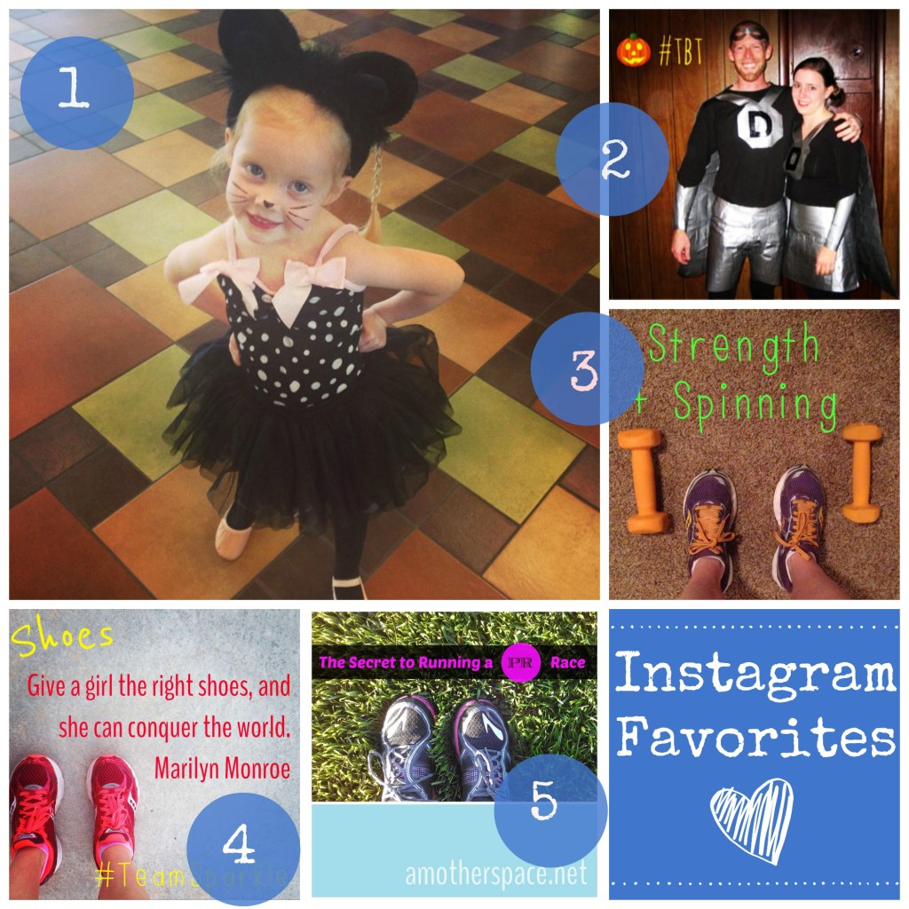
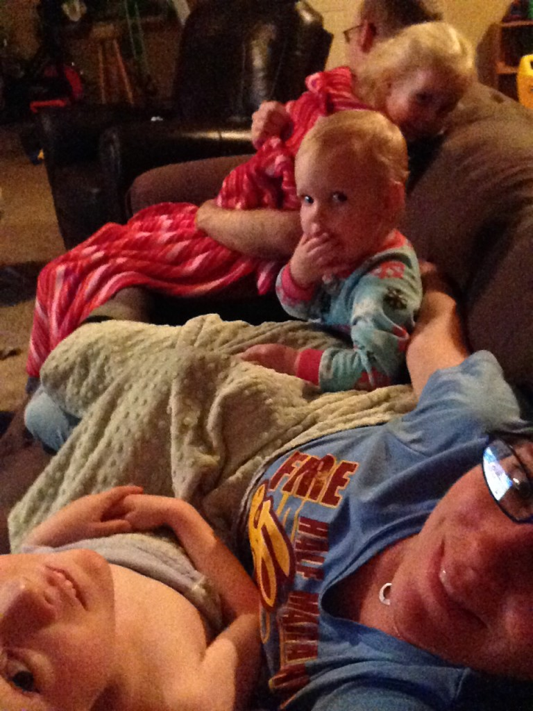
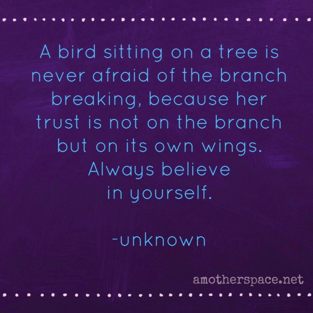

 Happy Halloween! I love that cheesy little tongue out kinda smile! We're looking forward to our traditional chicken noodle soup with mashed potatoes for dinner tonight before trick-or-treating . We're trying a new recipe this year though. It's from [Iowa Girl Eats](http://iowagirleats.com/2014/10/22/homemade-chicken-noodle-soup/?utm_source=feedburner&utm_medium=feed&utm_campaign=Feed%3A+IowaGirlEats+%28Iowa+Girl+Eats%29) and looks amazing, not to mention healthy!

## \[one\] Instagram

First a quick stop by some of my Instagram favorites of the week. \[one\] Costume day at dance class. Meow! \[two\] A look back to 2006 with my #tbt photo of the week. My husband and I shortly after we started dating. Captain Duct Tape with Duct Tape Girl by his side. \[three\] My exercise this week has been limited to spinning and strength workouts. \[four\] One of my #TeamSparkle instagram photos and one of my favorite quotes. \[five\] I shared my secret for achieving two big PRs recently. Did you miss it? Find it ------> [here](http://amotherspace.net/2014/10/the-secret-to-running-a-pr-race/ "The Secret to Running a PR Race").

Follow me on Instagram ----> [here](http://instagram.com/amotherspace).

## \[two\] Interesting Reads

[National 50-Mile Champ was Recreational Runner 4 Years Ago](http://m.runnersworld.com/general-interest/national-50-mile-champ-was-recreational-runner-4-years-ago?utm_content=buffer71b6b&utm_medium=social&utm_source=twitter.com&utm_campaign=buffer) from Runner's World

[How Crossfit Has Helped Me](http://bumpandrunchat.com/how-crossfit-has-helped-me/?utm_content=buffer6df27&utm_medium=social&utm_source=twitter.com&utm_campaign=buffer) from Bre over at Bump and Run

[5 Amazing Reasons to Run a Race](http://www.thefitswitch.org/2014/10/5-reasons-run-race/?utm_content=bufferdc956&utm_medium=social&utm_source=twitter.com&utm_campaign=buffer) from Jessica at the Fit Switch

[What 17 Marathons Have Taught Me](http://seemomrunfar.blogspot.com/2014/10/what-17-marathons-have-taught-me.html?spref=tw&utm_content=buffer61b5b&utm_medium=social&utm_source=twitter.com&utm_campaign=buffer) from Erin at See Mom Run Far

[Why Is 'Great' Never Good Enough?](http://www.runladylike.com/2014/10/21/great-never-good-enough/?utm_content=buffere5f93&utm_medium=social&utm_source=twitter.com&utm_campaign=buffer) from Jesica at rUnladylike

## \[three\] Life Lately

Life lately has meant a whole lot of late nights staying up to watch the Royals in the postseason. It's been an exciting few weeks for this Kansas girl (even though I am a Cubbie fan at heart) while the Royals have been battling for the championship. Our boys in blue lost the World Series in game 7 but they gave it their all and had a fantastic season. I'm just excited to get back to a regular sleeping schedule for everyone in our house, including myself!

\[caption id="attachment\_2893" align="aligncenter" width="530"\] This is how we do baseball: snuggling on the couch!\[/caption\]

## \[four\] Favorite Quotes

Yes, you've already seen this if you read my recent post on [mental toughness](http://amotherspace.net/2014/10/the-secret-to-running-a-pr-race/ "The Secret to Running a PR Race"), but it is worth repeating. Always believe in yourself.

## \[five\] Weekend Plans

My 5-year-old starts basketball this weekend. I'm sure it will be very entertaining to watch all the kids attempt to dribble the ball and run down the court. I can't wait to see how he likes it! Other than that we have an easy weekend scheduled. I'm ready to get caught up on some things around the house and spend some quality family time together.

 

**Do you have a traditional meal on Halloween? What are your weekend plans? Let me live vicariously through you and tell me your running/racing plans this weekend.**

 

 

 

I'm running I ran the Chicago Marathon with Team RMHC!

To find out more read my post about [Running for Charity](http://amotherspace.net/2014/06/the-chicago-marathon-running-for-charity/) or head over to my [fundraising page](http://www.kintera.org/faf/donorReg/donorPledge.asp?ievent=1097960&supId=399266070) to make a donation.

——————————-

Find A Mother’s Pace on…

Twitter [@amotherspace3](https://twitter.com/amotherspace3)

Facebook [amotherspace3](http://facebook.com/amotherspace3)

Instagram [amotherspace](http://instagram.com/amotherspace)

Pinterest [amotherspace](http://pinterest.com/amotherspace/)

Bloglovin’ [A Mother’s Pace](http://www.bloglovin.com/en/blog/6680087)

RSS [amotherspace](http://feeds.feedburner.com/amotherspace)
