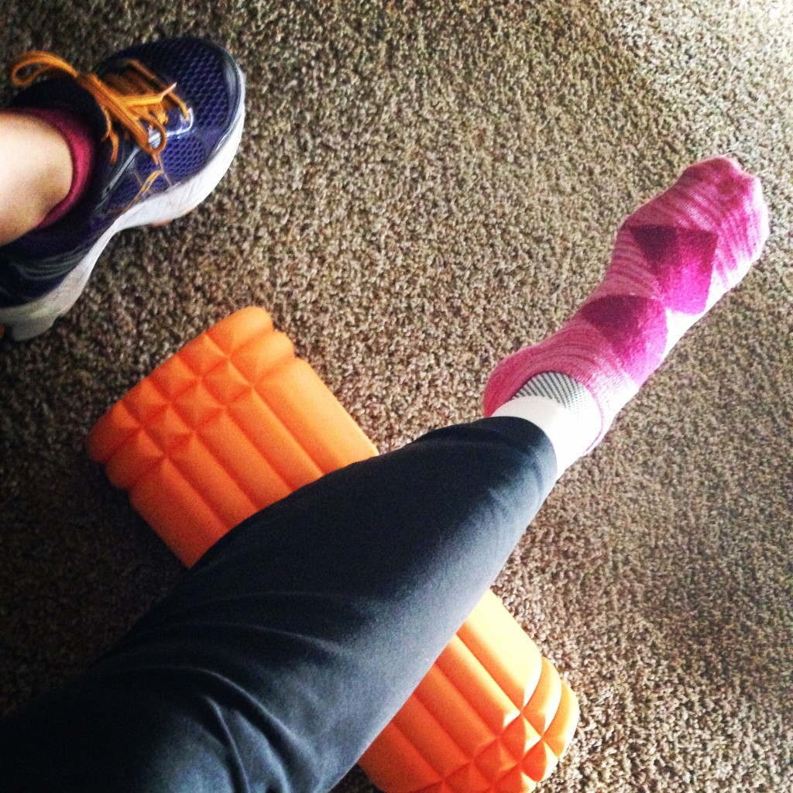
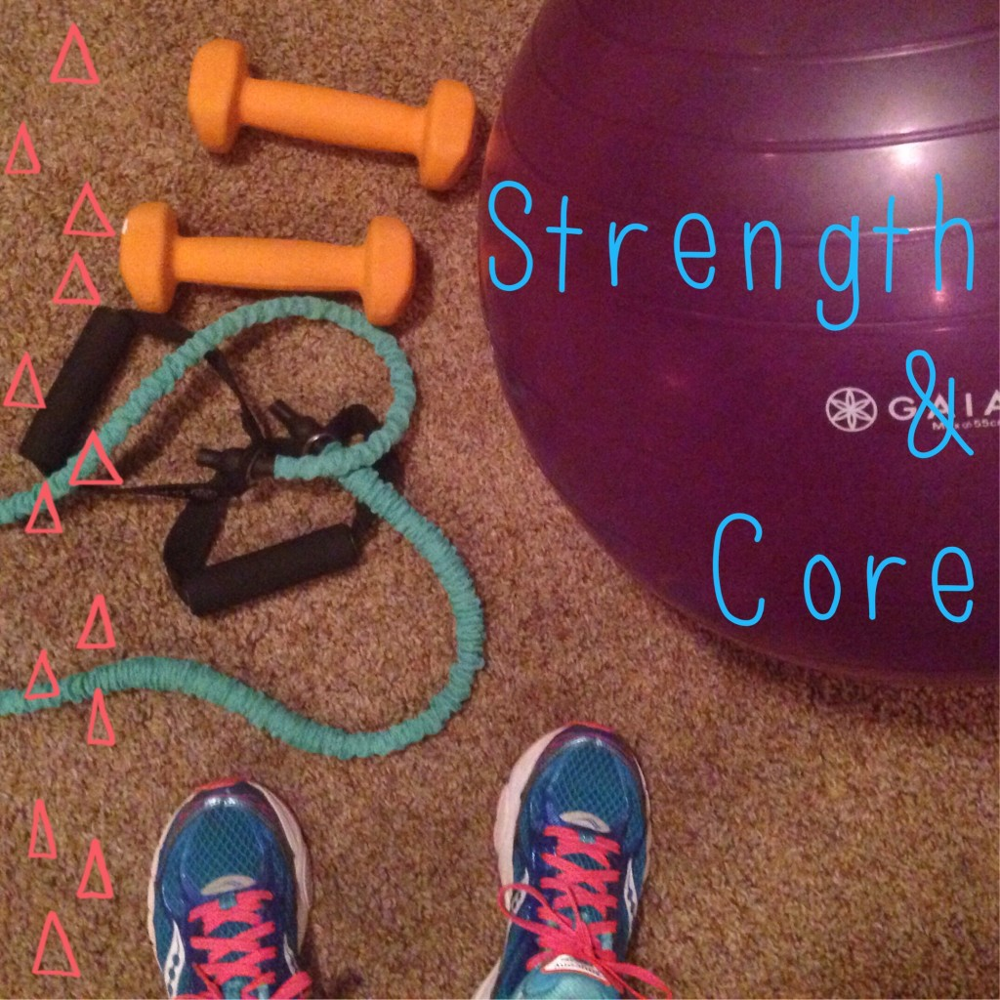

 

The last time I've logged 0 running miles in a week was during my last pregnancy over 20 months ago. A week ago I talked about my [Plantar Fasciitis](http://amotherspace.net/2014/10/dealing-with-a-running-injury/ "Dealing with a Running Injury") injury and it's still keeping me from running. I have okay days every once in awhile but most of the time it just hurts. I know there are much worse things in the world but not running is tough for me, as it is for a lot of runners with an injury.

I've definitely discovered that I have a ton of motivation when it comes to running and not so much when it comes to other types of exercise. Maybe it had something to do with all the late nights watching the World Series but I had a hard time getting up early just to strength train or jump on the spin bike. I hate to see all my fitness that I gained training for the marathon disappearing but other types of workouts are just not happening as much as they should, as you'll see in the summary below.

 

 

But I am motivated to do my added stretches, rolling and icing to help this foot heal quickly.

On Sunday I had my first pain free day since the marathon and, as I write this on Monday afternoon, I'm pain free again so far. This means that hopefully I'll get a very slow, easy and short run in later on this week. I really hope I'm on the mend.

Coming out of marathon training is hard anyway. You've probably heard of people experiencing the 'marathon blues' because the training plan is gone. The excitement of the marathon is over and it's back to regular everyday life. Well if you top that with an injury preventing any running at all it certainly is no fun. After [Chicago](http://amotherspace.net/2014/10/2014-chicago-marathon-race-recap/ "2014 Chicago Marathon Race Recap") all I wanted to do was run. I was on a runner's high from a great race. Hopefully this break from running will just give me a sense of appreciating the fact that I'm able to run again.

The other good thing about this is that I'm so glad that it happened after the marathon. If this had happened on one of my last long runs I would have been devastated!

Keep reading below to see what I did manage to accomplish during my workouts this past week. I'm hoping to report a better exercise week next Monday!

 

## **Weekly Workouts**

**Monday:** 20 minutes strength + core

 

 

**Tuesday:** 20 minutes spin

**Wednesday:**  rest

**Thursday:** rest

**Friday:** 20 minutes spin + 15 minutes strength

**Saturday:** rest

**Sunday:** rest

 

One of my main goals for 2014 is to Run This Year in kilometers. That's 2,014 kilometers or 1,251.44 miles.

Weekly Running Miles: 0

October Running Miles: 67.26

2014 Running Miles: 1164.04

2014 Running Kilometers: 1873.34

 

 

\_\_\_\_\_\_\_\_\_\_\_\_\_\_\_\_\_

I’m running I ran the Chicago Marathon with Team RMHC!

To find out more read my post about [Running for Charity](http://amotherspace.net/2014/06/the-chicago-marathon-running-for-charity/) or head over to my [fundraising page](http://www.kintera.org/faf/donorReg/donorPledge.asp?ievent=1097960&supId=399266070) to make a donation.

——————————-

Find A Mother’s Pace on…

Twitter [@amotherspace3](https://twitter.com/amotherspace3)

Facebook [amotherspace3](http://facebook.com/amotherspace3)

Instagram [amotherspace](http://instagram.com/amotherspace)

Pinterest [amotherspace](http://pinterest.com/amotherspace/)

Bloglovin’ [A Mother’s Pace](http://www.bloglovin.com/en/blog/6680087)

RSS [amotherspace](http://feeds.feedburner.com/amotherspace)
