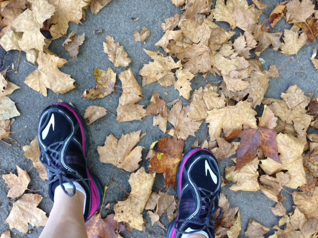
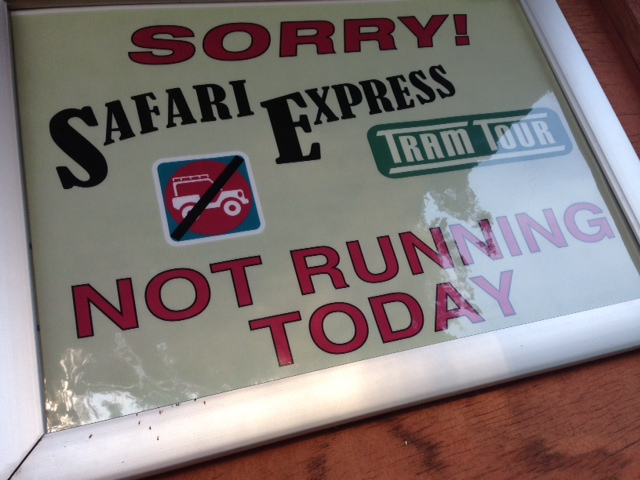
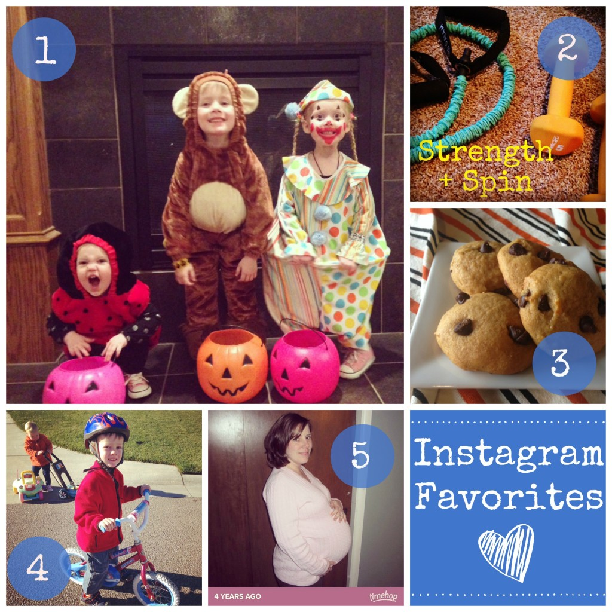
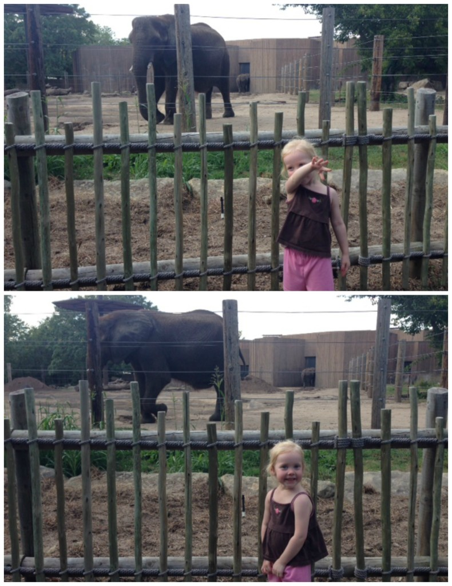
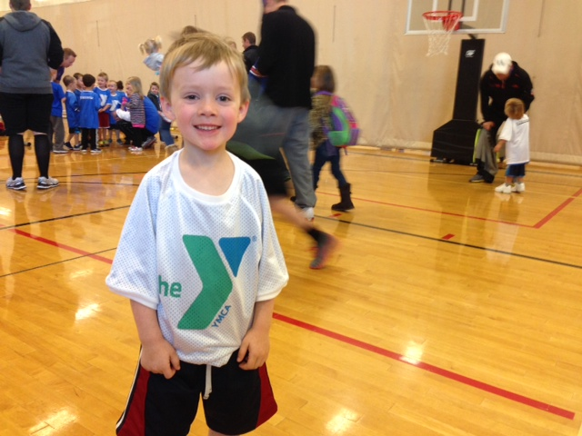

Lately I've been living vicariously through my Instagram feed. I'm admiring everyone that is having stellar fall runs but at the same time completely jealous of all the crunching that is happening in the leaves. I watched the coverage for the NYC Marathon last Sunday and it brought back so many memories from Chicago. It's hard to believe that it was only just about a month ago. The photos of the triumphant faces on Instagram of all the finishers of this windy, difficult race were so inspiring. Runners are so inspiring! I can't wait to get back out there.

I finally made an appointment to have an orthopedic insert made for my shoe and unfortunately it's two weeks away.

Not running for another two plus weeks seems entirely too long. Why did I wait so long to make this appointment? I may need to figure out something else in the mean time. Maybe I'll buy an insert from the running store to tide me over until the fitted one is made. Or maybe I'll try running after my husband tapes my foot and see how it feels. This not running thing is no fun! (Missed my post on my injury? Read about it ------> [here](http://amotherspace.net/2014/10/dealing-with-a-running-injury/ "Dealing with a Running Injury").)

On to brighter subjects! Here are some favorites from my week.

## Instagram

**\[one\]** Only one had a monkey costume on but there is no doubt that these 3 are all little monkeys. Halloween is such a fun holiday with children! **\[two\]** Strength + Spin: my current workout standard. **\[three\]** [Chocolate Chip Pumpkin Cookies.](http://amotherspace.net/2014/11/chocolate-chip-pumpkin-cookies/ "Chocolate Chip Pumpkin Cookies") Yum. Make them. That is all. **\[four\]** 3 months ago this guy broke his collarbone. This week we found out he's cleared for normal activity. Biking was the first thing he wanted to do! **\[five\]** Timehop from 4 years ago sent me a 34 weeks pregnant photo. I can't believe my Little A is turning 4 this month!

Follow me on Instagram ----> [here](http://instagram.com/amotherspace).

## Interesting Reads

[Letting go of Boston](http://runfargirl.com/2014/11/04/letting-go-of-boston/) from Sarah at Run Far Girl.

Sarah qualified for Boston by 10 minutes but decided not to sign up this year. She has the best reason of all and shares her story to inspire others.

[Breastfeeding. The End](http://crazyrunninglegs.com/2014/10/30/breastfeeding-the-end/?utm_content=buffer55b20&utm_medium=social&utm_source=twitter.com&utm_campaign=buffer). by Michelle at Crazy Running Legs.

This one hit close to home for me as I'm still breastfeeding my 20 month old daughter.

[How to Taper for an UNsuccessful Race Day](http://jillconyers.com/2014/10/how-not-to-taper/?utm_content=buffer3d14a&utm_medium=social&utm_source=twitter.com&utm_campaign=buffer) by Jill at Fitness, Health and Happiness.

Funny but all too true.

[5 Reasons Women Should Strength Train](http://thelemonbowl.com/2014/11/5-reasons-women-should-strength-train.html?utm_content=buffer45104&utm_medium=social&utm_source=twitter.com&utm_campaign=buffer) by Liz at The Lemon Bowl.

Strength Training is something that I give up when the miles get higher in training cycles. This is why I need to keep it in my training plan!

[How Water Affects Your Mood](http://www.theleangreenbean.com/water-affects-mood/) by guest host Jenna over on The Lean Green Bean

A great reminder to drink enough water every day.

## Local News

We've had a great loss at our local zoo with the death of one of our two elephants. Cinda was one of our favorite animals to visit at the zoo and we were/still are so excited for a new elephant exhibit to open soon. She was about 43 years old and had been at our zoo since 1972. She died of natural causes from aging and will be greatly missed. I'm just hoping that her partner elephant, Stephanie, will be okay with her loss.

The photos below are of my Little A showing off her elephant trunk with Cinda in the background.

## Life Lately

 

Basketball with 4 and 5 years olds. Yes, it's pretty entertaining. I can't wait for the next game.

 

That's all for today! Happy Friday, everyone and have a great weekend!

 

 

 

I'm running I ran the Chicago Marathon with Team RMHC!

To find out more read my post about [Running for Charity](http://amotherspace.net/2014/06/the-chicago-marathon-running-for-charity/) or head over to my [fundraising page](http://www.kintera.org/faf/donorReg/donorPledge.asp?ievent=1097960&supId=399266070) to make a donation.

——————————-

Find A Mother’s Pace on…

Twitter [@amotherspace3](https://twitter.com/amotherspace3)

Facebook [amotherspace3](http://facebook.com/amotherspace3)

Instagram [amotherspace](http://instagram.com/amotherspace)

Pinterest [amotherspace](http://pinterest.com/amotherspace/)

Bloglovin’ [A Mother’s Pace](http://www.bloglovin.com/en/blog/6680087)

RSS [amotherspace](http://feeds.feedburner.com/amotherspace)
