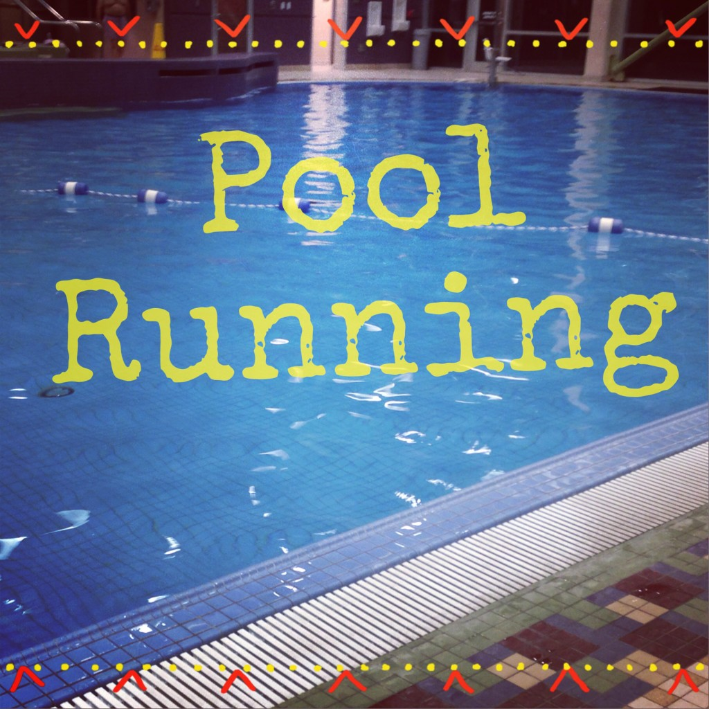
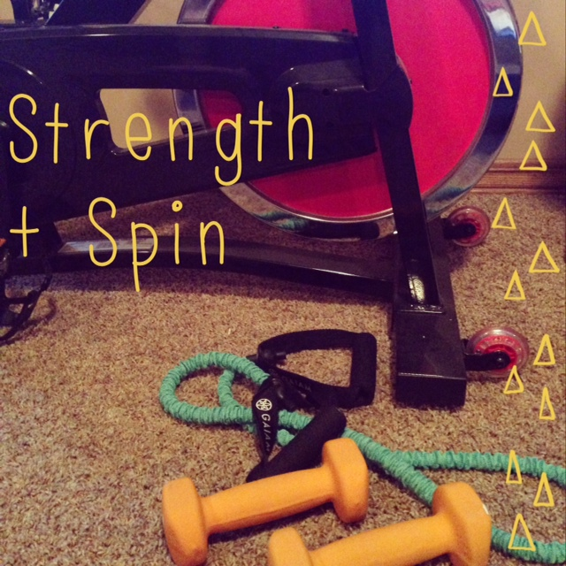
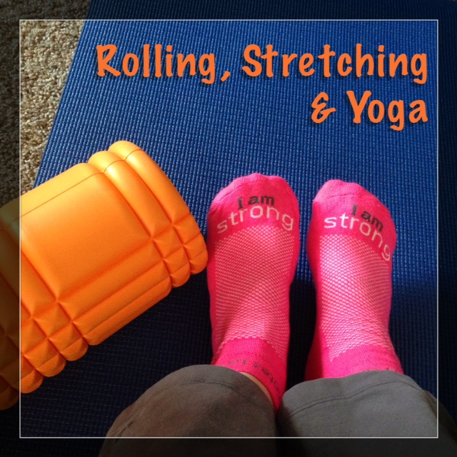
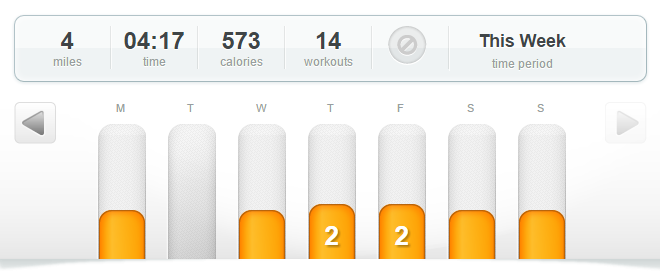

Last week I talked about my extreme [lack of motivation](http://amotherspace.net/2014/11/rolling-stretching-and-icing-motivation-during-a-running-injury/ "Rolling, Stretching and Icing: Motivation During a Running Injury") and I think a lot of it had to do with being frustrated with my [injury](http://amotherspace.net/2014/10/dealing-with-a-running-injury/ "Dealing with a Running Injury"). This week my foot feels better, not 100% yet, but much, much better and my motivation to workout came back.

I'm going on just over a week with no heel pain at all and last Monday, after 2 days of no pain, I decided to try pool running. I wish that I had been doing it all along! We headed to the pool on Monday evening and played in the shallow end for awhile. Then I put on the swim belt and headed to the deep end while my husband continued playing with the kids.

 

 

For 20 minutes I watched my family play and I 'ran' in place in the deep end. It wasn't fantastic, I didn't love it but it was a good workout. I should have been doing this all along so that my fitness from the marathon didn't disappear. I'm hoping that we continue to go to the pool on a regular basis throughout the winter and I continue to get some running in this way. It's a great way to cross train and hopefully keep me from injury again.

This week I concentrated on strength (4 workouts) and yoga (3 workouts) with a couple cardio spin workouts and even a couple RUNS! Marathon training left me little time to continue with strength and yoga but now that I'm on my own schedule again I am working it into my plan. _My injury-free plan._ I'm planning a post on Wednesday to talk more about his. Stay tuned!

So I've been easing back into running with a couple of short, easy-paced runs. They felt fantastic both during the run and after. I am amazed how much my legs felt it the day after my first 2 miler. Only 2 miles and I felt it the next day! I guess those 17 days between runs make a huge difference.

During my first run back I kept waiting for the pain to start. I couldn't believe that my foot wasn't hurting at all. My husband had taped it before I left and the added support really helped. I had only planned to run 1 mile but once I was out there and feeling great I just couldn't stop.

Keep reading below to find my weekly workouts from last week.

 

## **Weekly Workouts**

**Monday:** 20 minutes Strength + 25 minutes Spin + 20 minutes Pool Running

 

 

**Tuesday:** Rest

**Wednesday:** 20 minutes Strength + 25 minutes Spin

**Thursday:** 15 minutes flexibility Yoga + 15 minutes Strength + 20 minutes family Bike Ride

**Friday:** 2.02 miles (9:59 pace) + 15 minutes Runners Yoga

 

 

**Saturday:** 20 minutes Kettlebells and Core + 15 minutes flexibility Yoga

**Sunday:** 3.15 miles (10:08 pace) + 15 minutes Runners Yoga

 

One of my main goals for 2014 is to Run This Year in kilometers. That's 2,014 kilometers or 1,251.44 miles.

Weekly Running Miles: 5.17

November Running Miles: 5.17

2014 Running Miles: 1,169.21

2014 Running Kilometers: 1,881.66

 

 **Have you tried pool running? What kind of cross training do you like?**

\_\_\_\_\_\_\_\_\_\_\_\_\_\_\_\_\_

I’m running I ran the Chicago Marathon with Team RMHC!

To find out more read my post about [Running for Charity](http://amotherspace.net/2014/06/the-chicago-marathon-running-for-charity/) or head over to my [fundraising page](http://www.kintera.org/faf/donorReg/donorPledge.asp?ievent=1097960&supId=399266070) to make a donation.

——————————-

Find A Mother’s Pace on…

Twitter [@amotherspace3](https://twitter.com/amotherspace3)

Facebook [amotherspace3](http://facebook.com/amotherspace3)

Instagram [amotherspace](http://instagram.com/amotherspace)

Pinterest [amotherspace](http://pinterest.com/amotherspace/)

Bloglovin’ [A Mother’s Pace](http://www.bloglovin.com/en/blog/6680087)

RSS [amotherspace](http://feeds.feedburner.com/amotherspace)
