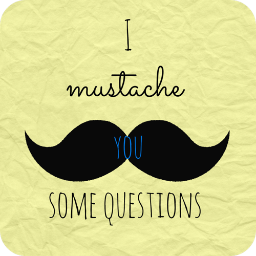

I've been enjoying this survey floating around and so I was excited when [Laura](http://www.mommyrunfast.com/fun-for-friday-survey/) tagged me to answer the I Mustache You Some Questions survey.

**Four names that people call me, other than my real name:**

- Angie (It's what I go by but my actual name is Angela.)
- Ang
- Mommy (best nickname ever!)
- That's it, I think. I'm still surprised that I don't have a nickname from my extended family, I'm just about the only one.

**Four jobs I have had:**

- Preschool/Pre-K teacher for 11 years
- Pizza Delivery Girl (college)
- Snack Bar at a Skating Rink (high school)
- Box Plant (making boxes was challenging and one of my favorite jobs!)

**Four movies I’ve watched more than once:**

- Charade (Audrey Hepburn + Cary Grant = my favorite movie of all time)
- Frozen (what can I say, my kids are loving it right now)
- How to Lose a Guy in 10 Days (completely a guilty pleasure movie!)
- Fever Pitch (yep, I love baseball)

**Four books I’d recommend:**

- [The Goldfinch](http://amzn.to/1xA2uFt) by Donna Tartt (I'm reading it right now for book club.)
- [Mind Gym](http://amzn.to/117fyX7) by Gary Mack (This one helped me to earn some [pretty significant PRs](http://amotherspace.net/2014/10/the-secret-to-running-a-pr-race/) lately.)
- [The Art of Racing in the Rain](http://amzn.to/1172h15) by Garth Stein (It had me in tears but I loved it.)
- [A Little Princess](http://amzn.to/1tS1GXE) by Frances Hodgson Burnett (My copy from childhood is falling apart.)

**Four places I have lived:**

- Sioux City, IA
- Sioux Falls, SD
- Wichita, KS
- Manhattan, KS

**Four places I have been:**

- Mexico
- Chicago
- New York City
- Colorado (I love Colorado in the summer!)

I've only been out of the country once so I answered with some of my favorite places to travel to in the United States.

**Four places I’d rather be right now:**

- Outside Running
- At Wrigley Field watching a Cubs game
- Hiking somewhere in Colorado
- Out on a sushi date with my husband

**Four things I don’t eat:**

- Black Olives
- Sauerkraut
- Subway (my least favorite place to eat out)
- Almond Joy candy bars (Coconut...blah!)

**Four of my favorite foods:**

- Pizza
- Sushi
- Ice Cream
- Chocolate

Not the healthiest list but I'm keeping it real!

**Four TV shows that I watch:**

- Parenthood
- Scandal
- House of Cards (My husband and I are watching it together.)
- The Good Wife

**Four things I am looking forward to this year:**

- Having my extended family in town for Christmas
- Playing outside in the snow with my kids
- My next goal race in the spring
- Watching my children grow and develop this year

**Four things I’m always saying:**

- We need to hurry, we're running late.
- Love you! to my family
- What should we have for dinner this week?
- Have a great day at school today! (I feel like I am always in the car dropping the kids off at school!)

**Four People I Tag:**

- [Marnie](http://supersmartmama.blogspot.com/)
- [Michelle](http://crazyrunninglegs.com/)
- [Michele](http://apaceofbalance.blogspot.com/)
- [Lindsey](https://onemotherofaday.wordpress.com/)

Check back on Wednesday for my weekly workouts from last week!

**What's your favorite t.v. show? What books would you recommend? What is your favorite movie?**

\_\_\_\_\_\_\_\_\_\_\_\_\_\_\_\_

I’m running I ran the Chicago Marathon with Team RMHC!

To find out more read my post about [Running for Charity](http://amotherspace.net/2014/06/the-chicago-marathon-running-for-charity/) or head over to my [fundraising page](http://www.kintera.org/faf/donorReg/donorPledge.asp?ievent=1097960&supId=399266070) to make a donation.

——————————-

Find A Mother’s Pace on…

Twitter [@amotherspace3](https://twitter.com/amotherspace3)

Facebook [amotherspace3](http://facebook.com/amotherspace3)

Instagram [amotherspace](http://instagram.com/amotherspace)

Pinterest [amotherspace](http://pinterest.com/amotherspace/)

Bloglovin’ [A Mother’s Pace](http://www.bloglovin.com/en/blog/6680087)

RSS [amotherspace](http://feeds.feedburner.com/amotherspace)
