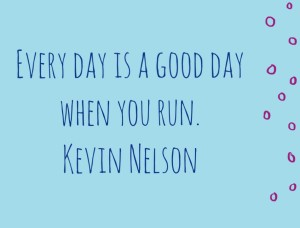
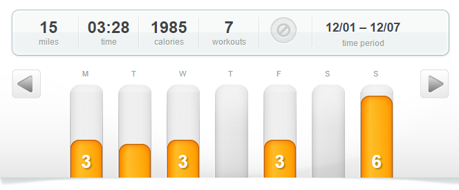
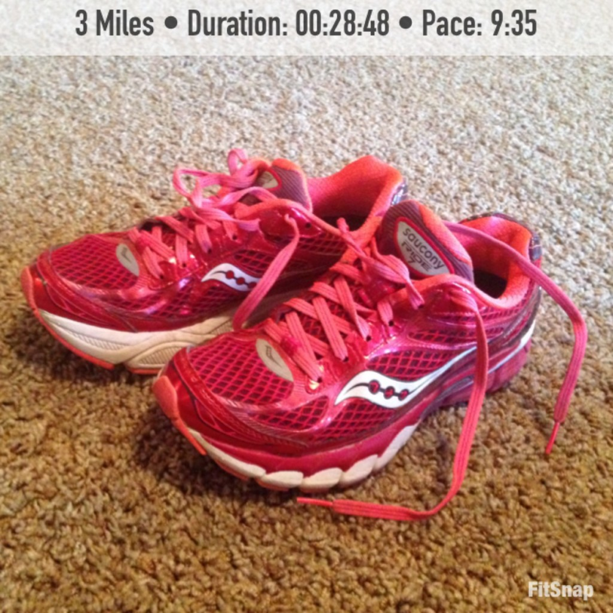
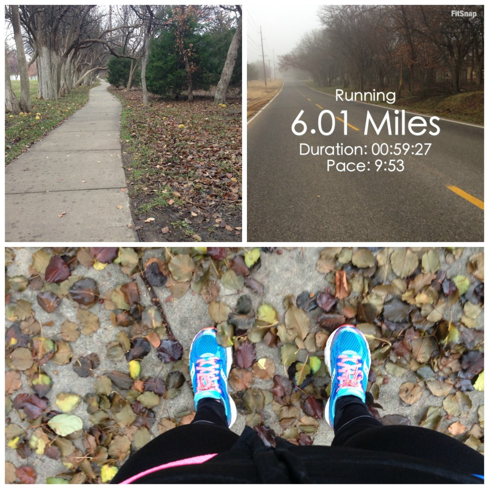

 

I'll just start by saying running with a plan in mind makes all the difference. My motivation to wake up in the morning is back, my foot is feeling pretty good and I'm back to running with miles penciled in on my training plan before I run each week.

Yes, sometimes it's the little things that make me happy!

My plan might be a simple one (hit 59 miles in the month of December and wrap up my year with at least 2,014 total kilometers) but it is proving to be very helpful in making sure I'm getting my workouts in every day.

I've been running on the treadmill a lot lately. It's much easier to run in the dark when it's warm out but now that it's cold I don't want to hit an unexpected patch of ice. I love running outside but it's just not worth the risk of getting an injury. So, the treadmill has been my friend lately. It's great because I'm catching up on my t.v. shows and I'm getting more strength training accomplished.

Last week I started the [Quick Strength for Runners](http://amzn.to/1IrdNpu) program by Jeff Horowitz. I'm planning on writing more about my experience with it the further I get into the program but I do have a few initial thoughts. It starts out very easy but you can adapt it to your ability. It claims that you can do the program in just an hour a week but last week I finished it in just 20 minutes. So, to make it longer I simply repeated the reps. I also like the directions for each move in the book. I've done a lot of pieced together workouts over the years so it's nice to do something that is specifically designed with a runner in mind.

 

 

## **Weekly Workouts**

 

 

**Monday:** 3 miles (9:35 pace) + 12 minutes of strength.

A treadmill run to start my week with a little strength training thrown into the mix. This week I'm starting over with week 1 of Strength for Runners.

 

 

**Tuesday:** 40 minutes Spin + 11 minutes strength

Climb intervals today on the spin bike with the second workout from week 1 of Strength for Runners. The strength seems easy (and short) but I'm sticking with it at this point.

**Wednesday: 3** miles (9:21 pace)

I'm loving the faster pace on the treadmill. It's much easier for me to run faster on a treadmill for some reason. I guess the quicker you run the quicker you're done, right?

**Thursday:** Rest

**Friday:** 3 miles (9:26 pace) + 22 minutes strength

Another treadmill run today. The dark mornings are pushing me toward the treadmill vs. running outside right now and it's a good change for me. I'm not dreading the treadmill yet!

**Saturday:** Rest

**Sunday:** 6.01 miles (9:53 pace)

An outside run! It feels so nice to be out in the fresh air after running on the treadmill all week. My plan is to try and run once on the weekends outside because most of my other runs are early in the morning and inside on the treadmill.

 

 

 

 

One of my main goals for 2014 is to Run This Year in kilometers. That's 2,014 kilometers or 1,251.44 miles.

Weekly Running Miles: 15.01

December Running Miles: 15.01

2014 Running Miles: 1,207.24

2014 Running Kilometers: 1,942.86

 

 

\_\_\_\_\_\_\_\_\_\_\_\_\_\_\_\_\_

I’m running I ran the Chicago Marathon with Team RMHC!

To find out more read my post about [Running for Charity](http://amotherspace.net/2014/06/the-chicago-marathon-running-for-charity/) or head over to my [fundraising page](http://www.kintera.org/faf/donorReg/donorPledge.asp?ievent=1097960&supId=399266070) to make a donation.

——————————-

Find A Mother’s Pace on…

Twitter [@amotherspace3](https://twitter.com/amotherspace3)

Facebook [amotherspace3](http://facebook.com/amotherspace3)

Instagram [amotherspace](http://instagram.com/amotherspace)

Pinterest [amotherspace](http://pinterest.com/amotherspace/)

Bloglovin’ [A Mother’s Pace](http://www.bloglovin.com/en/blog/6680087)

RSS [amotherspace](http://feeds.feedburner.com/amotherspace)
