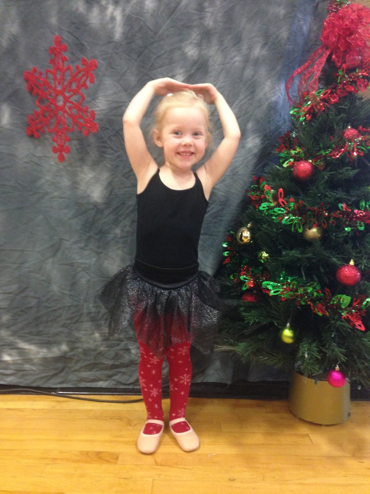
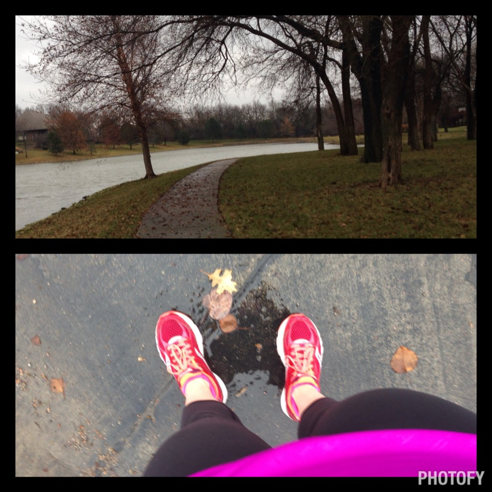
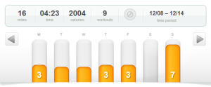
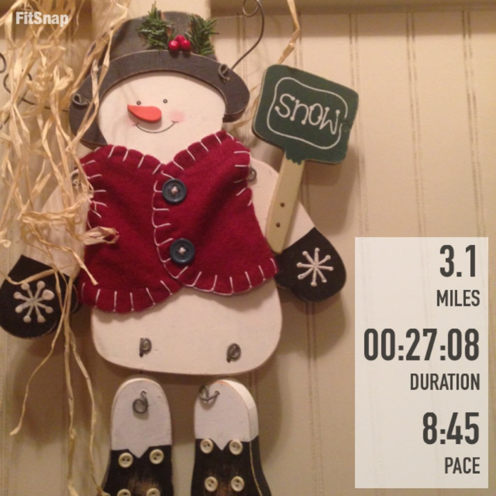

There's only a little over two weeks left of the year and I only have 28.1 miles left to meet my 2014 running goal! The goal is within sight and I'm getting excited about it.

Most of my running lately is done early in the morning on the treadmill but I always try to get outside on the weekend. This weekend we had a dance recital and a lot of family visiting to see this little ballerina.

Seriously, it was a super cute performance. Yes, I know I'm biased but this mama was proud of her little girl.

So on Sunday after all the visiting family members left to go home I headed outside to run. I was hoping to beat the rain but that did not happen.

 

Last weekend when I ran outside it was drizzly and dreary outside. This weekend it started out the same but quickly escalated to a downpour. One of the best perks of running on the treadmill so much is that I still love the run, even when the weather isn't the best. I also ran a new route which always makes the run more enjoyable!

Other than trying to meet a mileage goal for the year I'm not on any specific training plan right now. I've been running at my 'easy' treadmill pace for most runs which happens to be faster than my outside pace. But on Thursday when I hopped on the treadmill I just felt like running faster. I guess it was time to do something different on the treadmill besides just jump on and cruise. I choose a ladder workouts (see below on Thursday for more specifics) and that is just what I needed. At an 8:45 pace, this wasn't my fastest 5K but I definitely haven't seen any 8's lately. It felt great to know that I could still run that quickly if I wanted even though it was a incredibly tough workout.

 

## **Weekly Workouts**

**Monday:** 3 miles (9:27 pace) + 22 minutes QSFR ([Quick Strength for Runners](http://amzn.to/1qmdVk5)) #3 x 2

I started out my week with a quick treadmill run. 1 mile on. 1 round of strength. 1 mile on. 1 round of strength. And then finish with another mile. This is my favorite way to run on a treadmill right now.

**Tuesday:** Spin 35 minutes + 20 minutes QSFR #4 x 2

**Wednesday:** 15 minutes Beginner Flexibility Yoga

Yoga Studio App is the best for this beginner. I love that you can pick various routines and the length of the session.

**Thursday:** 3.1  miles (8:45 pace)

So today I just wanted to run fast. I was on the treadmill and did a ladder workout. I warmed up with .25 miles at 6.0 and then changed the speed every .25 miles after that. 6.5, 7.0, 6.5, 7.5, 6.5, 8.0, 6.5, 7.5, 6.5, 7.0. I finished strong with another 8.0. This was a fun run and it went by quickly because I was always changing the speed on the treadmill.

 

**Friday:**  3 miles (9:14 pace) + 20 minutes QSFR #3 x 2

I loved the hip strengthening exercises from Monday so I decided to do them again today. That and another treadmill run for me today.

**Saturday:**  Rest

**Sunday:** 7 miles (9:39 pace)

Running on the treadmill all week really makes me appreciate the days when I am able to run outside. Even rain and wind didn't dampen my spirits during this run. It's a little amazing that I was able to run in capris and a short sleeve shirt in the middle of December!

 

 

One of my main goals for 2014 is to Run This Year in kilometers. That's 2,014 kilometers or 1,251.44 miles.

Weekly Running Miles: 16.10

December Running Miles: 31.11

2014 Running Miles: 1223.34

2014 Running Kilometers: 1968.77

 

 **Do you run faster on the treadmill or outside?**

\_\_\_\_\_\_\_\_\_\_\_\_\_\_\_\_\_

I’m running I ran the Chicago Marathon with Team RMHC!

To find out more read my post about [Running for Charity](http://amotherspace.net/2014/06/the-chicago-marathon-running-for-charity/) or head over to my [fundraising page](http://www.kintera.org/faf/donorReg/donorPledge.asp?ievent=1097960&supId=399266070) to make a donation.

——————————-

Find A Mother’s Pace on…

Twitter [@amotherspace3](https://twitter.com/amotherspace3)

Facebook [amotherspace3](http://facebook.com/amotherspace3)

Instagram [amotherspace](http://instagram.com/amotherspace)

Pinterest [amotherspace](http://pinterest.com/amotherspace/)

Bloglovin’ [A Mother’s Pace](http://www.bloglovin.com/en/blog/6680087)

RSS [amotherspace](http://feeds.feedburner.com/amotherspace)
