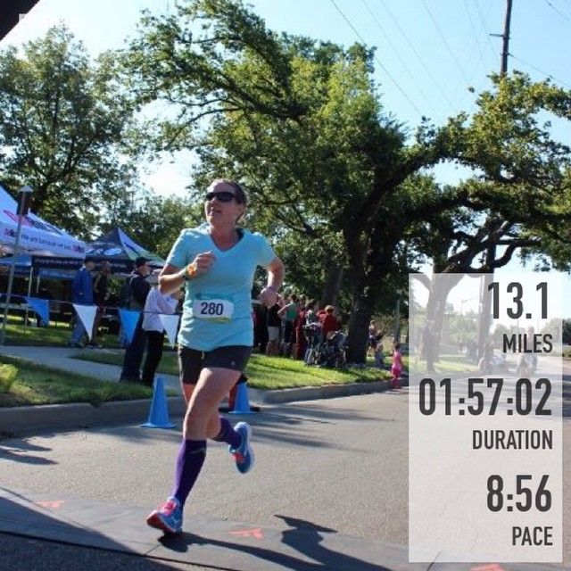
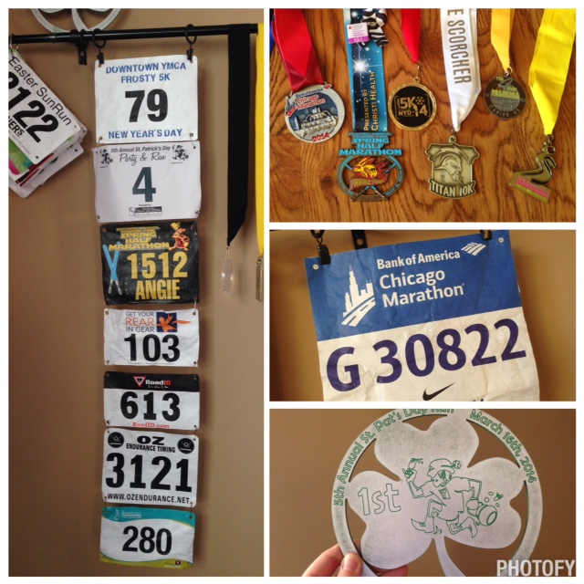
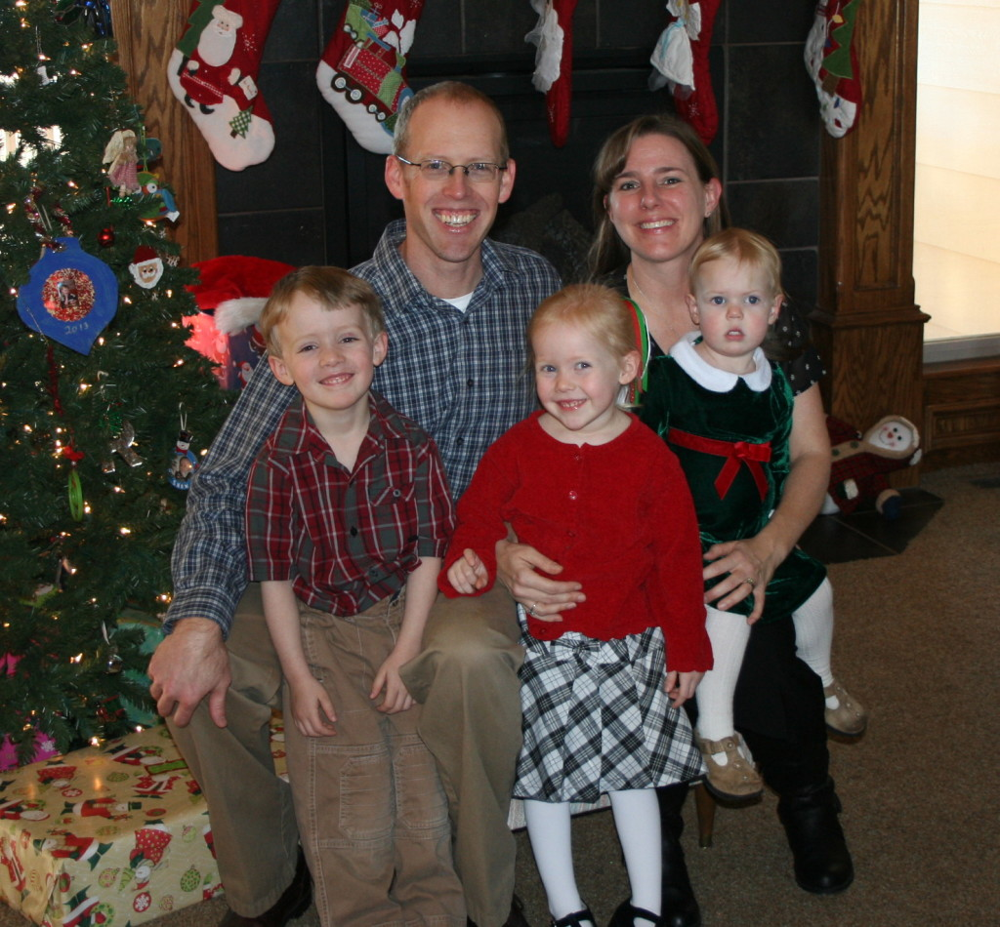

Running in 2014 turned out to be pretty fantastic, even though I spent the last couple of months dealing with an injury. I could also call 2014 The Year of the PR, I'll focus on that and not the injury! I discovered while going through races for this post that I set personal records in 8 of the 13 races that I ran this year! I know I'm probably not supposed to say it (because it's about me...) but, that's amazing!

 

 

I set my 5K PR in January and then broke it again in May. It now stands at 25:38. I set my 4 mile PR in March with a 34:04 time. In April I PR'd in the 10K with a time of 52:35. Then I made several half marathon PR's. The first was in May (2:04:21) then again in August (2:02:37) and finally I broke the 2 hour barrier with another PR in September (1:57:02.) I ran my second full marathon in October and set a 40+ minute PR with the time of 4:22:54.

That's most definitely a fantastic year! In fact, it makes me a little nervous about 2015 because in no way is it going to compare to how great 2014 was for my running. I'm okay with that though!

 

\[caption id="attachment\_2812" align="aligncenter" width="538"\] Photo Credit: [Photogenic Chicago](http://photogenicchicago.com)\[/caption\]

My goal race for the year was the Chicago Marathon in October. I spent the entire year preparing for it, even before training started. I wanted to make sure that I had a good base heading into training. The marathon turned out to be the best racing and possibly running experience of my life. Yes, it was that incredible. Did you miss that recap? You can read all about it -----> [here](http://amotherspace.net/2014/10/2014-chicago-marathon-race-recap/ "2014 Chicago Marathon Race Recap"). If you are contemplating running a marathon and the Chicago Marathon is one you are considering...sign up for the lottery or run for a charity, like the [Ronald McDonald House](http://amotherspace.net/2014/10/my-top-reasons-to-run-the-chicago-marathon-with-team-rmhc/ "My Top Reasons to Run the Chicago Marathon with Team RMHC"). I can't recommend it enough.

## **My year in numbers.**

 

1,261.89: number of running miles

2014 blew away my past mileage high of 622 miles. I set my Run This Year goal way back in January to run 2,014 kilometers throughout the year. I exceeded it last week and went on to run a total of 2,030.82 kilometers for the year.

 

 

165.44: highest mileage in one month

12: number of running months

16: number of days with no running due to Plantar Fasciitus after the Chicago Marathon. (It felt like forever so I'm surprised to see that it was only 16 days!)

13: number of races ([Frosty 5K](http://amotherspace.net/2014/01/2014-frosty-5k-race-recap/ "2014 Frosty 5K Race Recap"), 3 5 by the 5th virtual races, [St. Patrick's Day Party and Run 4 miler](http://amotherspace.net/2014/03/st-patricks-day-party-and-run-race-recap-2014/ "St. Patrick’s Day Party and Run Race Recap 2014"), [Easter SunRun 10K](http://amotherspace.net/2014/04/easter-sun-run-race-recap-2014/ "Easter Sun Run Race Recap 2014"), World Run Virtual 10K, [Spring Prairie Fire Half Marathon](http://amotherspace.net/2014/05/2014-prairie-fire-spring-half-marathon-race-recap/ "2014 Prairie Fire Spring Half Marathon Race Recap"), [Get Your Rear in Gear 5K](http://amotherspace.net/2014/05/get-your-rear-in-gear-2014-race-recap/ "Get Your Rear in Gear 2014 Race Recap"), [Southside Scorcher 10K](http://amotherspace.net/2014/07/titan-10k-southside-scorcher-race-recap/ "Titan 10K Southside Scorcher Race Recap"), [Run for Your Momma Half Marathon](http://amotherspace.net/2014/09/run-for-your-momma-half-marathon-race-recap/ "Run for Your Momma Half Marathon Race Recap"), [Johnston's Half Marathon](http://amotherspace.net/2014/09/johnstons-half-marathon-race-recap/ "Johnston’s Half Marathon Race Recap"), [Chicago Marathon](http://amotherspace.net/2014/10/2014-chicago-marathon-race-recap/ "2014 Chicago Marathon Race Recap"))

One of my goals for 2014 was to race 14 races. (#14in2014) if I had added them up before this week and found out I was only one race short I might have tried to squeeze one more race in this year!

4: number of virtual races (Spring 5 by the 5th Series + the World Run)

6: number of medals

2: Age Group Awards

0: number of DNS (did not start) races

4: number of states I ran in (KS, IA, OK, IL)

4: number of people in my (immediate) family that supported me every step of the way. I couldn't have had the running year that I had without their understanding and support as I went out on all my miles this year.

So, I kinda feel like I was bragging a lot in this post. I'm proud of my running improvements over the year (and shocked by them) but I don't mean to share them to brag.  I've had a good year and I always like to keep all these numbers in one nice little post at the end of the year. If you've made it to the end, thanks for reading!

**Are you a numbers geek like me? ** **Do you like to look back on all the running numbers of the year?**

\-------------------------------

Find A Mother's Pace on...

Twitter [@amotherspace3](https://twitter.com/amotherspace3)

Facebook [amotherspace3](http://facebook.com/amotherspace3)

Instagram [amotherspace](http://instagram.com/amotherspace)

Pinterest [amotherspace](http://pinterest.com/amotherspace/)

Bloglovin' [A Mother's Pace](http://www.bloglovin.com/en/blog/6680087)

RSS [amotherspace](http://feeds.feedburner.com/amotherspace)
