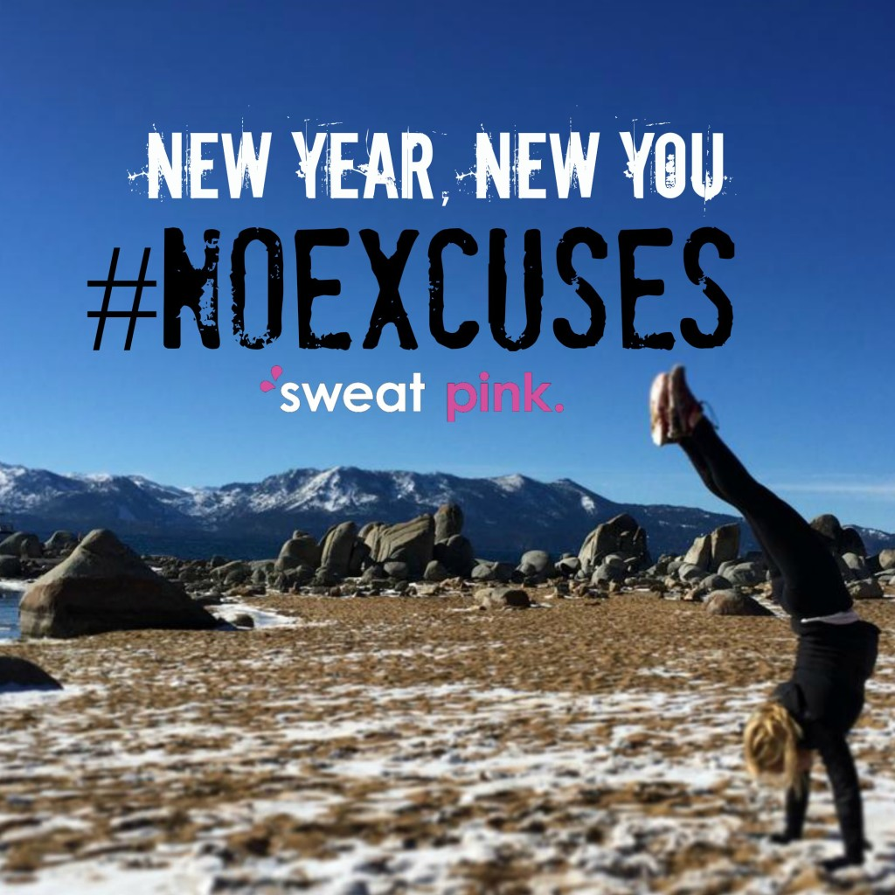
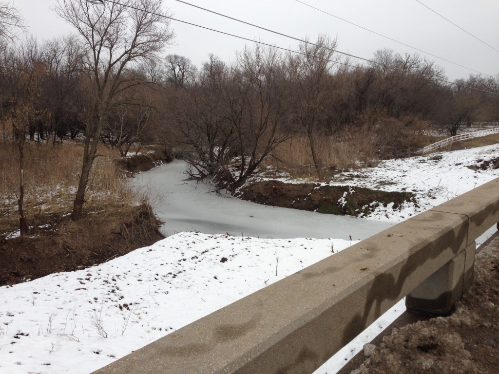
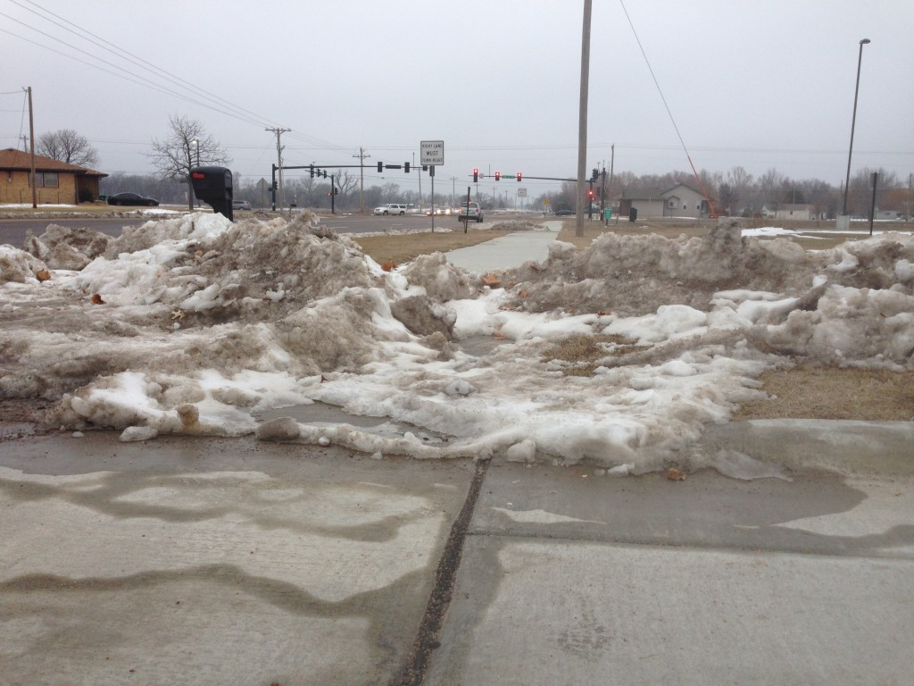
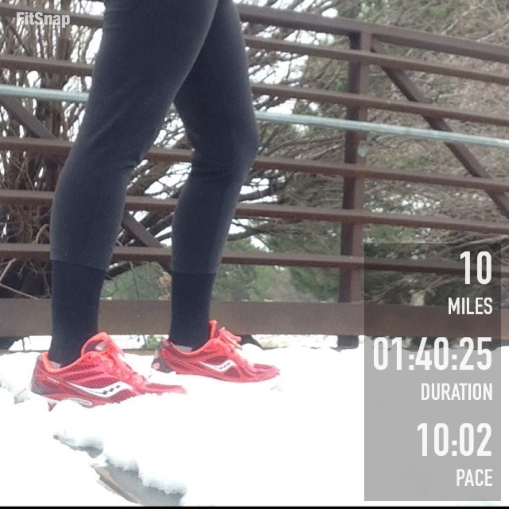
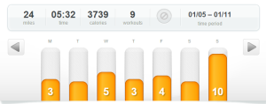
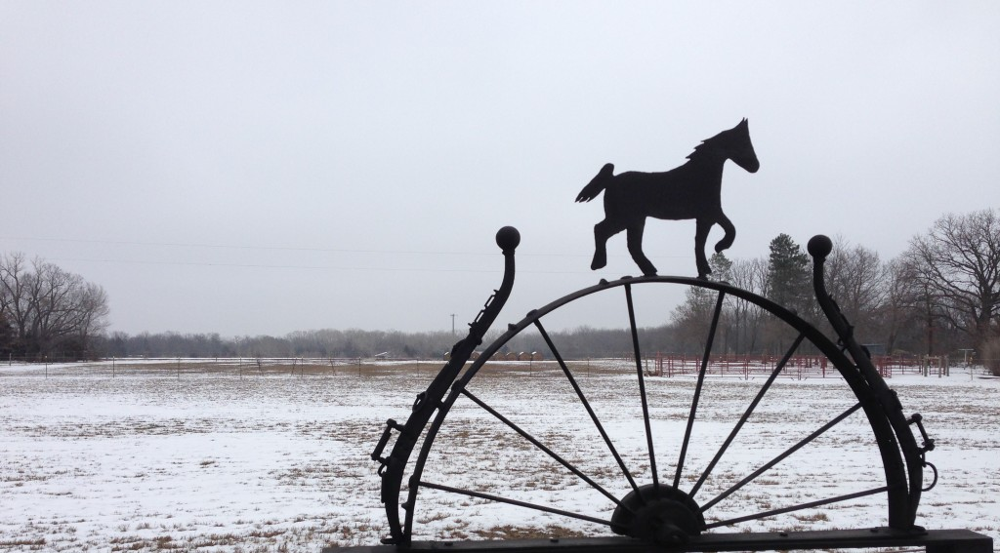

This week marks the start to the #SweatPink #NoExcuses Challenge. I'm joining in on the motivation and inspiration so you'll hear me talking about #NoExcuses quite a bit on Instagram, Twitter and this blog. Want to join in on the challenge? Find out more information -----> [here](%20http://bit.ly/1yCAQLl).

My long run last week was definitely my most challenging run lately and one of those 'No Excuses' types of runs. I saved the run for the afternoon, hoping that the snow would have melted off of the sidewalks from our snowfall a week ago and it did to a certain extent. But some parts of the sidewalk were a lot deeper than I thought they would be. I could have given up but instead I gave this run my all.

When I started off on my run I wasn't in the best mood. I didn't want to go out in the cold and run for 10 miles so I looked up how much I would need to run to still be on track for my mileage goal for the month. I could squeak by with 7.5 miles or so.

Since I was running an out and back I just decided to assess the situation at 4 miles and either turn around or keep going for one more mile. Of course once I reached the four mile mark I was in my groove and wanted to keep running. I turned around at 5 miles and ran back home.

My pace was all over the place because of the snow. At times I would look down at my watch and see that I was running a 12 minute pace. But it didn't effect my splits all that much, I guess. They ranged between 9:20 (mile 7) and 10:27 (mile 5) and a lot of that had to do with the difficulty in the snow.

\[caption id="attachment\_3040" align="aligncenter" width="530"\] Really??? And this is a week after the snow fell in the first place. Ugh!\[/caption\]

Some people just didn't shovel their sidewalks and some people shoveled driveways that pushed up against the sidewalk and made a small mountain to cross (see above photo.) The worst part was the sidewalk that didn't have any wind protection and because of that a lot of those areas had snow drifts on it. I tried to run in other tracks but it was a workout. I'm extremely glad that I've been working on the hip and joint mobility during my strength workouts lately. I used that added strength on this run!

Even though this run was TOUGH, it was outside (and not on the treadmill!)  By the time I arrived back home my bad mood was gone! The run was invigorating even though it took me forever to warm back up again.

 

 

## **Weekly Workouts**

**Monday:** 3 miles (9:14 pace)

After nearly two weeks of enjoying running outside I'm back to treadmill running early in the morning again. It was so hard to run on the treadmill again and I pushed the stop button a few times to pause my run. It took everything just to keep going and not jump of the treadmill and be finished.

**Tuesday:** 30 minutes Spin + 25 minutes Strength (QSFR #9)

Almost an hour of cross training this morning. I'm on workout 9 of Quick Strength for Runner's and while the workouts are getting harder, I still went in and added about 10 minutes of extra reps and exercises.

**Wednesday:**  4.5 miles (9:24 pace)

Timehop reminded me about Bart Yasso's #1 favorite treadmill workout and I haven't ran it since before I started training for Chicago. It was just what I needed to push me through 4+ miles on the mill! Here's the workout {12 min Warm Up, 5 min x 3 @ 10K pace (I ran 7 mph) with 2 minutes recovery (I ran 6.5 mph), Cool Down 10 minutes.} I shortened the workout to only 3 of the 5 reps due to the mileage that I wanted to accomplish and the time that I had.

**Thursday:**  3 miles (9:22 pace) + 25 minutes Strength (QSFR #10)

I ran one mile as a warm up to my strength workout. The Quick Strength for Runners is getting harder! I didn't repeat any of the moves in this workout and it took me 25 minutes. After the strength workout I hopped back on the mill and finished with 2 more miles. I slowed the treadmill down a little on this run to 6.3 to see if that would help me finish. Usually I think...the quicker you run the quicker you're done...but slowing it down today helped me to not push stop and rest during the run.

**Friday:** 3.5  miles (9:30 pace)

The treadmill felt better again today. Am I getting used to it again? I only had 3 miles on my schedule but I want to add an extra half mile here and there to bump my mileage up. It all adds up in the end! I'm looking forward to (hopefully!) running outside this weekend.

**Saturday:**  20 minutes Core Work

**Sunday:** 10 miles (10:02 pace)

My run in the snow.

 

##  **Weekly Run This Year Update**

My goal for the year is to race shorter distances but I'm still going to Run This Year again in 2015! I've signed up for the 'Run all year and win prizes option' Ha! I'm probably not going to make it past 2,015 Kilometers like I did last year but I'm still hoping to get a lot of miles in throughout the year! 2,015 KM is 1,252.06 miles or just 104.34 miles each month.

Weekly Running Miles: 24

January Running Miles: 42.61

2015 Running Miles: 42.61

2015 Running Kilometers: 68.51

 

 

——————————-

Find A Mother’s Pace on…

Twitter [@amotherspace3](https://twitter.com/amotherspace3)

Facebook [amotherspace3](http://facebook.com/amotherspace3)

Instagram [amotherspace](http://instagram.com/amotherspace)

Pinterest [amotherspace](http://pinterest.com/amotherspace/)

Bloglovin’ [A Mother’s Pace](http://www.bloglovin.com/en/blog/6680087)

RSS [amotherspace](http://feeds.feedburner.com/amotherspace)
