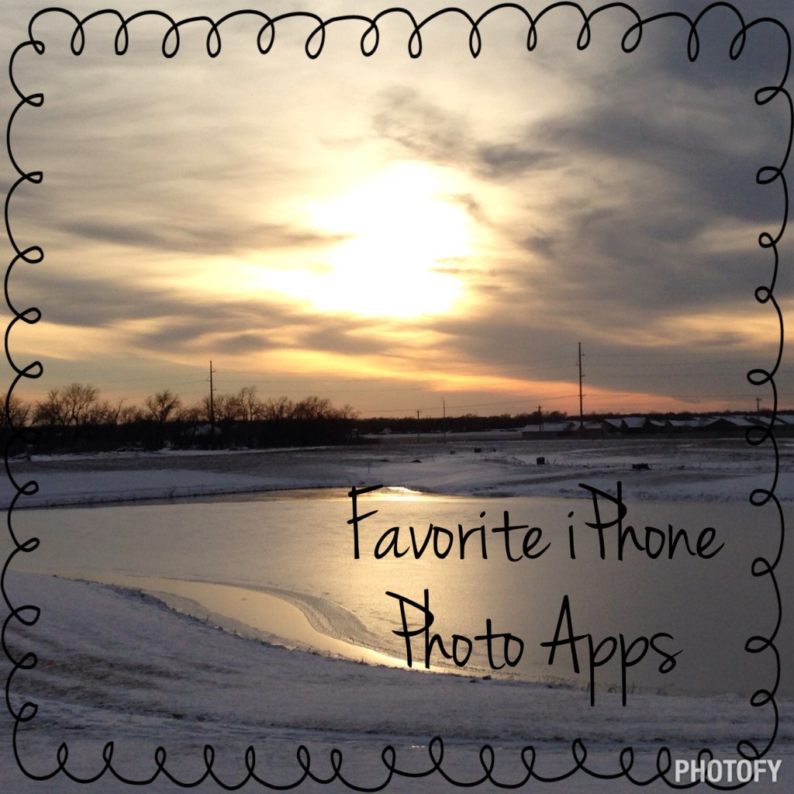
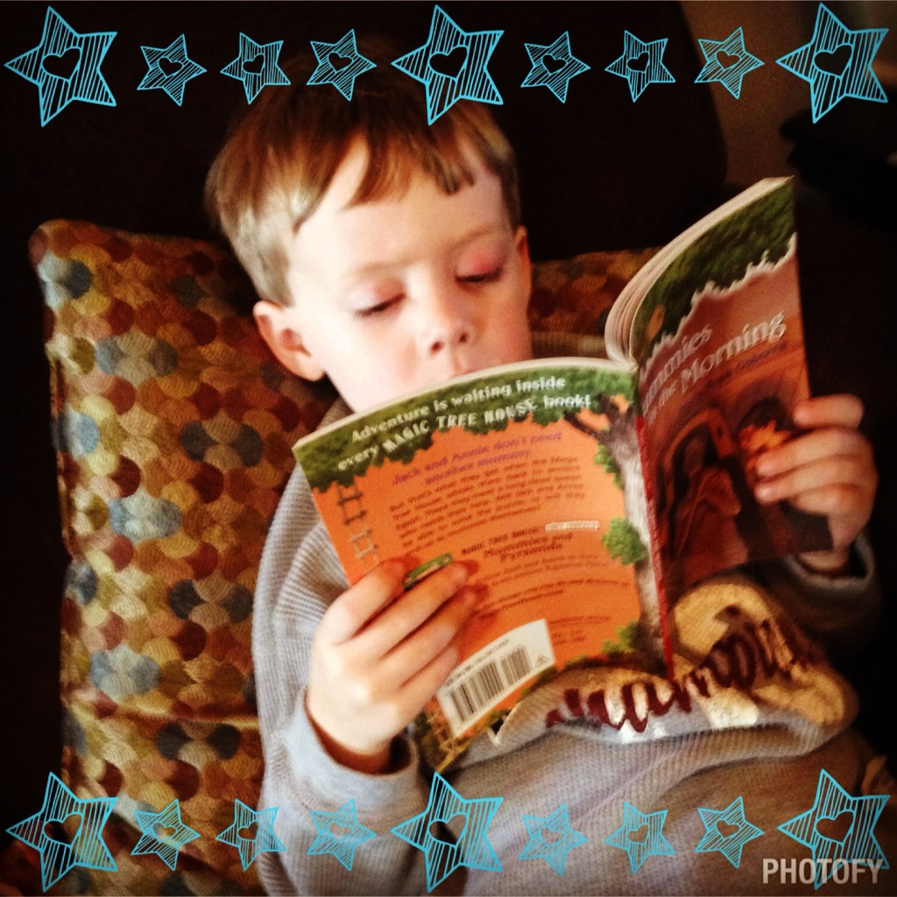

Instagram is probably definitely my favorite form of social media. I love the creativity that people show through their photographs and design abilities and I have fun adding my own pictures to the mix. I've made friends with people through Instagram and even met some of those friends in real life.

I always share my daily workout over on Instagram along with some family pics and a food shot mixed in occasionally. If you don't follow me on Instagram yet, you may find me ----- > [here](http://instagram.com/amotherspace/).

A few months ago I switched over to an iPhone from an Android phone and I'm loving all the new apps. There are a bunch of fabulous free apps out there to enhance photos that you take with your iPhone. And today you're in luck because I'm sharing my secrets! If you don't have an iPhone, I feel your pain. I loved my Android but ultimately decided to go with an iPhone because of all the apps that weren't available to Android users.

I've come across several photo apps that have become my favorites so I thought I would pass them on to you. I'm not associated with any of these apps other than the fact that I like them. If you want to try them out just search for the name in your app store. All of the apps that I have on this list are free but if you want to add more features many of them have that option for various prices. I personally haven't paid for anything with these apps and still find them very useful.

I've almost finished this post a few times over the past couple of months and in that time I've added a couple of really fun apps. I can't wait to find out what is new and exciting around the corner but for right now these are my favorites.

## **Favorite iPhone Photo Apps**

### Photofy

I'm amazed at all Photofy has to offer, for free! It has designs, creative fonts, borders, stickers and more. It's an easy to use app that has quickly become my favorite. Before finding Photofy I used A Beautiful Mess a lot. Fotor, Photogrid and BeFunky also have honorable mention here. I use all of them occasionally for various features and are worth checking out for variety.

### FitSnap

This is the app that I use most with my running posts on Instagram. After you take a photo just plug in your exercise (usually for me that's running), time, distance and any comment you may want to add. Then you pick how you want the wording to show up on your photo. It also has the option to add the pace of your activity. I like the look of this app a lot and how easy it makes sharing the information of a workout.

### GorillaCam

GorillaCam is the app I use to take multiple self-timer photos. We've used it to try and get a good family photo (is that really possible with 3 kids under 5???) but mostly I use it to take some interesting running photos when I'm out by myself. The photos below I took with GorillaCam (you can program it to take a certain amount of photos) then I picked out my favorite (the biggest one below) and edited it in Photofy to add the words.

### Timehop

I look forward to opening Timehop every day. Basically this app pulls together posts from Instagram, Facebook, Twitter, etc., from years past and puts it together each day. I LOVE to see how much the kids have grown throughout the years and it's also fun to see what my workouts have been like in the past. My favorite Timehop surprises are of my dog, MIka. She died almost 3 years ago now and I still miss her every day. It's a nice surprise to see a photo of her when I'm not expecting it! You can also share these photos easily from the app which makes for an easy #tbt (throwback thursday) post.

### Repost

I typically only use the Repost app when I want to enter into a giveaway on Instagram and you enter by reposting the post. It's an easy way to give credit to someone when you are reposting their photo.

### Photo Sync

Every time I come home Photo Sync automatically downloads the new photos that I have taken onto our computer over the WiFi in our house. Not having to worry about backing up my phone is priceless because it rarely got done before this.

**What is your favorite photo app? Do you use any of my favorites?**

**What would you add to this list?**

 

——————————-

Find A Mother’s Pace on…

Twitter [@amotherspace3](https://twitter.com/amotherspace3)

Facebook [amotherspace3](http://facebook.com/amotherspace3)

Instagram [amotherspace](http://instagram.com/amotherspace)

Pinterest [amotherspace](http://pinterest.com/amotherspace/)

Bloglovin’ [A Mother’s Pace](http://www.bloglovin.com/en/blog/6680087)

RSS [amotherspace](http://feeds.feedburner.com/amotherspace)
