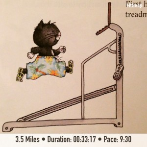
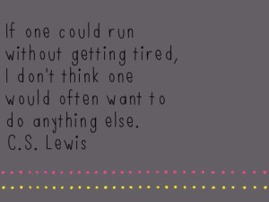

It's been awhile since I've done a Friday Favorites post but I couldn't resist this week. There are too many great things going on around here!

First, I'm excited to be the featured mother on Carly's Fit Mama Friday over at [Fine Fit Day](http://wp.me/p3t8EN-2d8). Head on over to read it and be sure to check out the rest of her blog as well. Carly's currently in her third trimester of her second pregnancy and she is rocking the workouts and healthy eating! She's quite an inspiration and always has something fun up on her blog. If you are visiting today because of my feature at Fine Fit Day, welcome! Leave a comment below and introduce yourself. I'd love to connect!

## Instagram

\[one\] My 6th wedding anniversary was this month and so I thought it was the perfect time to share one of my favorite New Yorker cartoons. I cut it out years ago and pinned it to a bulletin board. It still makes me laugh when I look at it. \[two\] It's always an exciting day at our house when we get out the holiday books. I couldn't be happier that all three of my children are in love with books. \[three\] A beautiful Kansas sunset. \[four\] My loves. We've had a bunch of snow this January but this week we've been enjoying some warmer weather. It's nice to get outside again! \[five\] My treadmill run from yesterday plus a strength workout!

Follow me on Instagram ----> [here](http://instagram.com/amotherspace).

## Recipes of the Week

So far this month I've actually made a lot of recipes that I've found online. They've all turned out fantastic and I hope you try out something below if it sounds good.

[Black Bean, Sweet Corn and Tomato Quinoa Burritos](http://iowagirleats.com/2015/01/07/black-bean-sweet-corn-tomato-quinoa-burritos-make-ahead-freezer-friendly/?utm_content=buffera046d&utm_medium=social&utm_source=twitter.com&utm_campaign=buffer) (Make-Ahead, Freezer Friendly) from Iowa Girl Eats.

I made this recipe this past week and doubled it before even making it the first time. I knew all the ingredients sounded fantastic and that I wanted to stash some away in the freezer. I'm so glad that I did that because the recipe turned out delicious, and while the kids didn't really eat it that well, my husband and I have a lot of burritos for a quick dinner or yummy lunch.

[Citrus-Topped Bakery-Style Blueberry Muffins](http://peasandcrayons.com/2015/01/citrus-topped-bakery-style-blueberry-muffins.html?utm_content=buffer40a43&utm_medium=social&utm_source=twitter.com&utm_campaign=buffer) from Peas and Crayons.

To be honest, I have to say that I skipped the citrus topping on these muffins because it didn't sound good to me. That said, they turned out so good that they are now my go-to muffin recipe. I also doubled this batch and froze some of the muffins. The kids LOVE blueberry muffins defrosted and warmed in the microwave!

[Mushroom and Black Bean "Meatballs"](http://thefitfoodiemama.com/meatless-monday-black-bean-and-mushroom-meatballs/?utm_content=bufferec62b&utm_medium=social&utm_source=twitter.com&utm_campaign=buffer) from Fit Foodie Mama.

I'll admit when I made this recipe I was hoping to trick my kids into eating mushrooms. They eat black beans but I can't get them to enjoy mushrooms. While I failed at getting the kids to eat mushrooms, my husband and I enjoyed this meal.

[Easiest Half-Batch Chocolate Chip Cookies](http://www.chelseasmessyapron.com/easiest-half-batch-chocolate-chip-cookies-one-bowl-no-mixer-required/?utm_content=buffer18aec&utm_medium=social&utm_source=twitter.com&utm_campaign=buffer) from Chelsea's Messy Apron.

I haven't made these cookies yet but I still had to share because they look so very yummy.

## Interesting Reads

[Importance of Functional Training and Knowing Your Imbalances](http://www.mommyrunfast.com/importance-of-functional-movement-and-knowing-your-imbalances/?utm_content=buffer1ecba&utm_medium=social&utm_source=twitter.com&utm_campaign=buffer) from Laura at Mommy Run Fast.

[3 Treadmill Workouts for Speed and Strength](http://www.happyfitmama.com/3-treadmill-workouts/?utm_content=buffer2e0e3&utm_medium=social&utm_source=twitter.com&utm_campaign=buffer) from Angela at Happy Fit Mama.

[Do Epsom Salts Work?](http://misszippy1.com/2015/01/epsom-salts.html) from Miss Zippy.

## Favorite Running Gear

This time around I'm picking my treadmill as a favorite. The cold and dark mornings mean that I'm inside on the treadmill, both for warmth and safety. I hear so many people call it a 'dreadmill' and I'm so glad I don't have that attitude about it. My brain definitely wouldn't be able to handle running on the treadmill if I was negative about it!  I'm just happy to be able to get a run in conveniently at home before we really get our day started. Of course, I always look forward to running outside but the treadmill definitely beats not being able to run at all.

## Currently Reading

Next week my book club meets and we'll decide our books for the entire year. Have you read anything that you loved lately? What about something that would make for a great discussion? I would love feedback in this area so that I can bring several good suggestions for the year. I know I want to suggest [The Goldfinch](http://amzn.to/1xzYT8n)  (affiliate link) by Donna Tartt but other than that I haven't started searching yet. What would you add?

## Favorite Quotes

## Did you Miss This?

This week I shared my favorite iPhone photo apps. Did you miss it? Check it out -------> [here](http://amotherspace.net/2015/01/favorite-iphone-photo-apps/ "Favorite iPhone Photo Apps").

 

**What book would you recommend for my book club? Do you enjoy running on the treadmill?** 

——————————-

Find A Mother’s Pace on…

Twitter [@amotherspace3](https://twitter.com/amotherspace3)

Facebook [amotherspace3](http://facebook.com/amotherspace3)

Instagram [amotherspace](http://instagram.com/amotherspace)

Pinterest [amotherspace](http://pinterest.com/amotherspace/)

Bloglovin’ [A Mother’s Pace](http://www.bloglovin.com/en/blog/6680087)

RSS [amotherspace](http://feeds.feedburner.com/amotherspace)
