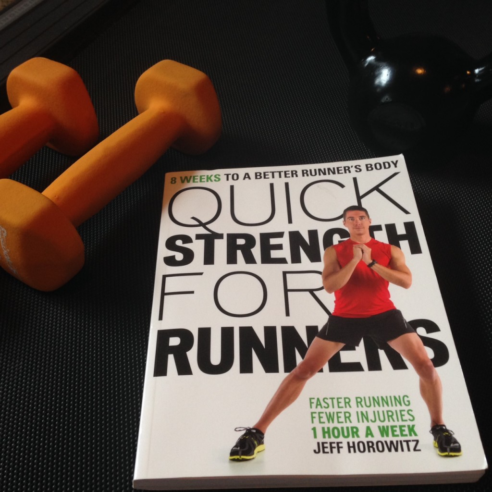
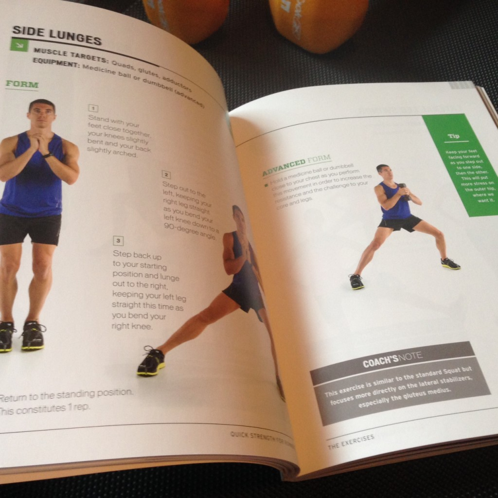
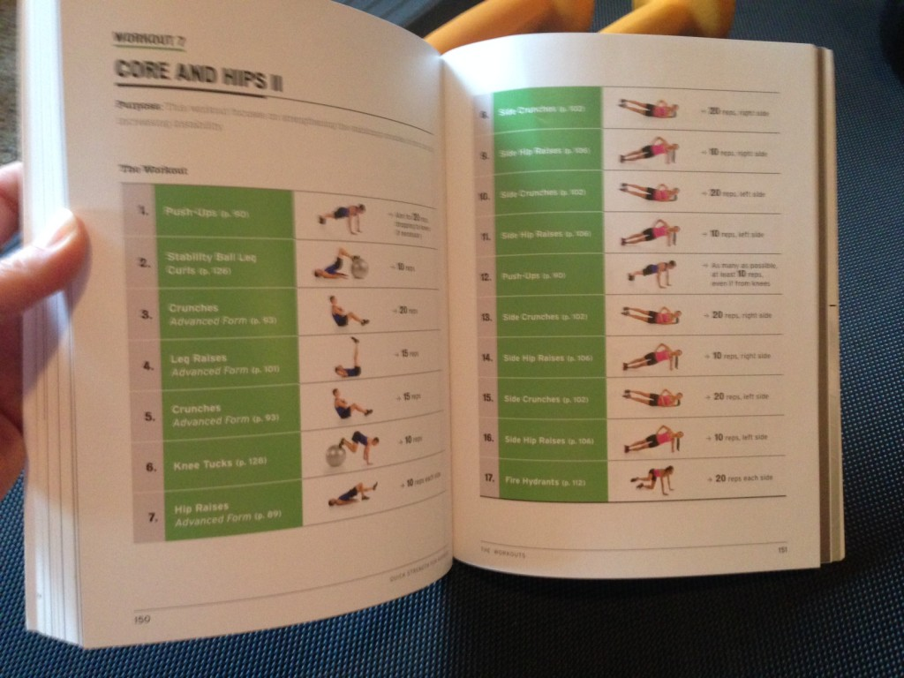
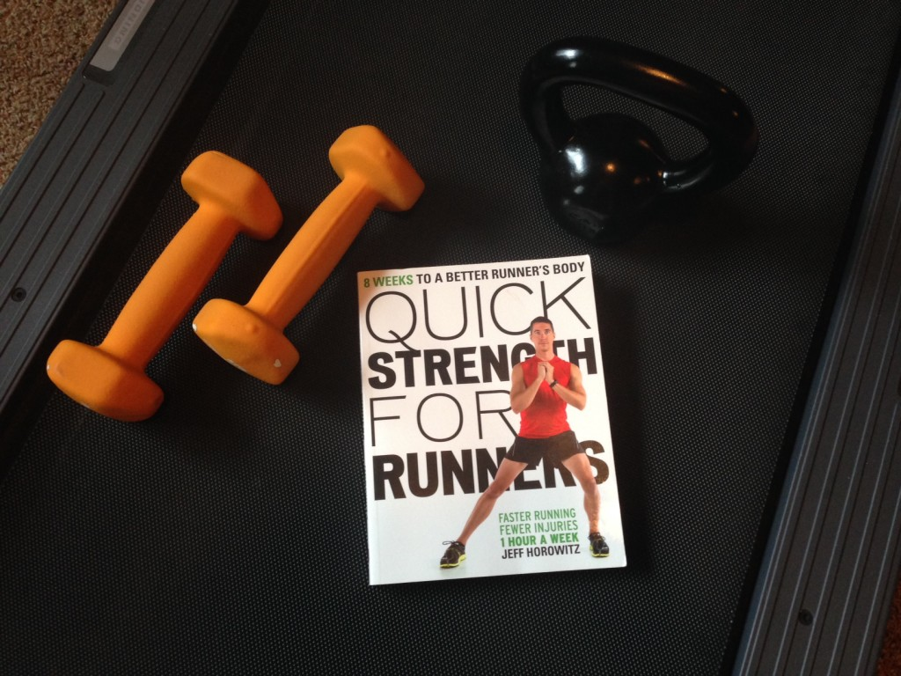
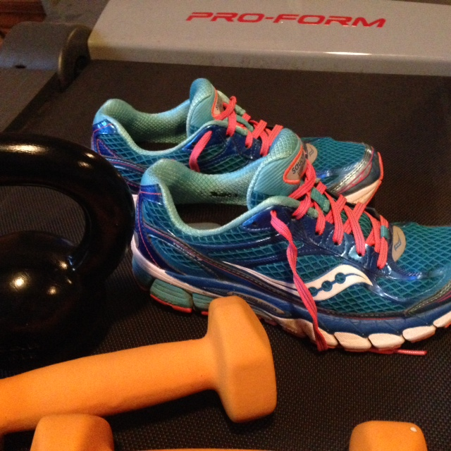

I recently finished an 8 week strength training program designed just for runners. Even better than just finishing, I actually completed the whole program in just 8 weeks! I did two workouts a week and didn't miss one. I'm not sure that I've ever completed a program successfully before!

Before starting the program I was doing strength workouts 2 or 3 times a week. I varied my workouts and basically picked from 5 or 6 favorite workouts from magazines, Pinterest or books that I have purchased in the past.

[Quick Strength for Runners](http://amzn.to/1yCKskx) by Jeff Horowitz (affiliate link) starts with a couple of chapters on why strength training is important and highlights some tools that are helpful to get you started but not necessary, in my opinion. You can make due with what you have in your home gym, if needed.

Next the book describes all the exercises in the program. It shows multiple pictures and a clear description of the exercise including an advanced form. I didn't completely read this section but I would reference it often when I had a question about a certain workout. It was very helpful to have all of these exercises listed out where I could easily flip to the page to see how to do the exercise correctly.

The book then shifts to the actual 8 week program. Because of my strength training base it seemed really easy at the beginning and I ran through most of the workouts in the beginning twice to make the workout work for me. But I certainly didn't do that all throughout the book. At some point each workout ended up taking me about 30 minutes without repeating anything.

Because of the easiness of the first workouts I think this would be a great program for a beginner to strength training. You can always repeat a week if something is too difficult later in the workouts. At the same time I think that this program works well for someone like me that has a strength training base but likes having someone else put together a program.

Now that I'm finished with the 8 week program I'm thinking of taking a couple of weeks off from the moves in the book and going back to my favorite workouts that I've given up for the past two months. Then I plan on incorporating one workout from this book, one core workout and one of my standards each week.

I really like the progression of the workouts in the sessions and I like knowing that it was made specifically with a runner in mind. I feel stronger since I've started the program and a lot of the exercises feel a little easier than the first time I tried them.

I purchased Quick Strength for Runners myself and wanted to share my thoughts on the book with you. I don't have any connection to the book or author other than the fact that I liked it and wanted to share.

Oh, if you're interested in some of my strength workouts that I've done other than this book, check out my [Strength Workouts](https://www.pinterest.com/amotherspace/strength-workouts/) Pinterest page.

**Have you tried Quick Strength for Runners? Do you strength train regularly?**

**What do you use as a guide?**

\[bctt tweet="Tips on Quick Strength for Runners | A Mother's Pace #runchat #strengthforrunners"\]

——————————-

Find A Mother’s Pace on…

Twitter [@amotherspace3](https://twitter.com/amotherspace3)

Facebook [amotherspace3](http://facebook.com/amotherspace3)

Instagram [amotherspace](http://instagram.com/amotherspace)

Pinterest [amotherspace](http://pinterest.com/amotherspace/)

Bloglovin’ [A Mother’s Pace](http://www.bloglovin.com/en/blog/6680087)

RSS [amotherspace](http://feeds.feedburner.com/amotherspace)
