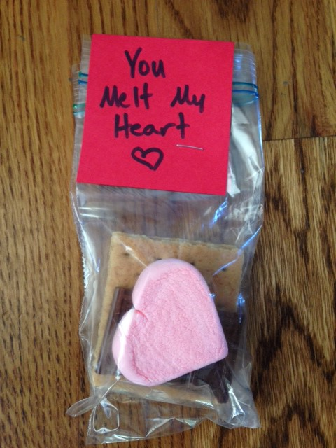
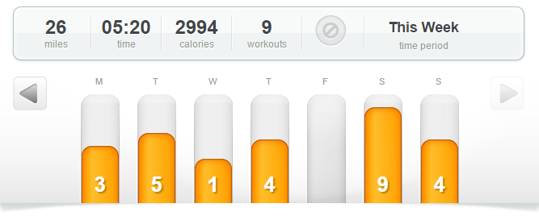
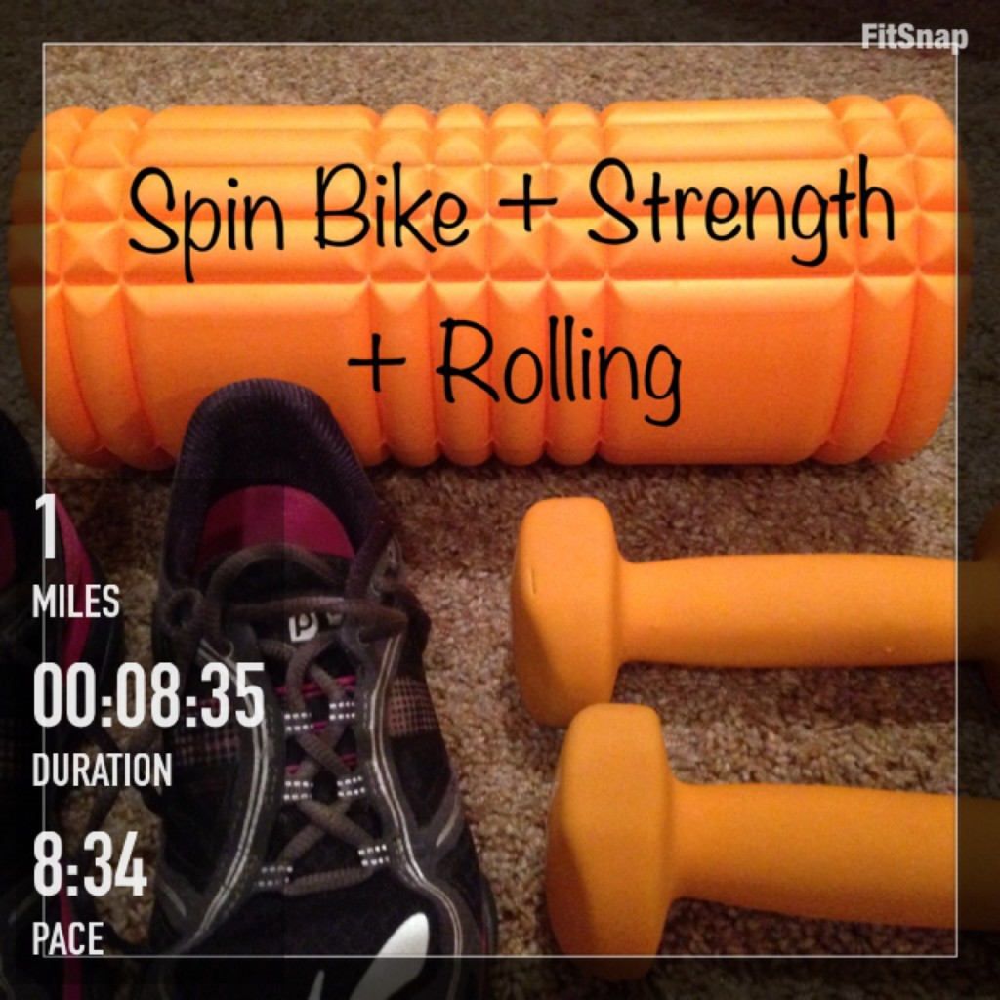
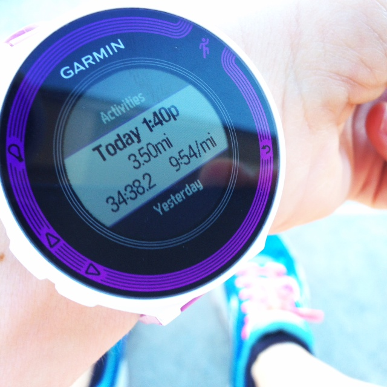
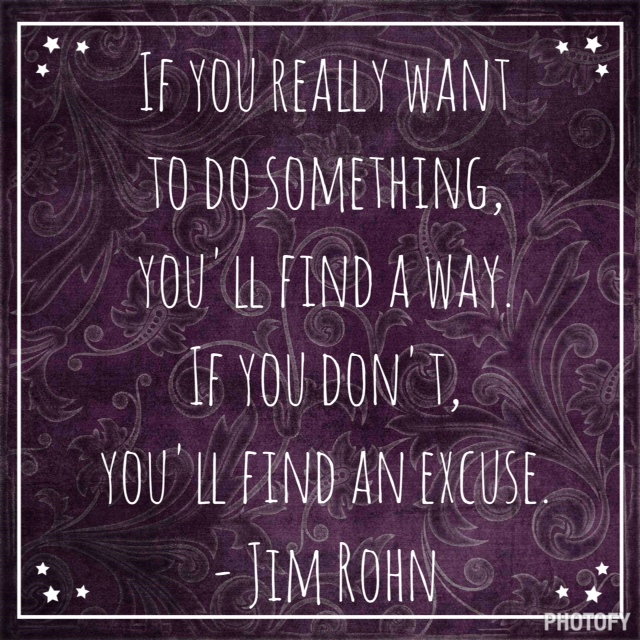

It hit me over the weekend that Valentine's Day parties are already this week. It's already the second week of February. How did that happen? So, we're busy making Valentine's for class parties at the end of the week. I finally decided on this cute idea that I found over on Pinterest.

Who doesn't love a s'more? Of course the example online was a little fancier than mine but this will work just fine for us!

Last week was a great week of running and probably my highest mileage since marathon training in the fall. 25.5+ miles of running with two beautiful runs outside. It warmed up toward the end of the week here which was just in time to get some outside running in over the weekend. I'm thinking of switching my 2 non-running days to week days so I can get out more on the weekends in the fresh air.

Clear blue skies on a warm winter run outside just can't be beat. I'm completely ready for spring now with this little taste of warmth!

## **Weekly Workouts**

**Monday:** 3 miles (9:28 pace) + 15 minutes Kettlebells & Core Work + 15 minutes Relaxation Yoga

The treadmill, kettlebells bright and early in the morning and relaxation yoga with my husband in the evening.

**Tuesday:** 5 miles (9:03 pace) + 15 minutes Relaxation Yoga

My 5 by the 5th virtual race. (read about it ---->[here](http://amotherspace.net/2015/02/february-2015-5bythe5th-virtual-race/ "{February 2015} #5bythe5th Virtual Race")) A 5k with a warm up and cool down to make 5 miles even.

**Wednesday:** 1 mile (8:35 pace) + 30 minutes Spin Bike + 30 minutes Strength Circuit

I started with a warm up on the spin bike then moved right into a Jillian Michaels strength circuit that I have. The circuit has me on and off the treadmill and so I clocked a mile on my 'rest' day. Oops! Then I hoped back on the spin bike to cool down before foam rolling a little bit.

**Thursday:** 4  miles (9:13 pace)

I was dreaming of warmer weather on my treadmill run this morning. As much as I'm extremely happy that I own a treadmill, I'm ready for spring and early morning running outside again!

**Friday:** Rest

**Saturday:** 9.03 miles (10:06 pace)

A long run on a beautiful and sunny day. I felt slow today and my legs were heavy but it felt great to be outside.

**Sunday:** 3.5 miles (9:54 pace)

An afternoon neighborhood run in the 70's today. It was almost too warm. Almost. Shorts in February are fantastic!

 

## **Weekly Run This Year Update**

My goal for the year is to race shorter distances but I'm going to Run This Year again in 2015! I've signed up for the 'Run all year and win prizes option' Ha! I'm probably not going to make it past 2,015 kilometers like I did last year but I'm still hoping to get a lot of miles in throughout the year! 2,015 KM is 1,252.06 miles or just 104.34 miles each month.

 

 

Weekly Running Miles: 25:53

February Running Miles: 25:53

2015 Running Miles: 130.29

2015 Running Kilometers: 209.68

\[bctt tweet="Blue Skies and a Weekly Running Log | A Mother's Pace #motherrunner #runthisyear"\]

——————————-

Find A Mother’s Pace on…

Twitter [@amotherspace3](https://twitter.com/amotherspace3)

Facebook [amotherspace3](http://facebook.com/amotherspace3)

Instagram [amotherspace](http://instagram.com/amotherspace)

Pinterest [amotherspace](http://pinterest.com/amotherspace/)

Bloglovin’ [A Mother’s Pace](http://www.bloglovin.com/en/blog/6680087)

RSS [amotherspace](http://feeds.feedburner.com/amotherspace)
