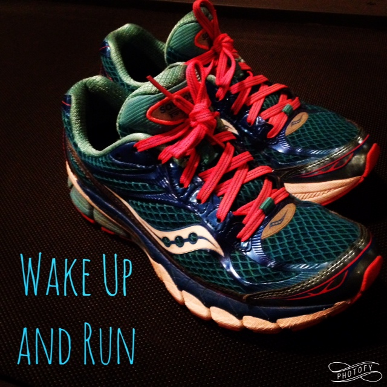
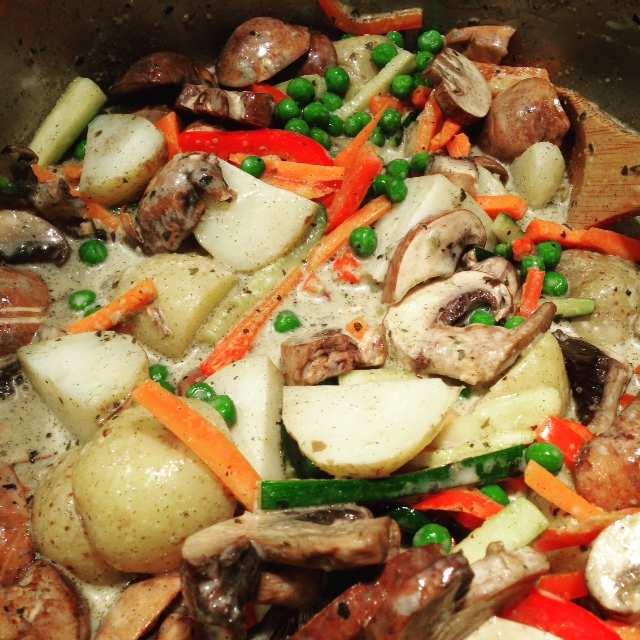

Goal setting at the beginning of the year is something that I look forward to. This year I broke my goals down into a few groups and I'm sharing them here with you today. Accountability is so important! Help me stay on top of my goals for the year. These goals also shed a light on the direction that I want to take my blog in 2016. Running, Healthy Food, Wildtree, Family, Reading. Those are all things I'm passionate about and all things I'll share on the blog.

#### Running

I miss running consistently but it is slowly coming back to me after the birth of my daughter in October. Setting running goals and competing in challenges is very motivating and helps me wake up in the morning. My biggest hurdle for these goals is being able to get my run in every day. It's tricky to balance the timing of heading out for an early morning run and nursing a baby. I'm taking a no excuses approach to my running goal unless my baby girl needs to nurse. That's obviously more important!

- Goal 1: **Run Consistently.** Strive for 5 runs per week. Work up to about 30 miles per week.
- Goal 2: **Strength Train Regularly.** Strive for at least 2 times per week.
- Goal 3: **Sign up for races or challenges.** Having a race on the calendar or needing to hit a certain amount of miles for #Challengeville is highly motivating.
- Goal 4: **Eat Healthy Real Food.** This goes hand in hand with my running goals for the year.

#### Healthy Food | Real Food

I've been a [Wildtree Representative](http://www.mywildtree.com/angierussell) for several months now and I can't say enough good things about the company. The food is fantastic. It's made with the finest natural and organic ingredients available. What I put on the table for my family is important for our health and I enjoy helping other families put healthy food on their table as well.

- Goal 1: **Menu Plan.** Each week I'm planning on sharing my menu plan with you. I've been really good at planning out the week for us at home but I'm hoping that sharing it with you will help to give you some ideas on what to fix for dinner.
- Goal 2**: Organize Our Pantry.** My goal in this area is to organize the pantry so it's easier to get to the healthy food that I want our family to eat. Hopefully this is a short term goal and I can get it finished in January!
- Goal 3: **Eat a Variety of Food.** I love when my kids try something new and like it! Trying new recipes exposes the kids (and us!) to different flavors and we've already found a lot that we enjoy. The photo below is from Wildtree's Thai Green Curry that we made a few days ago. A completely new recipe and so delicious!

#### Reading

Reading is so relaxing for me and my TBR (to be read) list is growing every day. When there is so much to be done every day it's hard to get in reading unless I make it a priority. That's why it's one of my goals this year.

- Goal 1: Read 24 books in 2016
- Goal 2: Read for at least 20 minutes. Every. Single. Day.

#### Family

Family is last on the list here but most important overall! My main goal for the year is to concentrate on spending quality time together. More game nights, more stories, more pretend play.

\[bctt tweet="What's your top goal for the year? Check out these Running, Reading, Food & Family Goals for 2016!"\]

So that's it. Those are my goals for the year. I look at this list and all together it looks a little overwhelming along with all my daily responsibilities. But I have a plan to fit it all in and I'm sharing that with you next week!

Have a great weekend!

**What is your top goal for the year?**

**Do you set aside time to do something fun for yourself, like reading?**
