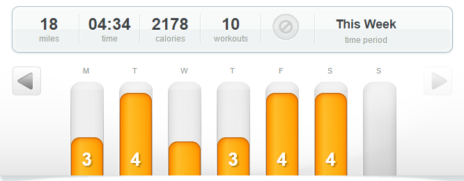

This week I hit my first monthly goal of 104 miles to start 2015 off the right way! I don't even want to add up how many of those miles were on the treadmill but I did pass the 100 mile mark while I was on the 'mill. We had an extra week basically in January so I'm going to have to kick it up a notch to be able to run the same amount in February!

I was really hoping to get out more last week and enjoy some warmer weather that we were having but it didn't happen. The wind was strong and the early morning weather didn't end up being so great but I did have one evening run that was fantastic outside. It just makes me want spring to arrive quickly! Groundhog day is this week so we shall see! :)

The Run This Year crew is putting on an Instagram challenge. Last time they hosted a challenge I 'met' a ton of people and even won a prize! Anyone can participate so find Run This Year on Instagram for the prompts each day if you would like to play along.

Alright, keep reading below to see how my workouts went last week to finish up the first month of the year.

## **Weekly Workouts**

**Monday:** 3 miles (9:31 pace) + 15 minutes Core Work

A treadmill workouts with a break for some core work in the middle.

**Tuesday:** 4.01 miles (9:54 pace)

I overslept this morning but it paid off in the end. It turned out to be a beautiful day and I was able to squeeze in a beautiful run outside as the sun went down.

**Wednesday:** 30 minutes Spin Bike + 30 minutes Quick Strength for Runners

**Thursday:** 3 miles (9:27 pace)

This was a mentally tough run on the treadmill. I thought it would never end but it only lasted 28 minutes.

**Friday:**  4 miles (9:28 pace) + 20 minutes QSFR #16

Much better today and I passed 100 miles so far for the year today! I also finished the Quick Strength for Runners program and I hope to get my thoughts out about it this week.

**Saturday:** 4 miles (9:16 pace)

I just did a 4 mile run today because I wanted to meet my goal for the month. 104 miles...check!

**Sunday:** Rest

## **Weekly Run This Year Update**

My goal for the year is to race shorter distances but I'm going to Run This Year again in 2015! I've signed up for the 'Run all year and win prizes option' Ha! I'm probably not going to make it past 2,015 kilometers like I did last year but I'm still hoping to get a lot of miles in throughout the year! 2,015 KM is 1,252.06 miles or just 104.34 miles each month.

 

 

Weekly Running Miles: 18.01

January Running Miles: 104.76

2015 Running Miles: 104.76

2015 Running Kilometers: 168.59

**How were your workouts in January? Are you still on track with your goals?**

**Who is going to participate in the Run this Year Instagram challenge with me?**

——————————-

Find A Mother’s Pace on…

Twitter [@amotherspace3](https://twitter.com/amotherspace3)

Facebook [amotherspace3](http://facebook.com/amotherspace3)

Instagram [amotherspace](http://instagram.com/amotherspace)

Pinterest [amotherspace](http://pinterest.com/amotherspace/)

Bloglovin’ [A Mother’s Pace](http://www.bloglovin.com/en/blog/6680087)

RSS [amotherspace](http://feeds.feedburner.com/amotherspace)
