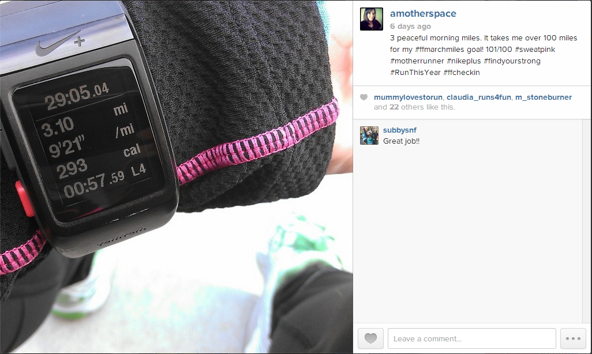
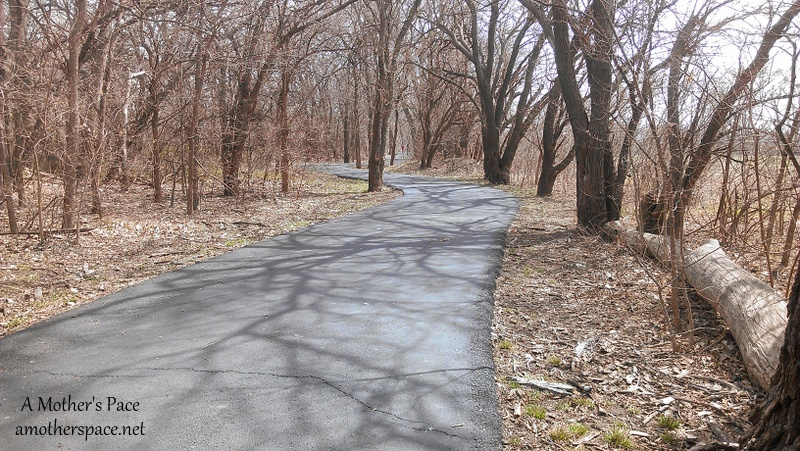
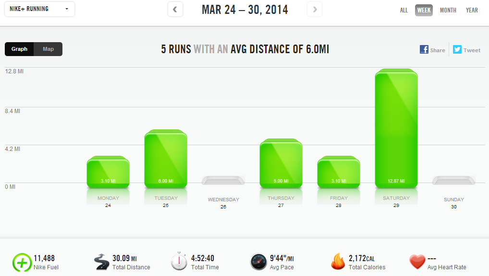

 

I set out in March with the goal of completing 100 running miles. All the miles were specifically in my training plan but when I saw that FitFluential was holding a #ffmarchmiles challenge to run 100 miles I had to play along. I thought it would be fun to officially keep track after each run instead of weekly like I normally do.

 

 

To join in on the challenge, I posted all of my workouts on Instagram and posted how far along I was in my mileage. I hit 100 early this week and kept running to hit 128.52 miles for the month so far. I have a few more miles to log today to cap off the month.

It's my highest mileage month in awhile and it feels good. I like the longer 5 and 6 mile runs during the week and I also am enjoying that only 1 or maybe 2 runs a week are around 3 miles.

My long run this past weekend was 13 miles. It worked out better for my family to run in the afternoon on Saturday instead of in the morning. I put Little A down for her nap and I headed out while my husband stayed home with the littles. It was a beautiful spring afternoon. The temps were in the mid 60's and the wind was manageable. It should have been a perfect run.

 

 

I was seriously lacking energy even before starting this run, which didn't help things. My long run goal range is between 9:30 and 10:50 (according to the [McMillan Running Calculator](http://www.mcmillanrunning.com/index.php/site/calculator)) but I would really like to keep it closer to the 9:30 side. I finished this run with a 10:09 average pace (with a strong finish) but most of the run I was hanging on to a 10:17 pace.

That 10:17 pace felt so hard and it just makes me doubt that I can finish my upcoming half with a 9:05 pace. I'm counting on the fact that this was just a difficult training run and the adrenaline of running in a race will help me achieve what I have been working towards.

 

 

**Weekly Workouts**

Monday: 3.1 miles (9:22 pace)

Tuesday: 6 miles (8:56 pace)

Wednesday: Rest

Thursday: 5 miles (9:00 pace)

Friday: 3.1 miles (9:26 pace) + 15 minutes NTC Arm Definer

Saturday: 13.25 miles (10:09 pace)

Sunday: Spin Bike 30 minutes + 15 minutes NTC Ab Burner

 

 

Mileage for Saturday is off this week. I actually ran 13.25 miles but my GPS stopped at 12.87 for some strange reason.

 

One of my main goals for 2014 is to Run This Year in kilometers. That's 2,014 kilometers or 1,251.44 miles.

Weekly Running Miles: 30.45

March Running Miles: 128.52

2014 Running Miles: 307.65

2014 Running Kilometers: 495.11

 

 

**How do you get past a mentally tough training run? How do you move past a difficult run?**

 

 

——————————-

Find A Mother’s Pace on…

Twitter [@amotherspace3](https://twitter.com/amotherspace3)

Facebook [amotherspace3](http://facebook.com/amotherspace3)

Instagram [amotherspace](http://instagram.com/amotherspace)

Pinterest [amotherspace](http://pinterest.com/amotherspace/)

Bloglovin’ [A Mother’s Pace](http://www.bloglovin.com/en/blog/6680087)

RSS [amotherspace](http://feeds.feedburner.com/amotherspace)
