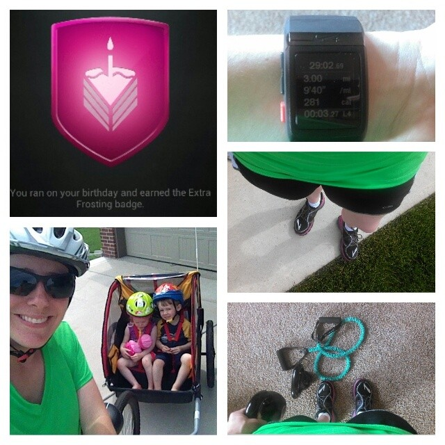
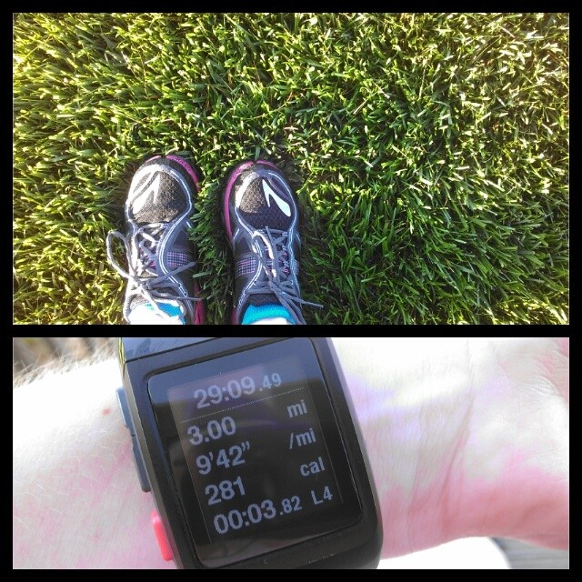
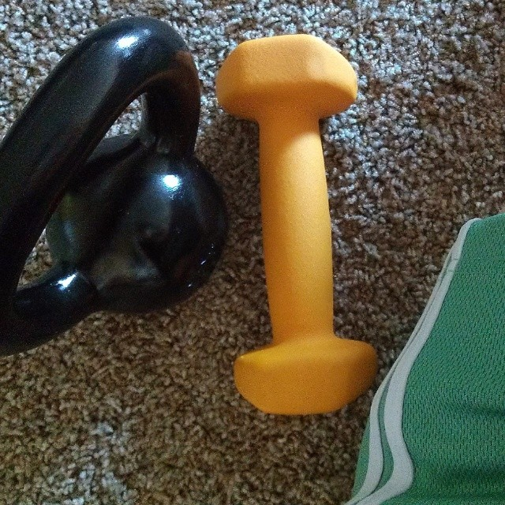

My big goal this week was to finish the month with another 100 running miles. It will be my 3rd month in a row and with marathon training coming up I'll be able to pull off 100 miles pretty easily over the next several months. I'd hate to have to start my streak over in July so I'm pushing for just over 25 miles this week.

And speaking of streaking, it's so hard to see all the #RWRunStreak posts on Twitter and Instagram. I've participated in the past two streaks and I'm certainly missing out this time around. The Runner's World Summer Run Streak lasts from Memorial Day until Fourth of July and participants pledge to complete at least one running mile a day. With marathon training beginning in June, I realized that I need to stick to my (tough)  training plan and not add a mile on my two running rest days each week. So I'm sitting this one out but I plan on signing on for the winter streak when it rolls around.

 

**Monday:** 3 miles + 20 minutes strength + 4 mile bike ride

Last Monday was my birthday and having an active birthday is my favorite way to spend it. I knew I wanted to run but needed to take it easy because of the 5k race the night before. When I got home my family was downstairs playing in the basement and so I continued my workout with some kettlebell moves and core work. I've been looking forward to a bike ride with kiddos for awhile now so the two older kids and I headed out before lunch. We were cruising heading North but when we turned around to head home my legs got a true workout peddling through strong wind with the sail, um, I mean trailer, on the back.

 

 

**Tuesday:** 5 miles

The humidity today was rough. I was a sweaty mess by the end of this run. This is the one type of run where I wish there would be just a little bit of wind to help dry me off a little while running. No such luck today!

**Wednesday:** 40 minutes Spin Bike + 20 minutes strength

Cross day means I spend a little time on the spin bike. After a 10 minute warm up I did 10 minutes of climb intervals before hoping off the bike to do a strength workout. I used the ball for crunches, weights for lunges and and resistance band for some arm work. Then I got back on the bike for 10 more  I'm still enjoying my time on the spin bike.

**Thursday**: 5 miles + 15 minute Nike Training Club Ab Burner Core Workout

It officially feels like summer when my shins start sweating. Nice, right? This was a humid one again and even though the temperature was still only in the upper 60's it felt much warmer than that. I'm hoping I get used to this warmer summer running soon.

**Friday:** 3 miles

3 morning miles. My left knee ached a little but felt o.k. after warming up.

 

 

**Saturday:** 30 minutes strength

I woke up and started to get ready to go out and run. I realized that I was feeling pain in my knee already. I literally stood in one spot for about 5 minutes trying to decide if I should run or not. 10 miles were needed to complete my 100 miles for the month but, more importantly, marathon training begins in a week. Now is not the time to run when I don't 'have' to just to reach a mileage goal. I ended up using kettlebells and weights for a great strength workout in the afternoon instead.

 

 

**Sunday:** Rest

This is my one scheduled day each week that I'm not running or doing any cross training.

 

So I didn't make my 100 miles in May goal but I know I made the smart decision. I'm heading out for 3 miles this morning and hopefully my knee will feel better after 2 days of rest.

 

 

## **Weekly Workouts**

 

Monday: 3 miles (9:40 pace) + 20 minutes Strength + 4 miles Biking

Tuesday: 5 miles (9:56 pace)

Wednesday: Spin Bike 40 minutes + 20 minutes Strength

Thursday: 5 miles (9:38 pace)

Friday: 3 miles (9:42 pace)

Saturday: 30 minutes Strength

Sunday: Rest

 

One of my main goals for 2014 is to Run This Year in kilometers. That's 2,014 kilometers or 1,251.44 miles.

Weekly Running Miles: 16

Weekly Average Pace: 9:48

March Running Miles: 90.65

2014 Running Miles: 505.86

2014 Running Kilometers: 814.10

 

**How was your running week? Would you have skipped a long run because of an ache?**

 

——————————-

Find A Mother’s Pace on…

Twitter [@amotherspace3](https://twitter.com/amotherspace3)

Facebook [amotherspace3](http://facebook.com/amotherspace3)

Instagram [amotherspace](http://instagram.com/amotherspace)

Pinterest [amotherspace](http://pinterest.com/amotherspace/)

Bloglovin’ [A Mother’s Pace](http://www.bloglovin.com/en/blog/6680087)

RSS [amotherspace](http://feeds.feedburner.com/amotherspace)
