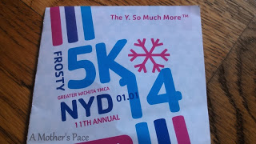
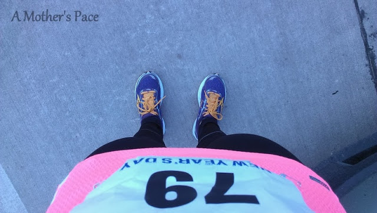
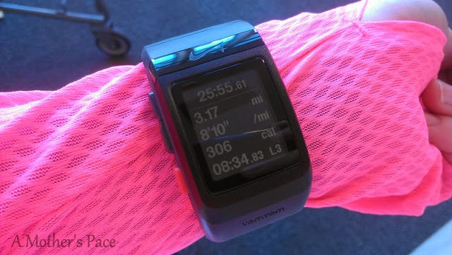
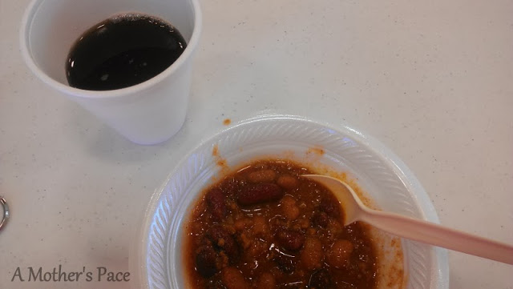
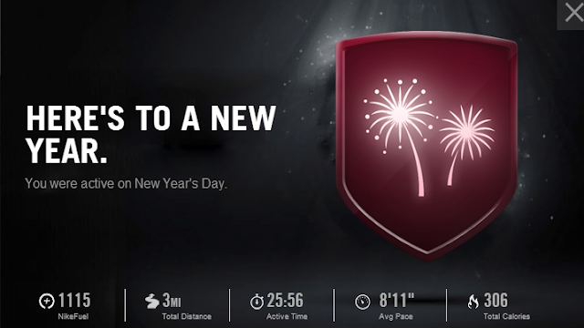

The Frosty 5K this year wasn't as _frosty_ as it has been in years past. I think the 'feels like' temperature was in the low 20's at race time. It made for a chilly but nice race.  
  
I arrived at the downtown YMCA about 45 minutes before race time and immediately found a parking spot. I warmed up a little before the race and slowly the 9:30 start time approached.  
  
I was a little surprised by the numbers in this 5K. It was a small race. Much smaller than in years past. At about 9:25 runners started to come outside of the Y and line up at the start line.  
  
  

  
Pretty soon we were off. I had no specific goal for this 5K. I hadn't been training for this race or trying to speed up my 5K time but unless I am running for fun with friends (or pregnant, really) I am always trying to beat the elusive 25 minute 5K. I knew that I wanted to run a sub 8:27 pace to beat my previous 5K time [**(26:15)**](http://amotherspace.blogspot.com/2012_06_01_archive.html#2263696659952841998) and to run sub 25 I would have to run faster than an 8:03 pace.  
  
I started out way too fast. My first mile split was 7:41. Entirely too fast. I slowed it down a bit in the second mile and ended up with an 8:17 average. The damage had been done though and I held on to an 8:36 average for the last mile.   
  
Pacing a 5K is hard for me because I think if I'm feeling good at the beginning that I can hold onto it for the short run. But after the first mile beeps I suddenly have doubts and realize that I shouldn't have gone out so fast. I need to practice progression runs to get a better feel for this in the future.  
  
They reminded us before the race that it is a _Frosty_ 5K and to watch out for some ice on the pathways. There were a couple of spots that I had to slow down or run in the grass to avoid ice but overall it was pretty clear.  
  
Even though I slowed down a lot in that last mile, I still knew that I was going to PR. I ended up finishing at 25:54 (official) with a 21 second PR. I'm getting closer to a sub 25...a little at a time!  
  
  

  
After the race the Y provided chili and coffee to the runners. I never in my life thought I would have chili and black coffee together in the morning! But after being chilled outside, the combination was just what I needed.  
  
  

  
I ran this race alone and was very surprised that I didn't see any familiar faces while I was down there. The Y puts on a good race and it is well organized. The course is down by the river in one of my favorite areas to run. The facilities are beautiful and the post race food is delicious.  
  
Normally a recap would end here but not this one. Later on in the afternoon I checked out the race results and found out that I had placed FIRST in my age group. I had checked my results after the race on the computer (At the finish line! This was the first race I've been too that you actually checked your results on a computer instead of a piece of paper.) and it listed me as 11th in my division. I thought that it meant in the age group but really it was for overall women.  
  
  

  
This is my first of (at least) 14 races for the year. I'm off to a good start!  
  
  
Official Distance: 5K (3.1 miles)  
Nike+ Distance: 3.15  
Official Time: 25:54  
Nike+ Time: 25:56  
Official Average Pace: 8:21  
Nike+ Average Pace: 8:11  
  
Overall Placement: 45/239  
Overall Women: 11/125  
Age Group: Female 35-39: 1/15  
  
  

  
  
  

**Did you run a New Year's Day race?**

\-------------------------------

  

Find A Mother's Pace on...  
  
Twitter [@amotherspace3](https://twitter.com/amotherspace3)  
  
Facebook [amotherspace3](http://facebook.com/amotherspace3)  
  
Instagram [amotherspace](http://instagram.com/amotherspace)  
  
Pinterest [amotherspace](http://pinterest.com/amotherspace/)  
  
Bloglovin' [A Mother's Pace](http://www.bloglovin.com/en/blog/6680087)  
  
RSS [amotherspace](http://feeds.feedburner.com/amotherspace)
