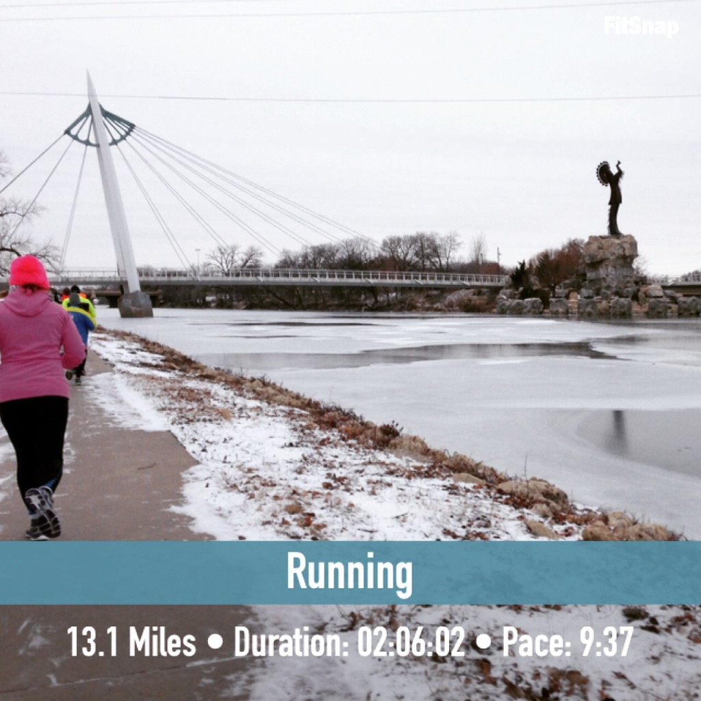
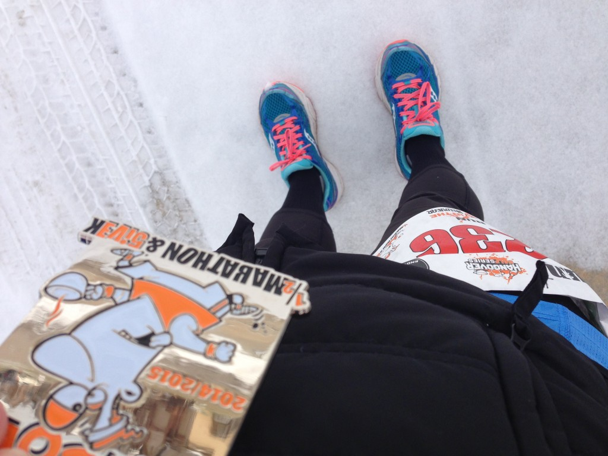
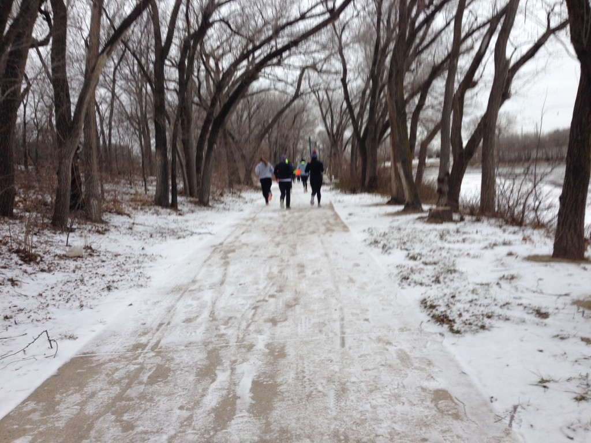
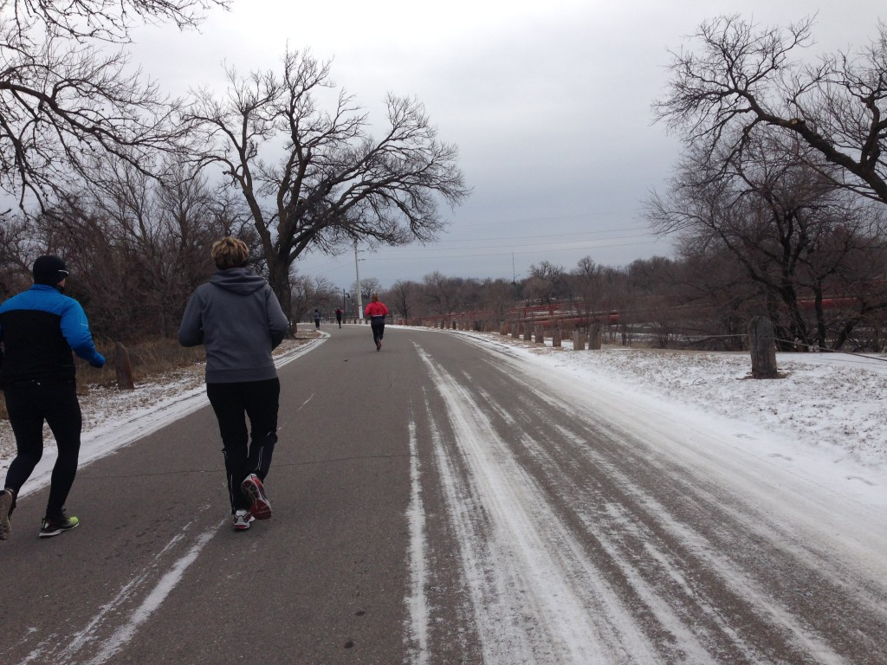
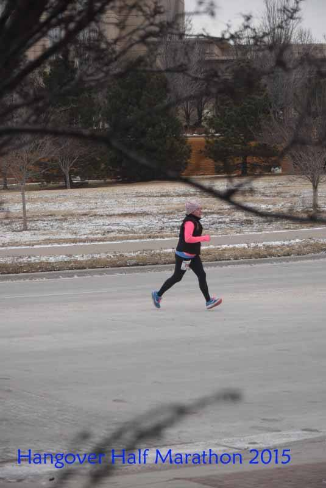
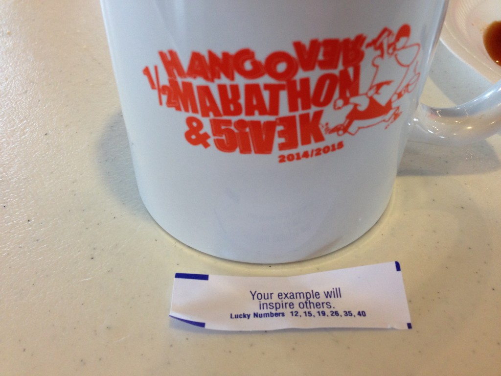
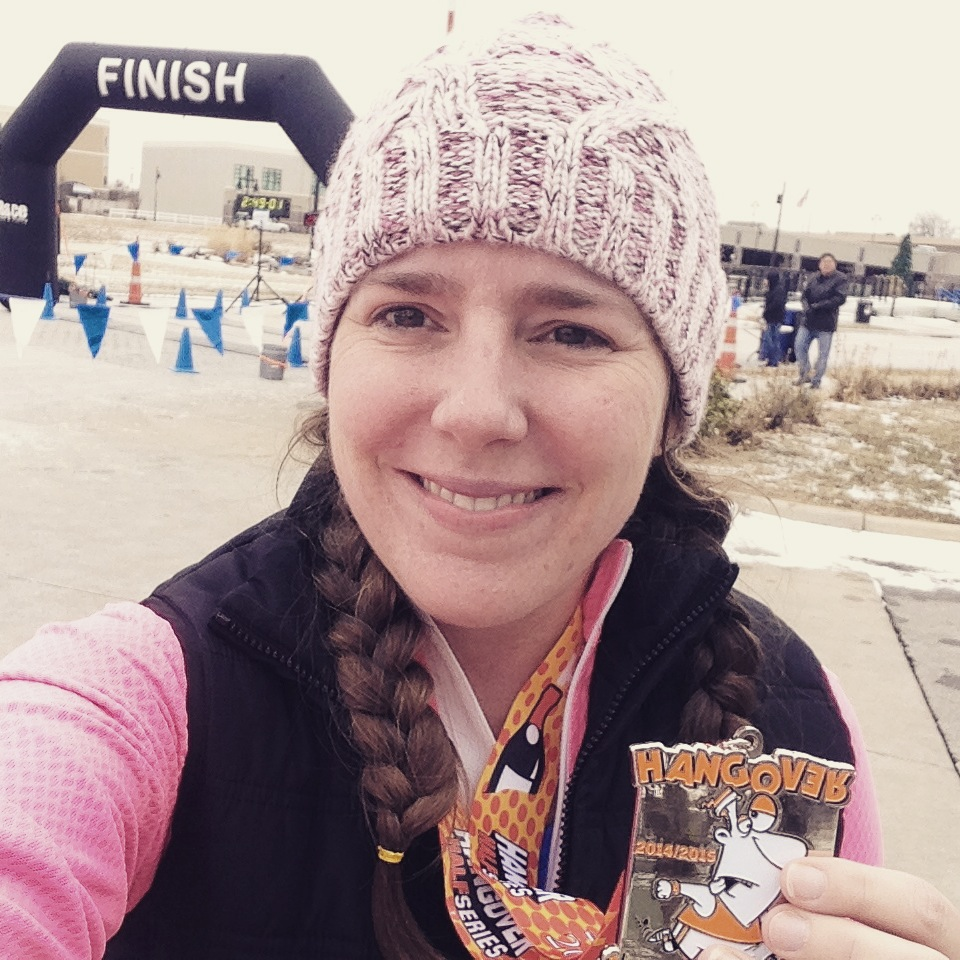
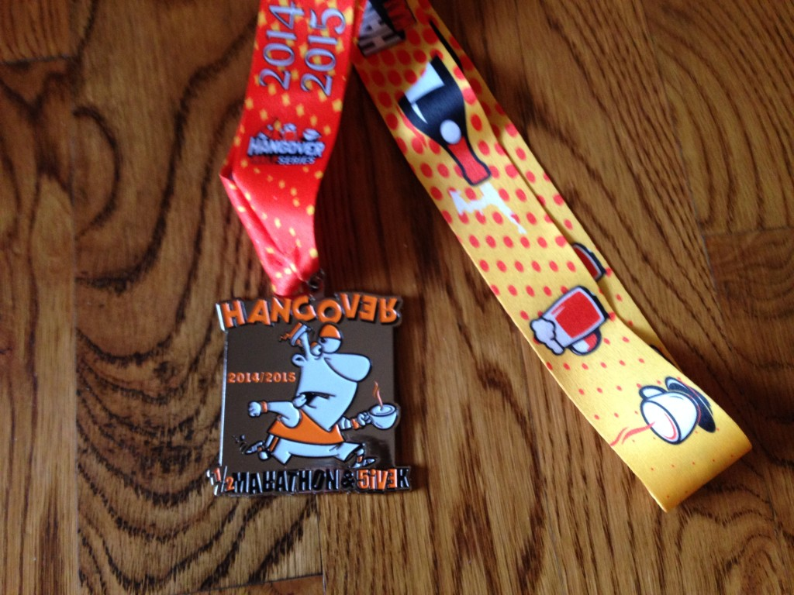

To start the new year off I did something kinda crazy. I decided on Monday to run a half marathon on Thursday, New Year's Day. What better way to begin a new year than to run a race, right?

 

 

Now, this might not seem crazy to everyone but I've never signed up for a race of this distance (or further) without specifically training for it, or at least during training for another race.

What made me do this? Well, I usually run a local 5k called the Frosty 5k but this year they didn't offer it. I was without my normal race and was trying to decide what to do. Should I just run the 5k that they offered or go big and run the half? I went big, of course!

 

 

Ever since the Chicago Marathon in October I've been trying to get back into running after an injury. I've made it to where I'm mostly comfortable, although my foot is sometimes tired after running or being on my feet a lot. In December I had worked up to running about 15 miles a week with a long run of about 8 miles on the weekends.

Because of my mileage I knew that I could finish 13.1 miles but I knew it wouldn't be easy. What made this even more interesting was that we had snow a couple of days before and freezing temps during the race. 23 degrees Fahrenheit with a 'feels like' temperature of 12 degrees. Brrr! I was more concerned about the paths being cleared of snow and ice than I was of the actual temperature.

I had second thoughts as I was snuggling with my daughter early in the morning before the race but I made myself get all layered up and drove down to the race start line.

I warmed up by jogging and doing some dynamic stretches and then we were off. It was a pretty small race and I'm wondering how many people the weather scared away.

 

 

We ran straight onto the bike path which was a little crowded in the beginning. It's a pretty place to run in Wichita though, especially with a little snow on the ground and a frozen river beside you. My goal going into this race was to finish without walking. I had no time goal at all and I completely thought that this was going to be my personal worst race, timing-wise. Spoiler...it was not!

Because of the cold temperature the race directors decided just to give out bottles of water instead of cups of water. I can see why this would be helpful because a lot of people spill water at the water stops and that would have made it slick. However, giving runners a regular size water bottle instead of a mini bottle wasn't the easiest to handle. For some reason I left my handheld in the car and so I was stuck carrying this huge water bottle from mile 3 until probably about mile 12. That's my only complaint of the race, other than that it was well thought out with a lot of good support and water stops.

 

 

I've never taken photos like this during a race before but I figured because this was a 'fun' race for me I was going to take a picture if I wanted. Usually in a race I think about wanting to take a picture but I never slow down to do it. I didn't stop running while I took these but I'm sure it slowed me down a little.

I mentioned that it felt like 12 degrees out and I was really nervous about running in that temperature before the race. I've been running in around 25 degrees and I was hoping that it wouldn't be extremely uncomfortable. My husband found a cover for my face in his stash of winter gear from when he used to live in Breckenridge and it ended up being the perfect thing to keep me warm. I wore it around my neck for the entire race and pulled it up over my nose when my face was cold.

 

\[caption id="attachment\_3023" align="aligncenter" width="535"\] Photo Credit: [Running Connection](https://www.facebook.com/RunningConnection?ref=br_tf)\[/caption\]

 

I also stashed my mittens in my vest pockets after a couple of miles and just relied on the thumb holes from my shirt. I ended up being very comfortable, temperature-wise during the race. I had on a pair of running tights, a sleeveless shirt, a blue C9 long sleeve shirt, my pink Saucony long sleeve shirt and my puffer vest. I ran with my hat, the mittens that I took off and the face mask that I wore around my neck for most of the race.

Although there were a few slippery spots on the course, overall the path was better than I had expected. There was one downhill that we ran twice (part of the course looped) and it was tricky running down it without slipping. I don't mind that we had snow on the ground. If you're running a race in January it just adds to the experience!

I said above that I had no time goals for the race but I was hoping to keep it under a 10 minute mile. I managed to do just that and, even though it was tough, I felt pretty good during the entire race. I finished in 2 hours and 6 minutes which is a lot better than I had anticipated. It's about 11 minutes faster than my slowest half marathon but 9 minutes slower than my PR. I'll take it!

One last thing about the race itself. When I turned off my Garmin I realized that it was very short. Only 12.86 miles. I'm so curious if it was a problem with my watch or if other runners experienced the same thing. I should have asked but I didn't think about it when I was chatting with people after the race.

 

 

After the race I immediately went inside the Boathouse (the venue where the race was stationed), went straight for my coffee mug and then filled it up with hot chocolate. I stretched for a few minutes, picked up the after race food and then sat down for the awards ceremony. PF Chang's provided the post race food and gave us lettuce wraps. It still felt like morning for me so eating a lettuce wrap seemed a little strange until I smelled it for a little while and realized how hungry I was. It was fun to have a fortune cookie on the first day of the year!

This was my first year participating in the Hangover Half Series. The entire series consists of a 5K on the evening of the 31st, another 5K to ring in the New Year and then either a 5K or the Half Marathon on New Year's Day. Some year I think it would be fun to run all three races!

 

 

## Hangover Half Marathon Results

Official Distance: 13.1 miles

Garmin Distance: 12.86

Official Time: 2:06:02

Garmin Time: 2:06:05

Official Average Pace: 9:37

Garmin Average Pace: 9:48

Overall Place: 106 out of 240

 

 

——————————-

Find A Mother’s Pace on…

Twitter [@amotherspace3](https://twitter.com/amotherspace3)

Facebook [amotherspace3](http://facebook.com/amotherspace3)

Instagram [amotherspace](http://instagram.com/amotherspace)

Pinterest [amotherspace](http://pinterest.com/amotherspace/)

Bloglovin’ [A Mother’s Pace](http://www.bloglovin.com/en/blog/6680087)

RSS [amotherspace](http://feeds.feedburner.com/amotherspace)
