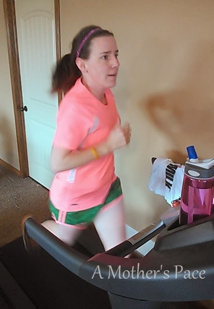
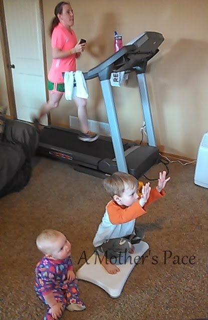
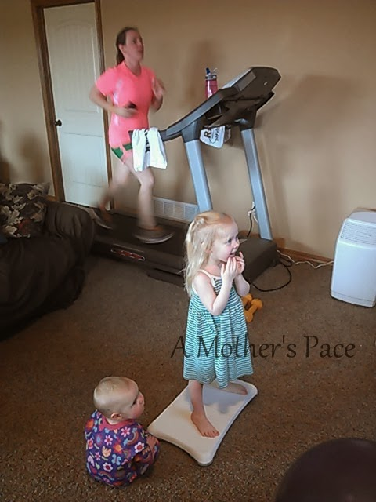
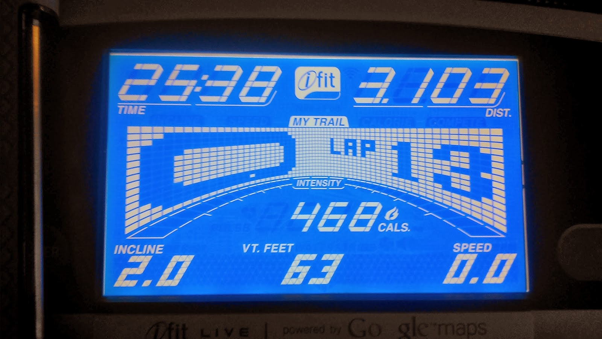
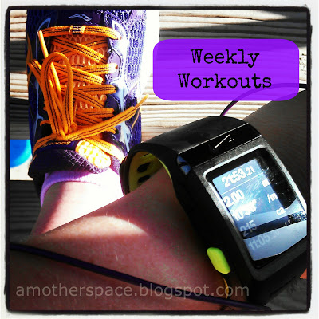
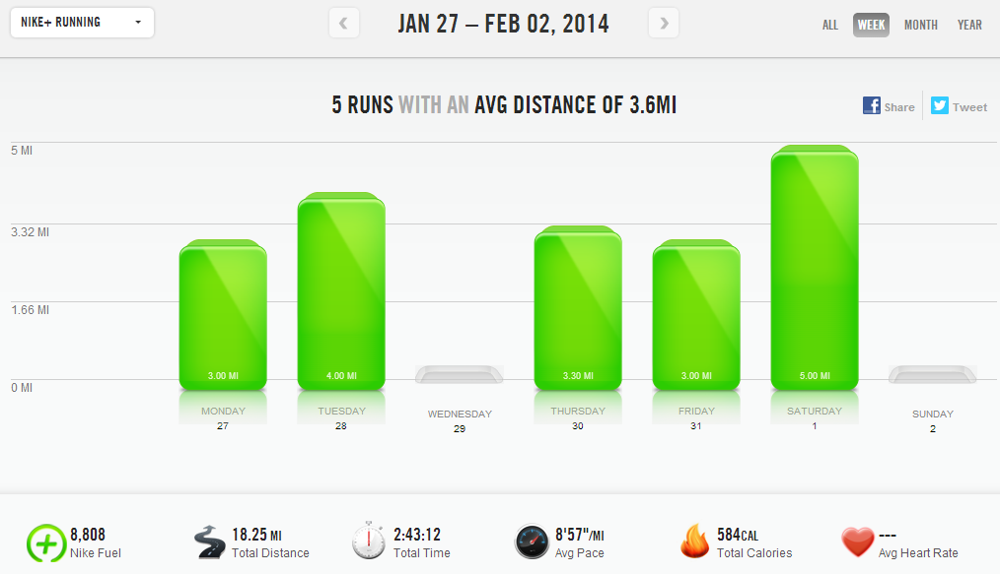

Every weekend I look forward to running outside. I usually have the time to start running a little later in the day and so I can run in the daylight. Unfortunately when I woke up on Saturday the roads were covered in ice. That meant that my 5 by the 5th race would have to be on the treadmill this month.  
  
Yes, I am participating in Laura's 5 by the 5th virtual race series. Find out more on her website, [Mommy Run Fast](http://www.mommyrunfast.com/). Since my half marathon training officially starts today (!!!) I decided to run 5k's for the series instead of 5 milers. Hopefully this will be easier to fit into my training when the beginning of the month rolls around.  
  
My goal for this round of races is to increase my 5k time by just a little bit each month.   
  

  
I jumped on the treadmill and warmed up with a half mile. (6.5 speed) Then kicked it up a notch to begin my 5k. My splits were 8:21, 8:52, 8:10 with the last .1 at 48 seconds.  
  

  
I was planning a negative split, which is a lot easier for me on the treadmill but my phone rang during the second mile. I track my run on the treadmill with Nike+ through my phone (that's why I have to hold it like I am in these photographs) and I guess when my phone rings it stops the app! Just stopping the treadmill to restart the app and starting back up again cost me a lot of time!  
  

  
I finished the 5k at 25:38 (8:03 pace) which is a personal best at the 5k distance. I'm excited to see where this challenge takes me for the next several months!  
  

  
After the 5k I cooled down until my mileage hit 5 miles for the run. The entire workout lasted for 42:59 and my average pace was 8:35. 
  
I had some pretty great entertainment during my run. My whole family came down to the family room for some Wii time while I was running. They were cracking me up but sometimes the game made me dizzy if I watched it too much. So mainly I watched my little goofballs instead.  
  
Thanks to my husband for taking the photos of my run!  
  
  
  

  
**Weekly Workouts**  
  
Monday: 3 miles (9:00 pace) + 25 minute Jillian Michaels Circuit  
  
Tuesday: 4 miles (9:00 pace) + 15 minute NTC Better Butt workout  
  
Wednesday: REST  
  
Thursday: 3.3 miles (9:05 pace) + 30 minute strength  
  
Friday: 3 miles (9:14 pace) + 15 minutes NTC Sculpted Arms  
  
Saturday: 5 miles (8:35 pace) + 6 minutes core  
  
Sunday: Spin Bike: 40 minutes + 10 minutes core  
  
  
  

  

  

Total Running Miles: 18.3  
Weekly Average Pace: 8:57  
  
February Running Miles: 5  
2014 Running Miles: 88.88  
  
2014 Running Kilometers: 143   
  
  
  
  

**Are you participating in Laura's 5 by the 5th race series?** 

  

  

  

  

\-------------------------------

  

Find A Mother's Pace on...  
  
Twitter [@amotherspace3](https://twitter.com/amotherspace3)  
  
Facebook [amotherspace3](http://facebook.com/amotherspace3)  
  
Instagram [amotherspace](http://instagram.com/amotherspace)  
  
Pinterest [amotherspace](http://pinterest.com/amotherspace/)  
  
Bloglovin' [A Mother's Pace](http://www.bloglovin.com/en/blog/6680087)  
  
RSS [amotherspace](http://feeds.feedburner.com/amotherspace)
