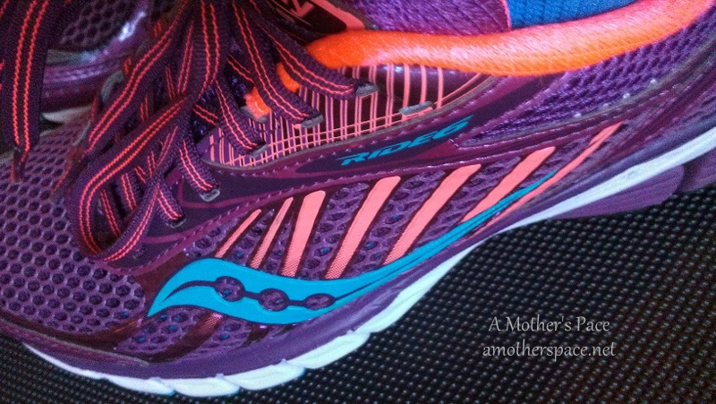
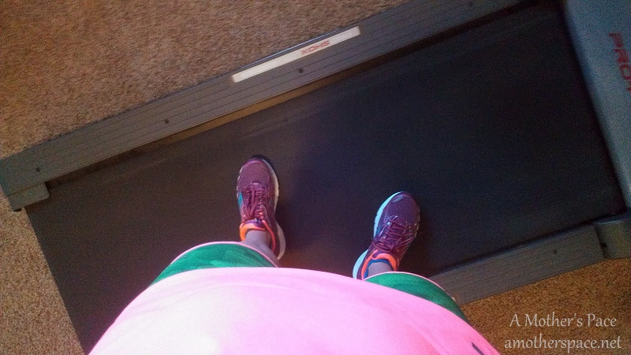
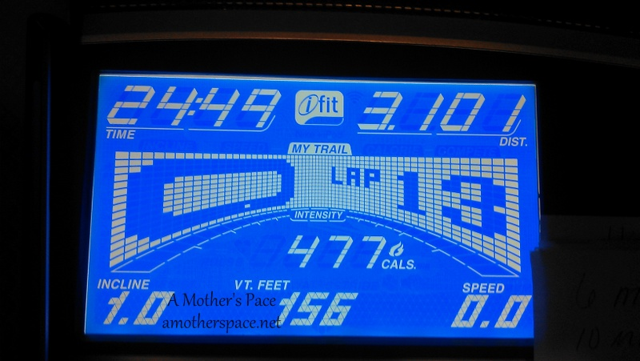
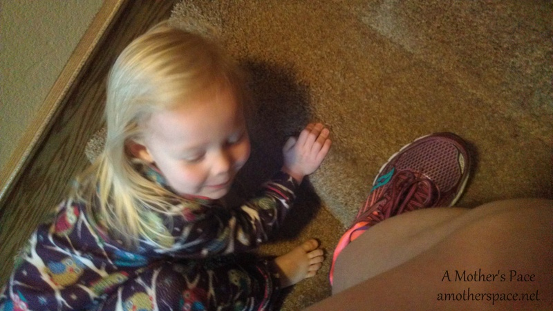

 

The first of the month means another 5 by the 5th virtual race recap. To find out more about Laura's race series, check out her website, [Mommy Run Fast](http://www.mommyrunfast.com/).

 

 

My goal for this month was to beat my 5k time from February, which was a PB for me at 25:38 (8:16 pace). I just happened to read my training plan wrong before my workout and I thought I needed to better an 8:03 pace. Those 13 seconds make a big difference at that speed but I didn't realize this until after I was already finished! When I realized that I would have to run 3.1 miles at 7.5 on my treadmill instead of the typical 7.0's I've been doing for speed work, I got a little nervous.

 

 

I plan my speed work by using Greg McMillan's Running Calculator and my plan for this was faster than a speed work session but this is a race, right? I decided to go for it and try to knock off a few seconds to better my best.

I jumped on the treadmill and warmed up at 6.3 for half a mile. Then I restarted my treadmill before I started the 5k. My 5k splits for the race: 8:00, 8:01, and 8:48 for the last 1.1 miles.

 

 

I ran my fastest 5k and finally went under the 25 minute mark, finishing in 24:49 (8:00 pace) with a new PB! I know the treadmill makes it easier for me to hit a quicker pace but this really gives me hope that I'll be able to do this in a road race soon.

I cooled down for a bit and finished my run with a total of 4.5 miles in 38:10 with an average pace of 8:28 for the entire run.

This was tough and I'm going to have to work hard during March in order to take off a couple of seconds for my April 5 by the 5th race. I'm thinking of adjusting my training paces a little because I am getting faster. I don't really want to use this treadmill race as a guide because I don't know that I would have actually ran that fast off of the treadmill.

 

 

After running on the treadmill I usually use the stairs on the way up to stretch out. After my 5 by the 5th race, my cheering section of one stopped to stretch with me. I love sharing fitness with my children.

And, in case you missed it, here's my [5 by the 5th: February](http://amotherspace.net/2014/02/5-by-the-5th-february/) recap.

This virtual race was my 3rd race of the year. I have one more race scheduled in March and I'm well on my way to completing my goal of 14 races in 2014. #14in2014

 

 

**Are you running Laura's 5 by the 5th Virtual Race? How was your March race? Are you participating in 14 races in 2014? How many races have you completed so far?**

 

\-------------------------------

Find A Mother's Pace on...

Twitter [@amotherspace3](https://twitter.com/amotherspace3)

Facebook [amotherspace3](http://facebook.com/amotherspace3)

Instagram [amotherspace](http://instagram.com/amotherspace)

Pinterest [amotherspace](http://pinterest.com/amotherspace/)

Bloglovin' [A Mother's Pace](http://www.bloglovin.com/en/blog/6680087)

RSS [amotherspace](http://feeds.feedburner.com/amotherspace)
