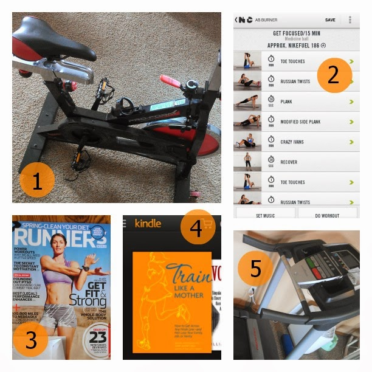

This week kicked off the [Move, Nourish Believe Challenge](https://www.facebook.com/events/571617342921583/) with the Sweat Pink community and Lorna Jane. It's three weeks of moving, nourishing and believing to help stay on track with healthy goals for the year.  
  
I followed the theme every day and took pictures throughout the week and shared them on Instagram. Are you on Instagram? [**Follow me**](http://instagram.com/amotherspace) and let me know your username below in the comments if I'm not following you already.  
  
I'm going to recap the week but first I'm starting with today's challenge...because it's Friday!  
  
**Friday:** Fave Friday! Show us your five fitness favorites! Exercises, people whatever gets you moving and motivated.  
  
  

  
This one was tougher than you may think. I am motivated by so many things so it was hard to pick just 5. 
  
\[one\]  
**Spin Bike**: This is my favorite form of cross training right now and I look forward to Sunday when it's time to get on the bike.  
  
\[two\]  
**Nike Training Club Android App**: I've been using NTC at least 3 times a week to guide me through leg, arm and core strength workouts.   
  
\[three\]  
**Runner's World Magazine**: One of my favorite mail days of the month is the day that I receive my Runner's World magazine. I don't sit down and read the entire thing in one sitting. I put it on my nightstand and enjoy a few pages at a time before bed.  
  
\[four\]  
**[Train Like a Mother](http://amzn.to/10eETuP)**: I just started the 'Own It' Half Marathon Plan in Train Like a Mother. It's the toughest half plan that I've attempted and I'm both excited and nervous about it.  
  
\[five\]  
**My Treadmill**: I wouldn't complete any training plan right now if it weren't for my treadmill. I'm sure I wouldn't make it to the gym that early in the morning and I know I haven't been running outside lately. Even though I can't wait to run outside regularly again, I'm a little in love with my treadmill this winter.  
  
And now here's my recap from the rest of the week.  
  
**Week One: MOVE**  
  
**Monday**: Sweat it out! Show us your favorite way to sweat.  
  
  

  
Unless you are _very_ new to this blog the fact that running is my favorite way to sweat is no surprise. My favorite type of running is when I am training for a race and this week I started training for my next half marathon.  
  
**Tuesday:** Change it up! Sweat a new way! Select a workout from movenourishbelieve.com/category/move and show us your post-sweat session selfie.  
  
  

  
Because I'm in a training cycle I had to stay with my planned 4.5 miles of the day but I also wanted to try something new. This year I've made strength and spinning a priority but if I had to add one additional type of workout it would definitely be yoga. I found a short 5 minute [yoga session](http://movenourishbelieve.com/category/move) and added it after my run but before my leg strength workout.   
  
**Wednesday**: Let's get planking! Plank for at least 5 minutes today. You can split the planks up.  
  
  

  
I completed my entire 5 minute plank all at one time but I did split up the type of planks. I ended up adding elbow punch planks into the pyramid workout above to not only complete the Move Nourish Believe Challenge but also an Ab Challenge that I'm working on as well. It's the longest I've ever held a plank and I was feeling it the rest of the day.  
  
**Thursday:** Buddy up! Workout with a friend today.  
  
  

  
Thursday we were on day number 3 of being snowed in. My workout buddy was my daughter, who woke up way too early, but was (as always) interested in doing squats and walking lunges with me. I love when she's watching me workout and says, "I can do that!" and joins in. The photo above shows my 4.5 mile run and then 25 minutes of core and strength work, including the Ab Challenge moves listed.  
  
And that's week one! Week two starts on Monday and focuses on nourishing from the inside out.  
  
  

**What is your favorite fitness motivation right now?** 

  
  
  

\-------------------------------

  

Find A Mother's Pace on...  
  
Twitter [@amotherspace3](https://twitter.com/amotherspace3)  
  
Facebook [amotherspace3](http://facebook.com/amotherspace3)  
  
Instagram [amotherspace](http://instagram.com/amotherspace)  
  
Pinterest [amotherspace](http://pinterest.com/amotherspace/)  
  
Bloglovin' [A Mother's Pace](http://www.bloglovin.com/en/blog/6680087)  
  
RSS [amotherspace](http://feeds.feedburner.com/amotherspace)
