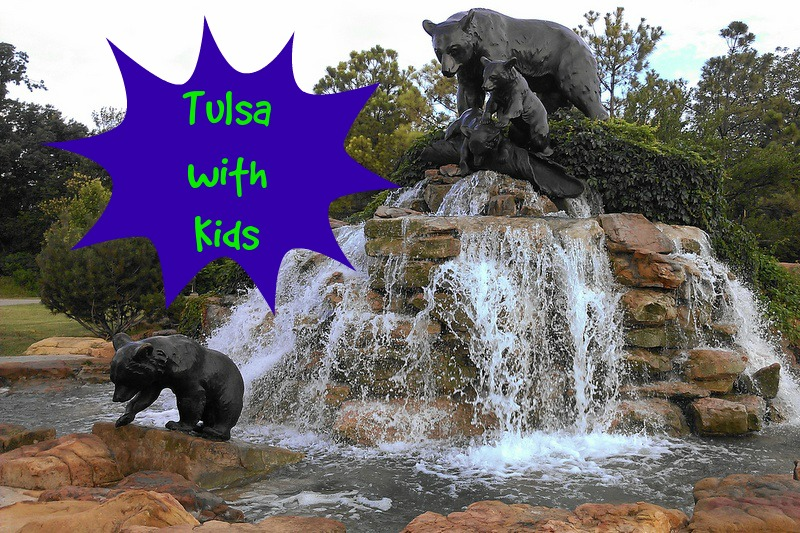
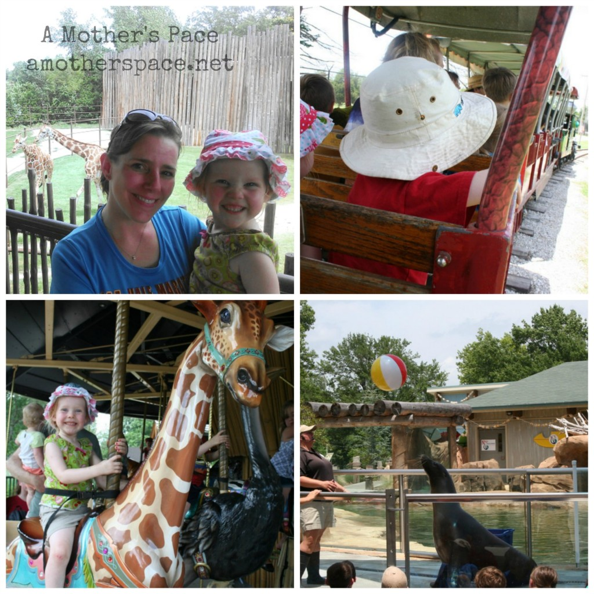
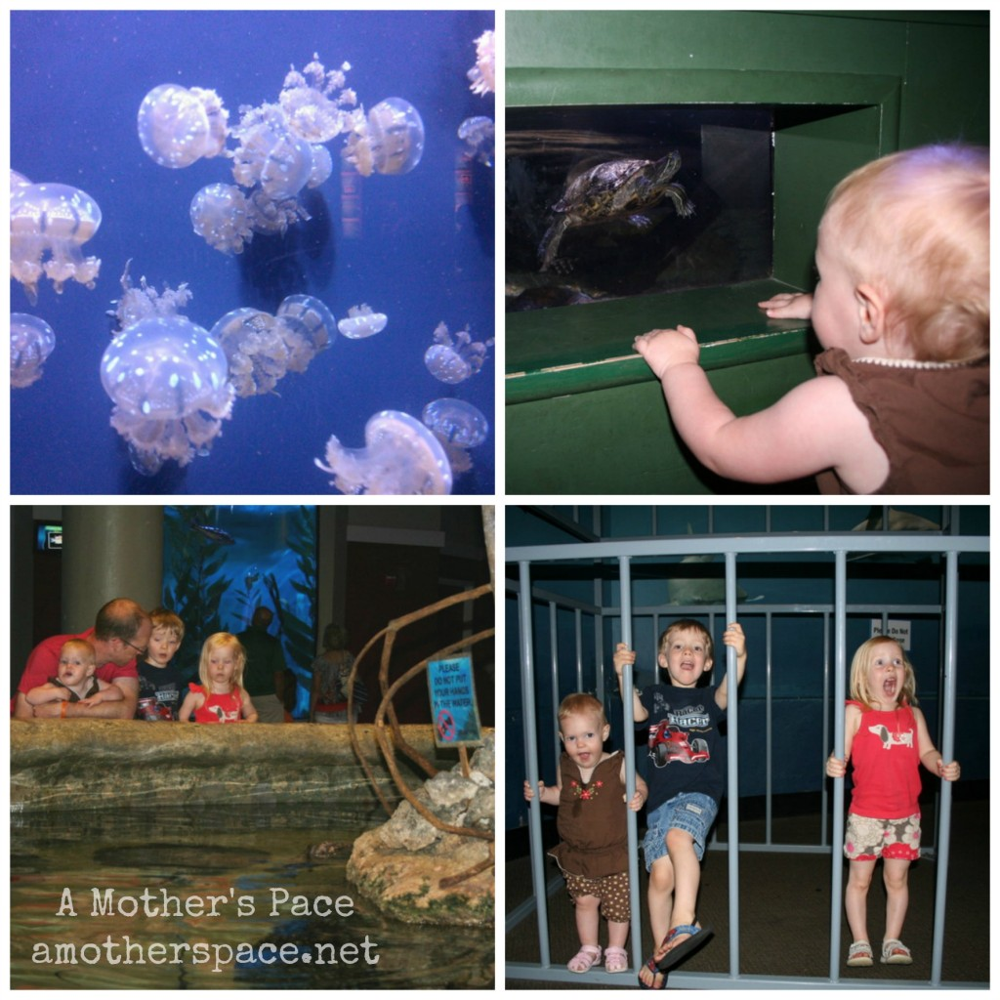
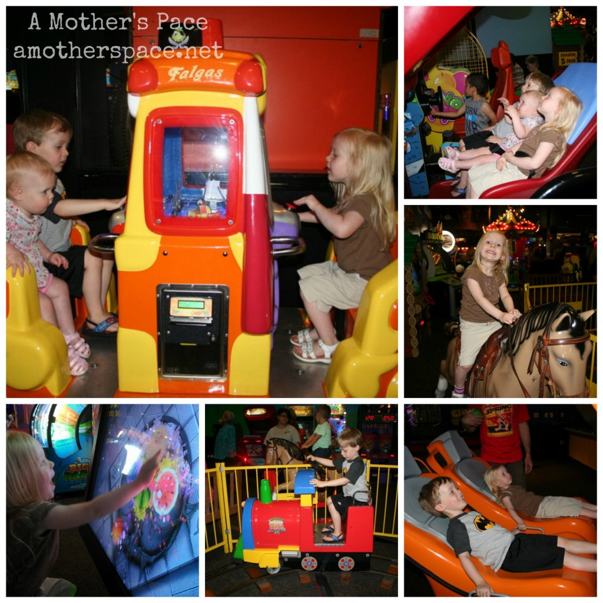
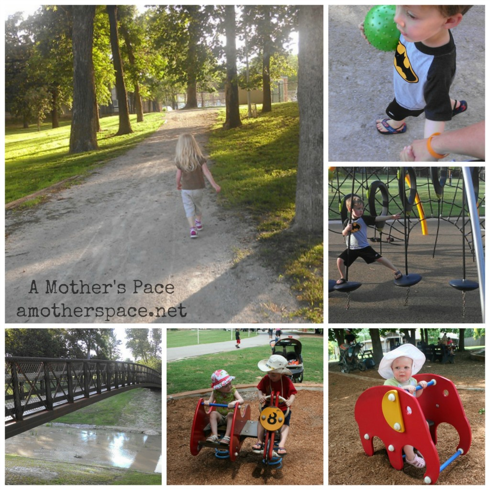
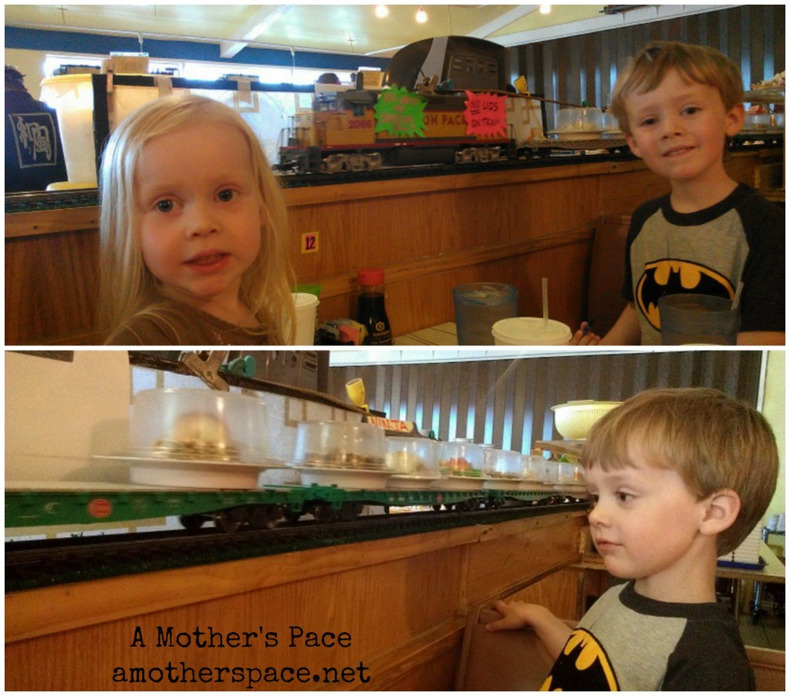

 

I thoroughly enjoyed [running while I was exploring Tulsa](http://amotherspace.net/2014/06/running-in-tulsa-chicago-marathon-training-week-2/ "Running in Tulsa [Chicago Marathon Training: Week 2]") but we also found a lot of exciting kid centered activities while we were on our mini vacation last week.

 

 

## The Tulsa Zoo

We spent our first day at the [Tulsa Zoo](http://www.tulsazoo.org/). We enjoy going to zoos a lot and this was definitely a highlight of the trip.

 

 

The train ride was a necessity because we have 3 little train lovers in our house. My daughter has always loved giraffes so it was fun to see them up close and also get to ride one on the carousel! The sea lion show was also a highlight of our day. We spent hours walking around the zoo and playing on the playground. It was such a fun day!

We are members of our amazing zoo here in Wichita and the Tulsa Zoo participates in the reciprocal program. That means that we were able to get discounts on our entry tickets, the train tickets and even when we bought our lunch.

 

## The Oklahoma Aquarium

The aquarium was the reason that we chose to travel to Tulsa instead of Oklahoma City. They had a lot of local fish on exhibits and some favorites too like seahorses and jellyfish.

 

The shark tunnel was my sons favorite part and Little E enjoyed pointing at all the fish swimming by in the various tanks. They are working on a sea turtle exhibit which will be pretty amazing. The aquarium was not very big, not to say that it wasn't a great aquarium but we didn't end up staying there as long as I thought we would.

## The Incredible Pizza Company

 

 

We completely stumbled upon [The Incredible Pizza Company](http://tulsaincrediblepizza.com/fun-for-kids/index-redirect.php) with a Google search and I must say the kids loved it. We got there at opening time and stayed through the afternoon. First we ate lunch at the buffet. It is not the healthiest food in the world by any means but there is plenty of it! We then went back to the area for younger kids and rode every single ride. It was fun to watch them try new things. All the machines took cards instead of tokens which was much easier to keep track of.

We then ventured out into the bigger area and played a few of the harder games. One of my favorites to watch the kids (and my husband) play was Fruit Ninja. It's a touch screen and you slice the fruit with your finger. Little A is playing it in the bottom left photo above.

## Tulsa Parks

 

 

We found a couple of parks in Tulsa and this ended up being one of my favorite activities. Going on evening walks and playing on the equipment was a great way to end the day. We also noticed that Tulsa has several splash pads and even went to a park specifically because we thought it had one. It did, but it wasn't turned on. That's o.k. though because the equipment and walking path was enough for us.

## Sushi Train

 

 

If you have a train lover in your family I highly recommend [Sushi Train](http://www.sushitraintulsaok.com/). My husband and I enjoy sushi and the sushi there was good, not great but good. The real highlight is the train that drives around the booths that carries sushi to the tables. Diners could pick a plate of sushi and then the bill would be added up by the colors of plates that you had when you were finished.

They also had a menu with normal kids items so we ordered a couple of kids meals for the kids and then started to get sushi off of the train. Little A and Little O had fun helping us pull the sushi off when as it went around the track. Little A even surprised us by snagging one when we weren't looking. Luckily it was a veggie roll and she ended up eating it. They also had dessert sushi that was fun for the kids. It was a Rice Krispie treat inside a fruit roll up with gummy bears on top.

Tulsa ended up being the perfect mini vacation. It's only about 3 hours away from us and it has plenty of great attractions to keep a family busy. We found a lot of good restaurants, swam in the hotel pool and even drove around neighborhoods admiring the houses and landscaping. We'll be back when the kids are older and able to do more hiking. I was surprised to find out that there are a lot of hiking trails and a huge lake right there too.

**Have you been to Tulsa? What would you add to my list of activities for kids?**

 

 

I'm running the Chicago Marathon with Team RMHC!

To find out more read my post about [Running for Charity](http://amotherspace.net/2014/06/the-chicago-marathon-running-for-charity/) or head over to my [fundraising page](http://www.kintera.org/faf/donorReg/donorPledge.asp?ievent=1097960&supId=399266070) to make a donation.

——————————-

Find A Mother’s Pace on…

Twitter [@amotherspace3](https://twitter.com/amotherspace3)

Facebook [amotherspace3](http://facebook.com/amotherspace3)

Instagram [amotherspace](http://instagram.com/amotherspace)

Pinterest [amotherspace](http://pinterest.com/amotherspace/)

Bloglovin’ [A Mother’s Pace](http://www.bloglovin.com/en/blog/6680087)

RSS [amotherspace](http://feeds.feedburner.com/amotherspace)
