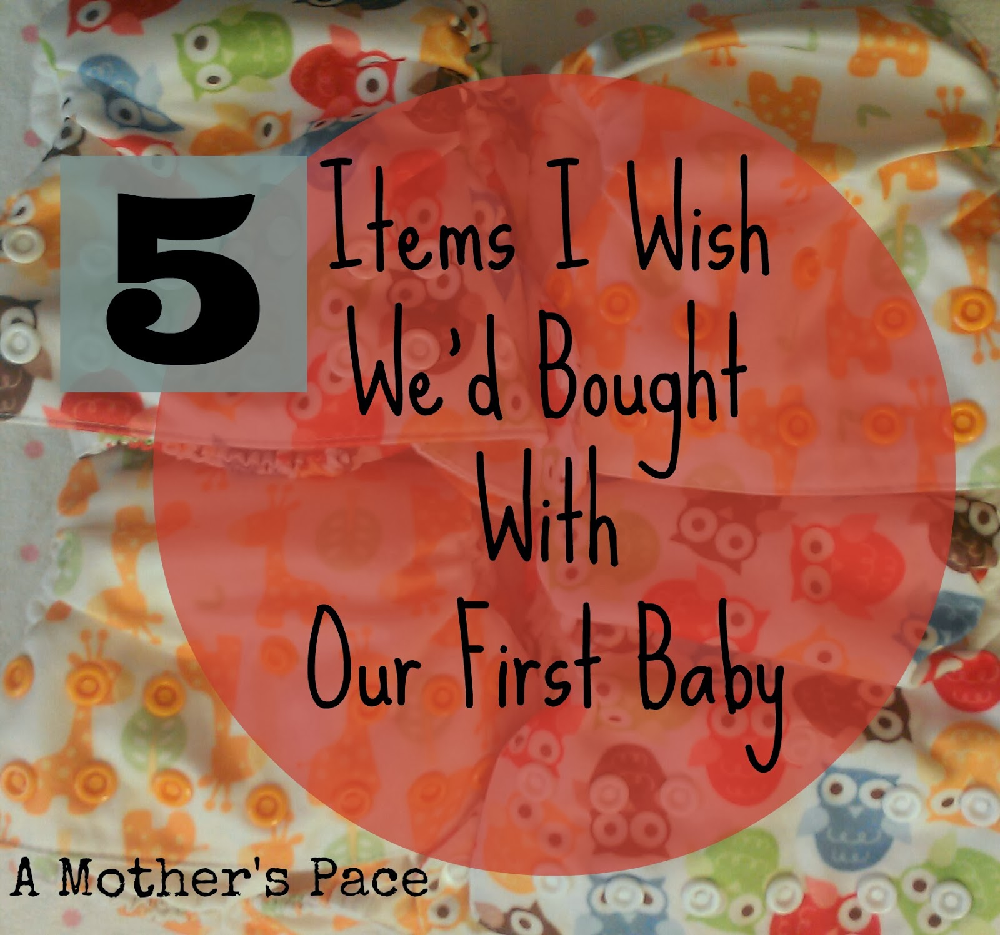
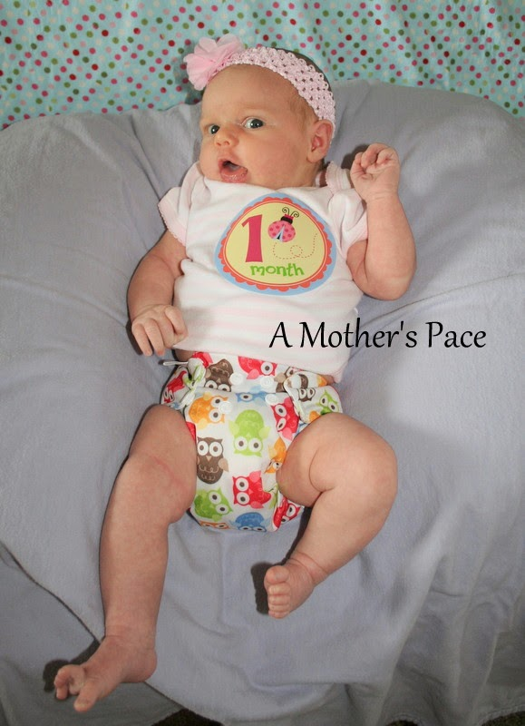
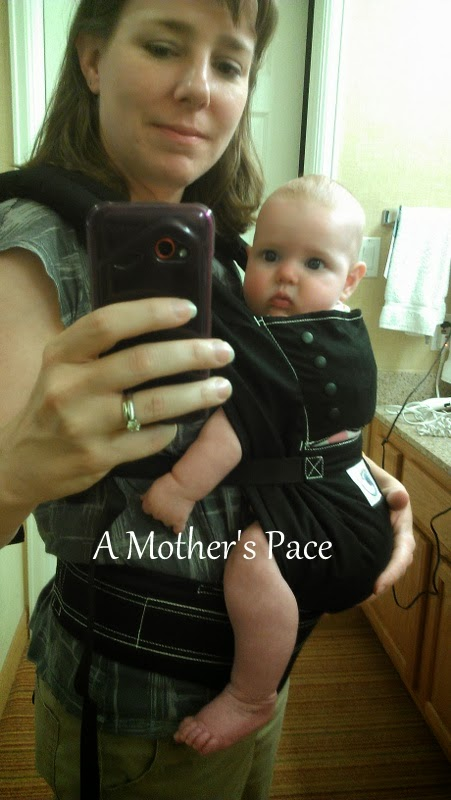
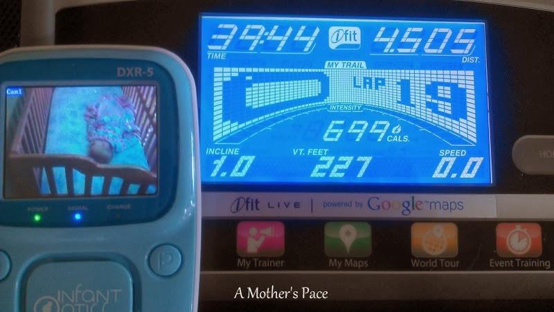

I'm a mother of 3 and they are all pretty close in age.   
My son is 4 years old. My first daughter is 14 months behind him at age 3. My youngest daughter is 11 months old.   
  
So the past 4 years (five years, really) we've been all about kids and babies at our house. We've reused a lot of items for all 3 babies but there have been a few things that we broke down and finally decided to buy with baby #3. 
  

  
\[one\]  
**Newborn Sized Cloth Diapers**  
  

  
We received four newborn sized diapers as a gift after our Little E was born. These **[Swaddlebees diapers](http://amzn.to/1j7NQAm)** are fantastic and I would highly recommend trying them out. I've used a lot of cloth diapers over the years but, in my opinion, it is worth it to buy a diaper that fits well even if the baby will only wear it for a couple of months.  
  
\[two\]  
**A Jogging Stroller**  
  

They really need to cheer up, don't they!   
  
This **[stroller](http://amzn.to/1c80Ody)** was our sixth stroller purchase (yikes!) but it is my favorite one of all. It pushes so easily and I love being able to take the kids out running with me. Before, I had used our bike trailer to take the two older kids out but it was awkward to push. This actual jogging stroller is worth the added expense, especially if you're like me and find it used.  
  
\[three\]  
**A Hands-free Bra for pumping**  
  
Even though I stay at home with my kids and exclusively breast feed my daughter this **[Medela bra](http://amzn.to/1hQfO0E)** was so nice for pumping. Little E doesn't take a bottle but I did pump several times a day soon after she was born to help with milk production. I also pumped once a day for several months to store up milk to use for her cereal. I also did this with both of my other two children and wasted so much time sitting there holding the pump the entire time. Definitely worth the investment!  
  
\[four\]  
**Ergo Baby Carrier**  
  

  
I bought the **[Ergo Baby Carrier](http://amzn.to/1j7Omy3)** while we were away on a business trip with my husband. I had the double jogging stroller for the two big kids and held the baby in the carrier. We went to the zoo, the aquarium, a garden and many other places that week alone. We've used it a lot since then as well. It's another one of those things that I never wanted to spend the money on but once I did I was so happy about the purchase. We have a Baby Bjorn but it hurt my back to carry a baby in it for very long and with the Ergo I had no discomfort.  
  
\[five\]  
**A Video Monitor**   
  
  

  
We bought this [**Infant Optics**](http://amzn.to/1irrfyv) video monitor a week before my husband had to leave town on business. I knew I would run exclusively on the treadmill while our baby was sleeping and I didn't want to worry about not hearing her with our normal monitor. With the video I can watch her while she is waking up and finish my run without worrying that she is not o.k. I also love having the video monitor in day to day life too. It's so nice to check on her visually without having to disturb her by going in the room.  
  
  

**What would you add to this list? What are your baby essentials?**

I have a **[GIVEAWAY](http://amotherspace.blogspot.com/2014/01/powered-by-bits-review-and-giveaway.html#.UuF0mRDnbrc)** going on this week so if you haven't signed up already, head on over and put your name in the hat!

  
  

_This post contains affiliate links. I was not compensated in any other way for reviewing items in this post. All opinions are my own. When you click on these links and make purchases it supports this blog._

  

\-------------------------------

  

  

Find A Mother's Pace on...  
  
Twitter [@amotherspace3](https://twitter.com/amotherspace3)  
  
Facebook [amotherspace3](http://facebook.com/amotherspace3)  
  
Instagram [amotherspace](http://instagram.com/amotherspace)  
  
Pinterest [amotherspace](http://pinterest.com/amotherspace/)  
  
Bloglovin' [A Mother's Pace](http://www.bloglovin.com/en/blog/6680087)  
  
RSS [amotherspace](http://feeds.feedburner.com/amotherspace)
