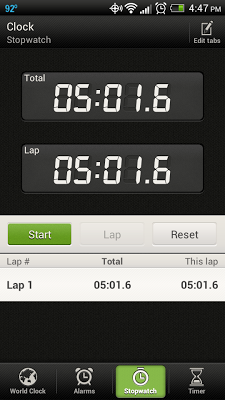

Recently I read on Twitter or maybe a blog post about a runner who set a goal to do 5 minutes of core work every day. I wish I could remember who said it to give them credit.   

  

Immediately when I read it I thought I could do that. 5 minutes isn't that long. 

  

Typically when I do strength or core work I set out to do it for at least 15 minutes. I always thought that any less than that wouldn't really do much for me. 

  
  

  

Then I thought about what 5 minutes really is. 

- 5 minutes a day is 35 minutes a week.
- 5 minutes a day is 140 minutes a month.
- 5 minutes a day is 1,680 minutes a year.

When you think about it that way, 5 minutes a day is doing quite a lot.  
  
  

  
I set a goal (on July 9th) to complete 5 minutes of core work each day. How have I done? Not so hot. Until August started I'd only done core work 11 out of the 23 days in July.  
  
Vacation was bad for my core. I didn't stick with it as much as I wanted but the idea was there.  
  
But then August rolled around and I discovered Kat's challenge.  
  
Kat over at [Sneakers and Fingerpaints](http://bit.ly/1bTbL3N) started a new challenge that is exactly what I needed to stay focused. I signed up for the August Core Focus Challenge (#AugustCoreFocus) as soon as I heard about it. Perfect! Find out more about the challenge by visiting her page (link above) or visiting challengeloop.com. (Thanks for the awesome challenge, Kat!)  
  
Because of the challenge I've managed to do at least 5 minutes of core work every day. Exactly what I wanted.   
  
I have a feeling she's starting easy on us but so far we've done bridges, floor marching and a few planks. Yesterday she challenged just a little more by adding an elbow to knee plank. I'm excited to see what she adds throughout the month!  
  
Hopefully doing core work every day will become a habit that sticks around for awhile.

  

**Do you have 5 minutes a day for core work?**

  
  
Updated to add Friday Link Ups from [Jill Conyer](http://jillconyers.com/fitness-friday-2/) and [Running Bloggers](http://runningbloggers.com/fitness-friday-linkup-4-2/).   
  
             

\------------------------------------------

  

Staying at home with kids sounds easy, right? Life with 3 little ones is busier than I imagined. I don't write every day on the blog but I do update Facebook, Twitter and Instagram more often.   
  
Find A Mother's Pace on...  
  
Twitter [@amotherpace3](https://twitter.com/amotherspace3)  
  
Facebook [http://facebook.com/amotherspace3](http://facebook.com/amotherspace3)   
  
Instagram [amotherspace](http://instagram.com/amotherspace)  
  
Pinterest [amotherspace](http://pinterest.com/amotherspace/)  
  
Bloglovin' [A Mother's Pace](http://www.bloglovin.com/en/blog/6680087)  
  
RSS [amotherspace](http://feeds.feedburner.com/amotherspace)
