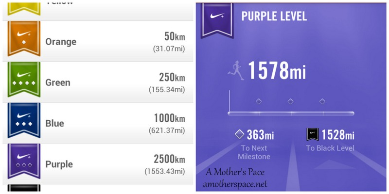
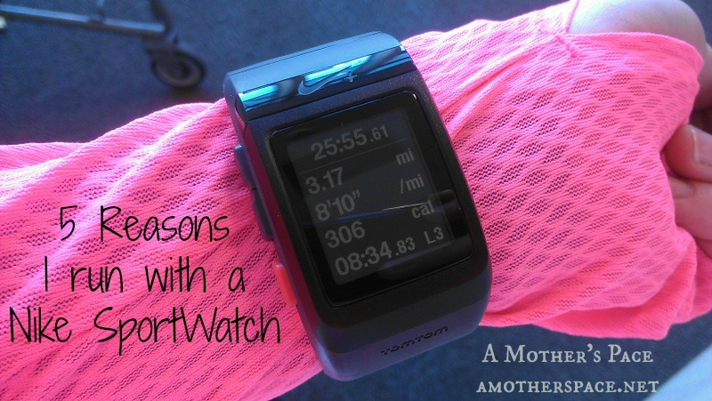
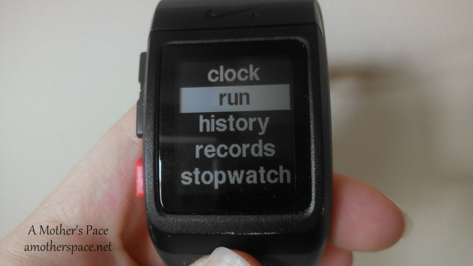
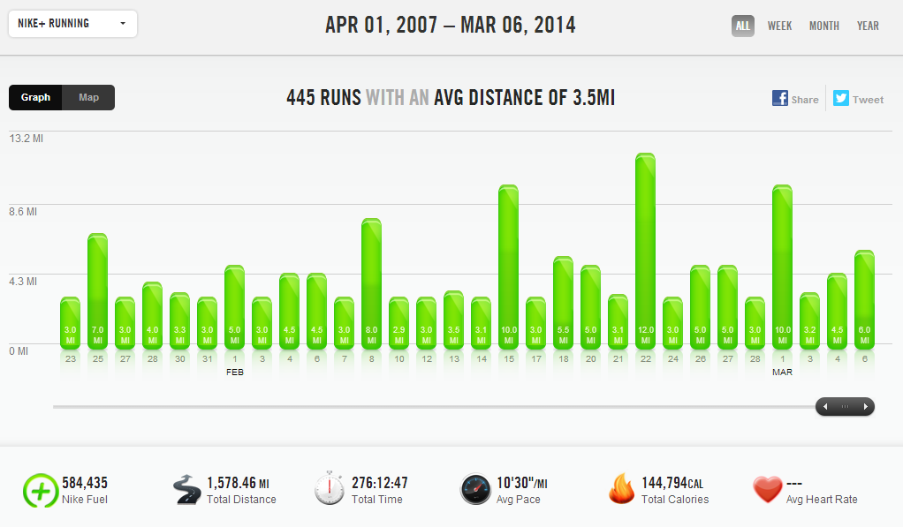

I've been running with Nike+ since I started tracking runs back in 2007. I was using my iPod nano and the foot pod to keep track of the mileage. It's a dinosaur but we still have it. It's loaded with some kids music and occasionally (when it's charged up) the kids will listen to it.

I took a break from Nike when I was training for my full marathon in 2010 because the running GPS phone apps seemed to work better.

Then in 2012 I bought the [Nike+ SportWatch](http://amzn.to/12Yrubz). Because I now had immediate access to data on my wrist, that was when I first started paying more attention to my pace and really keeping track of miles that I was running.

I've been using the SportWatch since and I'm a fan. I'm not being compensated in any way for this post and I purchased all the Nike products listed with my own money or I received them as a gift from a family member. This post does contain an affiliate link so if you click it, you will help to support this blog.

I'm going to get the biggest negative about the watch out of the way early. I've found that the average pace is very accurate on the watch but the actual pace is usually off by about a minute. This makes using the watch for interval workouts difficult if I am relying on it to tell me if I'm running the right pace.

 

 

Recently my Nike App on my phone gave me a notification that I've reached the purple level, which means that I have tracked over 1,553 miles or 2500 km with Nike+. This got me thinking about how long I've been with Nike and then, of course, I started writing this post in my head!

 

## 5 Reasons Why I Run With a Nike SportWatch

 

**\[one\] The look of the watch.**

It's a sharp looking watch and I like it's physical features. It's easy to flip between stats while running and check out average pace, lap time etc.

 

 

**\[two\] The Nike+ website.**

As someone who loves running numbers and data, the Nike+ website is fun. I can log on and see graphs of all my runs dating back to 2007.

 

 

I've ran a total of 276 hours since 2007! That's a whole lot of time!

**\[three\] The Nike+ Community.**

Not only is the community on the Nike+ website fantastic but I've also met a lot of fellow users through Instagram. I tag my runs with #nikeplus and then use the hashtag to find out what other runs are being accomplished all over the world. And it is really worldwide. I've found people from France, Italy, London and a lot of other countries as well. I love seeing where running takes these people in their corner of the world every day.

**\[four\] It works well on a treadmill.**

I like for all of my data from my running to be in one place. Until Nike+ came out with a phone app this was a big drawback of owning the SportWatch. There is no way to add in data on your own (unless you call customer service, see #5) but now that they have this app, which does a great job overall, both my treadmill runs and my outside runs are all on the Nike site.

And if the app has my treadmill run off on mileage it is very easy to adjust before my run syncs with the website. More on this below.

**\[five\] Nike has a fabulous customer service department.**

Yes, in order to know this I've had a few things go wrong with my watch. The main reason that I call customer service is to update a run. Sometimes my treadmill run isn't accurate or I forget to start up the app again after taking a break on the treadmill. If the mileage is off on the app the user can change it to the appropriate mileage but if the time is off I need to call and have the customer service change it. They are always very helpful, quick to update my information and willing to go the extra mile.

In all honesty, I've gone through several watches. I've had a watch that malfunctioned while still under warranty and one that had condensation under the screen and eventually stopped working. They replaced both watches with a new one even though the condensation happened after the warranty had expired. So far this third watch is working great and I've not had any issues with it at all.

 

**Are you a Nike+ user? If not, how do you track your runs? A phone app? Garmin?**

\-------------------------------

Find A Mother's Pace on...

Twitter [@amotherspace3](https://twitter.com/amotherspace3)

Facebook [amotherspace3](http://facebook.com/amotherspace3)

Instagram [amotherspace](http://instagram.com/amotherspace)

Pinterest [amotherspace](http://pinterest.com/amotherspace/)

Bloglovin' [A Mother's Pace](http://www.bloglovin.com/en/blog/6680087)

RSS [amotherspace](http://feeds.feedburner.com/amotherspace)
