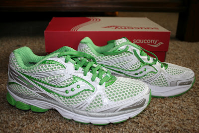

  

Five Things I WON'T Miss About Being Pregnant

  
1\. Heartburn  
I can't wait to eat red sauce or drink coffee and not have to worry about how it will affect me for hours after I've finished. Tums are disgusting but helpful.  
  
  

  
2\. Insomnia  
I would much rather have a beautiful little baby keeping me awake than heartburn, sore hips or just not being able to sleep.  
  
3\. Sciatic Nerve Pain  
I just never know when this is going to bother me and it is awful! Sometimes is lasts for just a few minutes and other times I can barely walk the entire day.  
  
4\. Crazy Emotions  
I've had my fair share of these this pregnancy. I'm sure my family will be more than happy to have their 'normal' mommy and wife back. Everything seems to make me cry lately.  
  
5\. Not being able to RUN  
Longing to feel healthy again and have some 'me' time outside, alone with the pavement.   
  
  

<table align="center" cellpadding="0" cellspacing="0"><tbody><tr><td><a href="http://2.bp.blogspot.com/-oQE9cCgRs-0/T9eYvsx2ZxI/AAAAAAAAAnc/Mp4wqVEGhfA/s1600/IMG_6480.JPG" imageanchor="1"></a></td></tr><tr><td>I miss my shoes!</td></tr></tbody></table>

  
There are, of course, many more than just 5 things but these top my list. And I have to say, even though I am essentially complaining about my pregnancy here, I am so excited for our new little one to join the family. All these aches, pains and other inconveniences are very much worth it when that new little baby comes along.  
  

\-------------------------------

  

Find A Mother's Pace on...  
  
Twitter [@amotherspace3](https://twitter.com/amotherspace3)  
  
Facebook [amotherspace3](http://facebook.com/amotherspace3)  
  
Instagram [amotherspace](http://instagram.com/amotherspace)  
  
Pinterest [amotherspace](http://pinterest.com/amotherspace/)  
  
Bloglovin' [A Mother's Pace](http://www.bloglovin.com/en/blog/6680087)  
  
RSS [amotherspace](http://feeds.feedburner.com/amotherspace)
