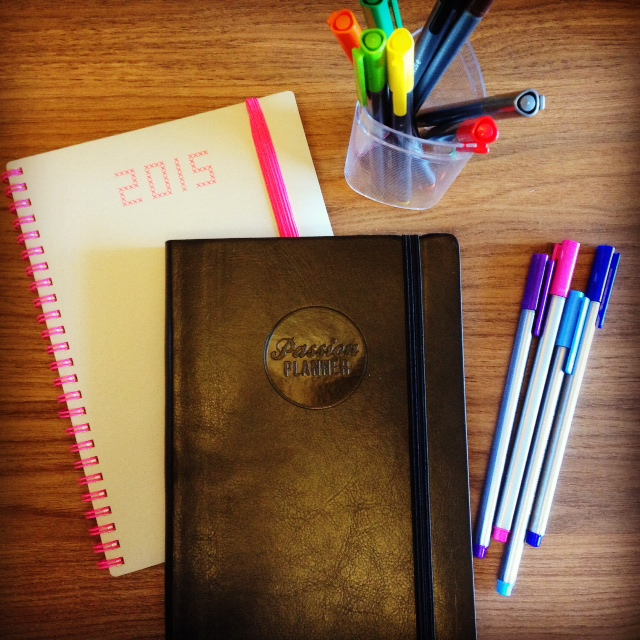
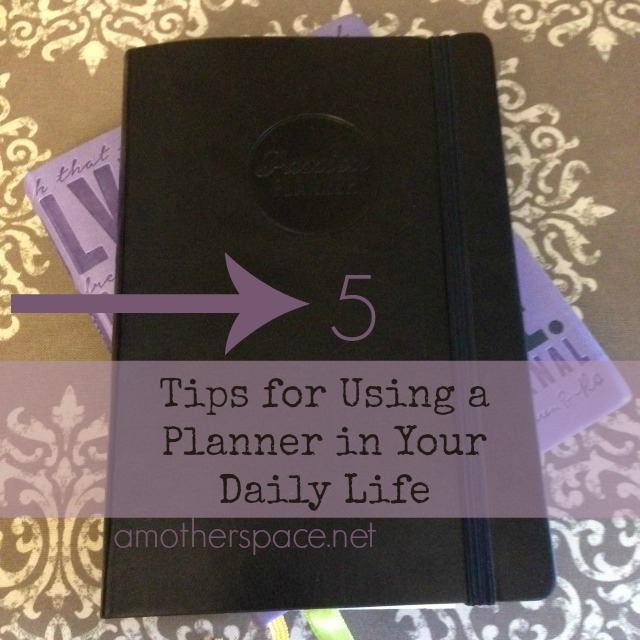
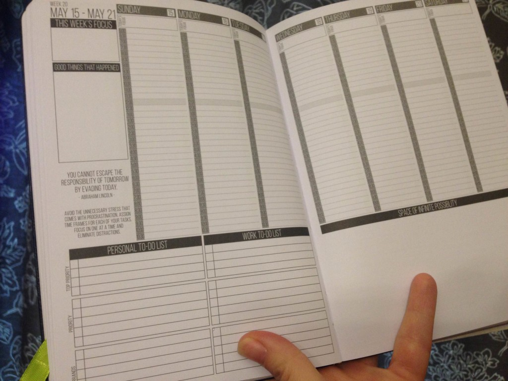

Lately I've been feeling like there are so many things I want to accomplish in a day and it's hard to squeeze it all in. Family, running, reading, my Wildtree business, this blog, household chores and I could go on and on. I know that I can't _do_ it all but I have stumbled upon a way to _organize_ it all that works for me.

I've never used a planner before but this year I ordered the Passion Planner to give it a try. I need to organize my brain and as much as I would like to do it through my phone and the computer I've found that I need a paper and pen approach.

I began switching over my 2015 calendar and adding items into my planner before 2016 started. A planner is so much more than a calendar because instead of just keeping dates it gives me space for my goals, to-do lists, meal planning and more.

This planner also has blank pages in the back and grid pages as well. I've found that it's very handy to keep lists and information that I access a lot throughout the year on these pages. So far I have my 2015 Christmas list (so I can remember what I purchased!), a spot for my 2016 Christmas list, a birthday list for the year, my 2016 reading list, and some pages dedicated to my Wildtree business. There's still a lot of extra space to add things throughout the year too!

As I have been using my planner I've come up with a few tips that may help you as you are deciding to write your life down in a planner.

- **Make goals.** Actually writing out goals helps you to figure out what is important to you and what you want to make time to accomplish. We can't do everything so a little planning and some goals can help you decide what is most important in your life.
- **Look at it every day.** This one is an important tip that some people overlook. I plan my month and week out but I still look at my planner several times throughout the day. I add activities that I have done, cross items off my to-do list and write down what we actually ate for dinner.
- **Meal Plan.** I have a list for the week going on a different calendar (one that has a magnet on the back that I can hang up to reference throughout the week) but in my planner I write out what we have actually eaten for dinner. This helps tremendously as I meal plan because I can look back on past meals and what we haven't eaten for awhile. I also make notes on how it tasted so I know if I should make it again!
- **Star items that have been completed.** An example of this is my running schedule. At the beginning of the week I write down the days that I want to run and then once I have done the run I go back and put a big star by it.
- **Make it fun.** I doodle and use colorful pens in my planner. I thought that I would want everything color coded (different colors for the kids activities, meal planning, exercise, Wildtree events, etc.) but I ended up just liking a variety of colors on all the pages. I also haven't invested in stickers or washi tape but I know there are a lot of options out there to make your planner colorful.

\[bctt tweet="5 Tips for Using a Planner in your Daily Life #passionplanner #organization"\]

My planner also keeps me accountable. I have several things that I like to do daily (like 20 minutes of reading or 5 minutes of tackling paper items) and I can cross them off when I finish that task each day. _Is it strange that one of my goals each day is to read for 20 minutes? I'm telling you, if I don't schedule it in these days it doesn't get done!_

The one thing holding me back from using a planner before was that I didn't think I had time to do it! The opposite has actually happened though. Instead of wasting time figuring out what I need to do each day it's all right there in front of me and I can just jump in when I have an extra 5 minutes here and there. I've gotten so much more accomplished in little bursts that it makes the small amount of time I've taken to write it all down very worth it.

This particular planner is so versatile and I'm very happy with my purchase. I'm telling you all about it because I'm loving it so much and not because I'm receiving any compensation at all from the folks over at [Passion Planner](http://www.passionplanner.com).

**Do you use a planner?**

**Are you a paper and pencil type or do you depend on electronics?**

