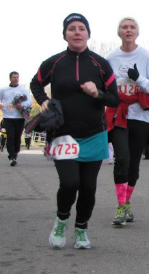
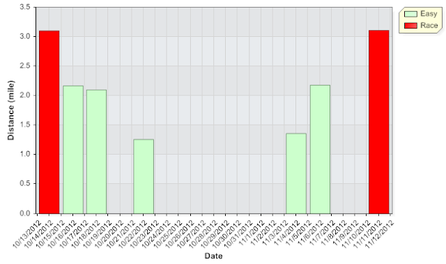

Lately I have spent some time reevaluating my running motivation. Over the past year or so, signing up for races has been my best motivation to get out and run. Racing while pregnant is a completely different story and it has become too hard to complete the 5K distance comfortably.   
  
Sunday I [ran a 5K](http://amotherspace.blogspot.com/2012_11_01_archive.html#6289671583329869780) and I enjoyed it but at 6 months pregnant it was tough.  
  

  
I think a little too tough. I haven't been running that distance or very regularly since my last 5K and it showed in how I ran (slowly) and how I felt afterwards (sore legs).  
  

  
Yikes, that's a whole lot of not running!  
As a past (and hopefully future!) marathoner and half marathoner who loves distance running, the fact that I am finding a mere 3.1 miles too much for me right now is very difficult to wrap my head around. I know I am pregnant, I know that changes everything and I know that every pregnancy is different for every woman.   
  
Exercise feels best first thing in the morning. My body is fresh from resting during the night but it is still so hard to get up early and run. I'm just tired and need rest at this point in my pregnancy. Now that the mornings are so cold, it is even harder to get out of my warm bed to hit the freezing streets.  
  
I know, I know. Excuses, excuses.  
I'm trying to change my motivation. I want to be motivated to run (or walk, if needed) to get my exercise in. If it is only a mile or two at a time it is still exercise. So, I'm training myself to change my motivation.   
My new motivation: Running or walking for any distance to be healthy for both myself and the baby.   
  

\-------------------------------

  

Find A Mother's Pace on...  
  
Twitter [@amotherspace3](https://twitter.com/amotherspace3)  
  
Facebook [amotherspace3](http://facebook.com/amotherspace3)  
  
Instagram [amotherspace](http://instagram.com/amotherspace)  
  
Pinterest [amotherspace](http://pinterest.com/amotherspace/)  
  
Bloglovin' [A Mother's Pace](http://www.bloglovin.com/en/blog/6680087)  
  
RSS [amotherspace](http://feeds.feedburner.com/amotherspace)
