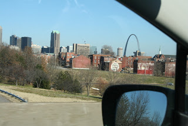
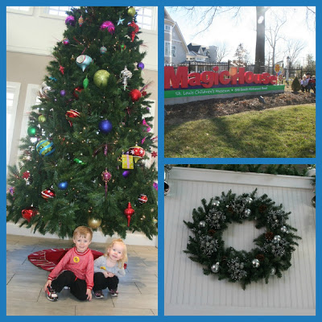
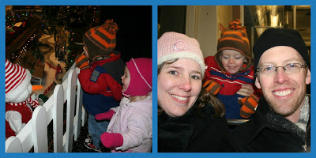
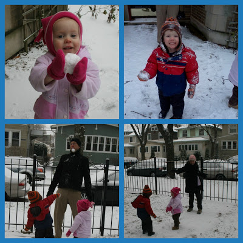
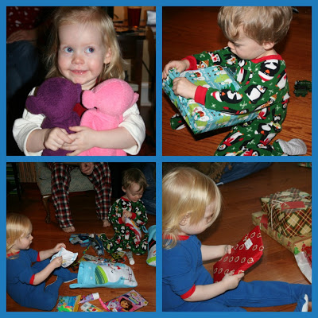
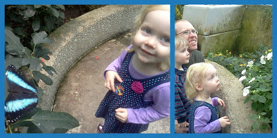

Today we are back to real life. Daddy is back to work and the kids and I are at home. We aren't back to school or our other activities yet but this is very close to our daily life.

  

We spent Christmas break traveling to Chicago to see my sister and brother-in-law. On the way we stayed the night in St. Louis. 

Best decision! It gave us a break from the 12 hour drive and gave us the opportunity to visit the Magic House. 

The Magic House blew away my expectations. The kids loved it and the parents loved it too! We went first thing in the morning before it got super busy. O still talks about the sand table. My favorite area was the water room.

A really enjoyed the 'under 2' room. And Daddy quite possibly had more fun than the kids the entire day! I highly recommend a visit if you are in the St. Louis area.

  

And then we were off to Chicago! We spent a lot of time hanging out at home with family but also got out to see the city. The downtown Christmas lights are beautiful and we were able to enjoy them on a carriage ride.

The kids loved the trains. We stumbled upon a train display in the Hancock Building and, of course, riding a real train was a highlight of our trip.

We were pleasantly surprised with snow on Christmas morning. It was perfect snowball snow! 

Presents!

A trip to the butterfly house. The kids were amazed by all the butterflies flying around. It was really beautiful in there.

  

Chicago is always a fun city to visit but soon it was time for us to leave. We headed back to St. Louis and then the next day headed to Emporia for our Christmas with Nana and Papa. 

  

Then, finally home!
