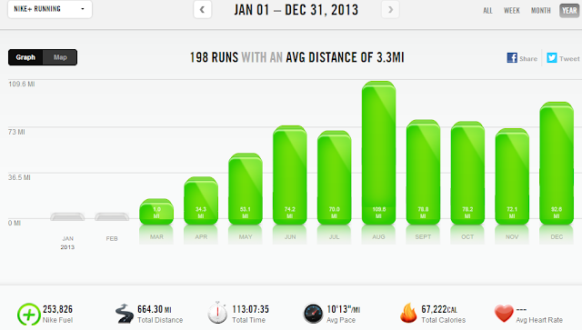
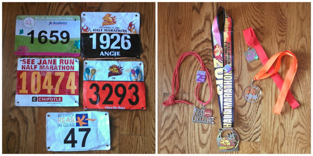
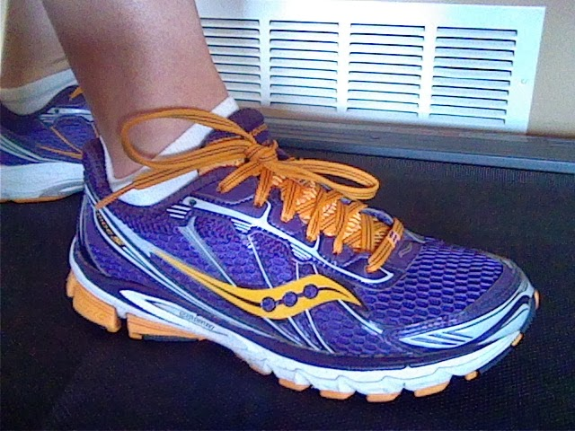

Running in 2013 was a roller coaster ride. I was so happy to be back at running after the birth of my third daughter but it was tough. I wasn't expecting it to be such a long 'comeback' but it was quite a journey.  

  

  
My goal race for the year was the Prairie Fire Half Marathon in October. Even though I did not end up with a PR, my training went very well and I was happy with this postpartum race.   
  
All throughout the month of December I was trying to reach the next milestone of 600 miles for the year. Actually, I had no idea that I added incorrectly in my training log somewhere. After comparing my paper log to Nike+ month to month I realized that I actually surpassed 600 miles much earlier than I had thought. Of course I only figured this out yesterday... The good news is that my mileage is a lot higher than I thought for the year!  
  
Speaking of mileage, 2013 was my highest mileage year yet. Although I already have plans to leave 2013 in the dust when it comes to mileage next year.  
  
**My year in numbers.**  
  
665.27: number of running miles  
  

  
  
10: number of running months  
  
  

  
5: number of races (Spring Prairie Fire 5K, Get Your Rear in Gear 5K, See Jane Run Half Marathon, Prairie Fire Half Marathon and Girls on the Run 5K)  
  
4: number of virtual races (Fall 5 and 10 Series)  
  
4: number of medals  
  
0: number of DNS (did not start) races  
  
4: number of states I ran in (KS, IA, CO, IL)  
  
153.75: number of treadmill miles  
  
  

  
9: number of stroller miles  
  
123.09: number of Runner's World Run Streak miles  
  
I can't wait to see what 2014 brings!   
  
  

**Are you a numbers geek like me?**   
**Do you like to look back on all the running numbers of the year?**

  
  
  

\-------------------------------

  

Find A Mother's Pace on...  
  
Twitter [@amotherspace3](https://twitter.com/amotherspace3)  
  
Facebook [amotherspace3](http://facebook.com/amotherspace3)  
  
Instagram [amotherspace](http://instagram.com/amotherspace)  
  
Pinterest [amotherspace](http://pinterest.com/amotherspace/)  
  
Bloglovin' [A Mother's Pace](http://www.bloglovin.com/en/blog/6680087)  
  
RSS [amotherspace](http://feeds.feedburner.com/amotherspace)
