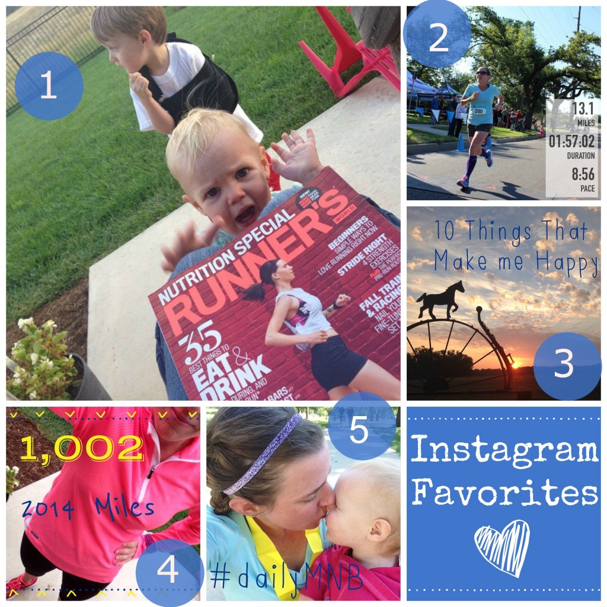
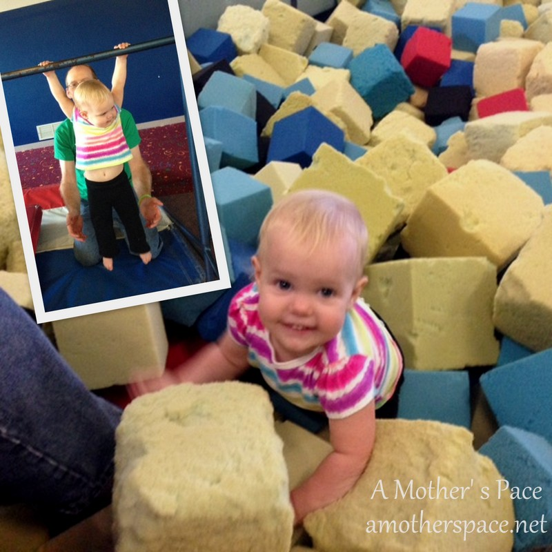
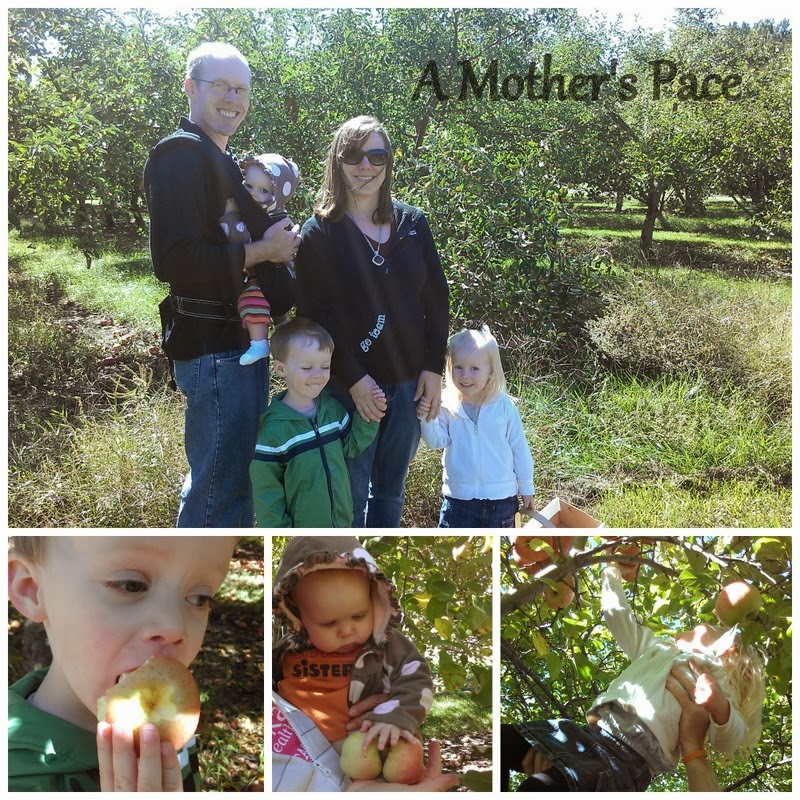

It's marathon training peak week!

So far I've completed 17.58 miles and I have 24 more on the plan. That will put me at just over 41 miles for the week which, I believe, is my highest mileage week ever. The fact that this many miles happened the week after my half marathon race probably wasn't the best planning on my part but it's working out just fine. My legs took a little while to warm up during my running but felt they pretty good after I got going.

It's almost TAPER time! Just 22 days until I get to run the streets of Chicago!

Friday is here so I've put together some of my favorites from the week along with a training confession. I'm sure I could write an entire post of training confessions but one will have to do for today.

Happy Friday, friends!

## Instagram

\[one\] Relaxing reading Runner's World while the kids play in the backyard sounds perfect, right? My daughter disagreed! The magazine had to wait. \[two\] The finish line shot from my [half marathon PR](http://amotherspace.net/2014/09/johnstons-half-marathon-race-recap/ "Johnston’s Half Marathon Race Recap") last weekend. It still makes me excited every time I think about it! \[three\] I was tagged this week to share 10 Things That Make Me Happy and one of them included sunrise running. \[four\] Last week I hit 1,000 miles for 2014. My highest mileage EVER and I still have a few more months of running to do. \[five\] I'm participating in the Daily Move, Nourish, Believe Instagram Challenge. It's nice to slow down each day and think of ways to Move, Nourish and Believe. On this day I wrote that I wanted to enjoy the little moments every day.

Follow me on Instagram ----> [here](http://instagram.com/amotherspace).

## Interesting Reads

[How to Run the Chicago Marathon](http://www.runnersworld.com/running-tips/how-run-chicago-marathon?utm_content=buffer4555e&utm_medium=social&utm_source=twitter.com&utm_campaign=buffer) by Coach Jenny \[I need to read this every day for the next 22 days!\]

[Running Tips: Post Race Blues](http://finefitday.com/2014/09/running-tips-post-race-blues.html?utm_content=bufferdf916&utm_medium=social&utm_source=twitter.com&utm_campaign=buffer) by Carly on Fine Fit Day

[15 Strategies for Eating Well and Avoiding Take-Out During Busy Seasons](http://www.keeperofthehome.org/2014/09/avoid-take-convenience-foods-busy-seasons.html?utm_content=buffer23896&utm_medium=social&utm_source=twitter.com&utm_campaign=buffer) on Keeper of the Home

[Why I Won't Be Setting a Time Goal for My Next Marathon](http://www.tinamuir.com/2014/09/why-i-wont-be-setting-time-goal-for-my.html?utm_content=buffer2a71a&utm_medium=social&utm_source=twitter.com&utm_campaign=buffer) by Tina on Fuel Your Future

## An Update

Last week my dilemma was how to fit in my last 20 miler before the Chicago Marathon. I had a lot of great feedback, both on the blog and on twitter so I thought an update was in order. In the end I decided to postpone my run a week. I was leaning toward running a warm up mile or two before the race and then running 5 or 6 miles after the half to fit it all in. The biggest issue with this was that my family was spectating the race and I didn't want to make them have to wait for me to run even longer. I just decided to run the 20 miles the following Saturday (tomorrow!!) instead of the 15-17 miles that were on my plan. I'm happy that I went with that option because I've been hearing more and more Chicago Marathon runners talking about their last 20 miler coming up this weekend. I won't be the only one out running the long miles!

_**Confession:**_ Is it weird that I'm looking forward to this run and I might even be a little sad when it's over? Marathon training is tough and time consuming but there is just something about those crazy long runs.

## Life Lately

My youngest has discovered gymnastics and can't get enough of it. She has no fear and will jump from the trampoline into the foam pit without any help from me. She loves the mats, the bars and of course bouncing on the trampolines. I can't wait to sign her up for a parent participation class when she turns 2 but right now the Toddler Time at the Y will have to do!

## Currently Reading

I'm still listening to The Goldfinch on Audible while I'm running and it's pretty amazing. The dark mornings have put me at a standstill though because I don't take my headphones along when it's dark outside. I'm planning on getting a good chunk finished during my 20 miler on Saturday but I may have to break down and buy the book to finish reading it. I just can't listen to it enough to finish the book as quickly as I want!

## Weekend Plans

The Apple Orchard! I can't wait to pick an apple off of the tree and take a bite. The kids had such a good time [last year](http://amotherspace.net/2013/10/apple-picking/ "Apple Picking") so they are very excited to pick apples again this year. We're looking forward to applesauce, apple crisp and my daughter wants me to make apple cake. I've never made it before but I'm willing to find a new recipe!

\[caption id="attachment\_936" align="aligncenter" width="607"\] 2013 Apple Orchard Visit\[/caption\]

**Does anyone have an apple cake recipe for me? Anyone else running one last super long run before the Chicago Marathon? Do you listen to audio books while running? What's a favorite?**

 

I'm running the Chicago Marathon with Team RMHC!

To find out more read my post about [Running for Charity](http://amotherspace.net/2014/06/the-chicago-marathon-running-for-charity/) or head over to my [fundraising page](http://www.kintera.org/faf/donorReg/donorPledge.asp?ievent=1097960&supId=399266070) to make a donation.

——————————-

Find A Mother’s Pace on…

Twitter [@amotherspace3](https://twitter.com/amotherspace3)

Facebook [amotherspace3](http://facebook.com/amotherspace3)

Instagram [amotherspace](http://instagram.com/amotherspace)

Pinterest [amotherspace](http://pinterest.com/amotherspace/)

Bloglovin’ [A Mother’s Pace](http://www.bloglovin.com/en/blog/6680087)

RSS [amotherspace](http://feeds.feedburner.com/amotherspace)
