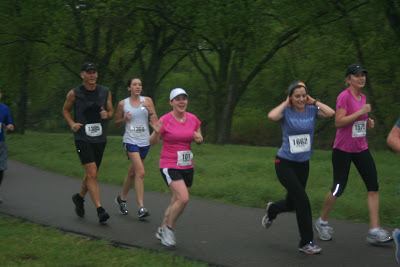

Miss Zippy asked her readers to "[Tell me about your 2012](http://misszippy1.com/2012/12/tell-me-about-your-2012.html#comment-64581)" and I decided to play along. She had some great questions so I thought I would share them here too. Feel free to share your answers below as well!  

  

- Best Race Experience? Our local Wichita River Run 10K in June. A new PR for me, it was the perfect racing weather and I smiled the whole race.
- Best Run? Same as above. I'm 7 months pregnant and I haven't had the easiest running experiences lately!
- Best new running gear? My [clip light](http://www.amazon.com/Cyclops-CYC-MHC-W-Micro-Mini-Light/dp/B001QCXTBI/ref=wl_it_dp_o_nS_nC?ie=UTF8&colid=1FTCYRMLJA67K&coliid=I1LLTEG9XRGGB0) for my hat. I love how light weight it is and it helps so much for the early morning runs.
- Best piece of running advice? It's o.k. to slow down. I slowed down considerably for this pregnancy and it was hard to get used to the new pace.
- Most inspirational runner? I have to pick all of the Olympic Runners this year. It was so inspirational watching the running events but I think my favorites were Shalane and Kara.

- If you could sum up your year in a couple of words, what would they be? Many ups and downs. 

<table align="center" cellpadding="0" cellspacing="0"><tbody><tr><td></td></tr><tr><td>(<a href="http://espn.go.com/olympics/summer/2012/espnw/story/_/id/8237764/2012-summer-olympics-marathon-misfire-trio-us-women" rel="nofollow" target="_blank">Source</a>)</td></tr></tbody></table>

  

\-------------------------------

  

Find A Mother's Pace on...  
  
Twitter [@amotherspace3](https://twitter.com/amotherspace3)  
  
Facebook [amotherspace3](http://facebook.com/amotherspace3)  
  
Instagram [amotherspace](http://instagram.com/amotherspace)  
  
Pinterest [amotherspace](http://pinterest.com/amotherspace/)  
  
Bloglovin' [A Mother's Pace](http://www.bloglovin.com/en/blog/6680087)  
  
RSS [amotherspace](http://feeds.feedburner.com/amotherspace)
